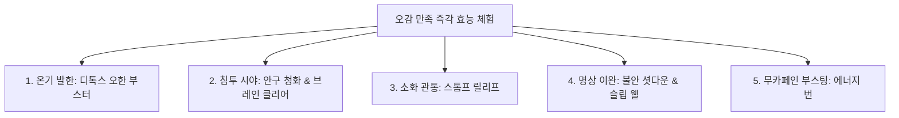

# 🌈 K-Medi 오감 만족 즉각적 효능 체험 5대 시그니처 기획서
## (Personalized Instant Efficacy Experiences: The 5 Signature Rituals)

본 기획서는 플랫폼 고객들이 매장에서 음료나 요리를 접할 때, **"마시거나 먹은 지 15~20분 이내에 신체에서 확연하고 즉각적인 반응(Instant Feedback)이 오는 경이로운 경험"**을 다채롭게 제공하기 위한 5대 시그니처 체험 모델(Rituals)을 제안합니다. 특정 질환 치료가 아닌, 오감을 자극하는 약선 약리 작용과 리추얼(의식)의 결합을 통해 차별화된 웰니스 브랜드 이미지를 구축합니다.

---

## 1. K-Medi 5대 즉각 효능 체험 라인업 (Signature Experiences)

---

### 🍵 1. 온기 발한 체험: "디톡스 오한 부스터 (Detox Warm Booster)"
* **목표 신체 상태**: 으슬으슬한 초기 감기 기운, 냉방병, 스트레스로 인해 몸이 차갑고 오한이 돌 때.
* **약리적 융합**: 건강(말린 생강), 계피, 자소엽(한방 자줏빛 허브), 대추 고농축 핫 에센스.
* **15분 리추얼(Ritual) 연출**:
  1. 음료 제공 시, 어깨와 목 뒤에 얹을 수 있는 **따뜻하게 데워진 황토 허브 찜질팩**을 함께 올립니다.
  2. 자소엽의 정유 성분이 피부 모공을 부드럽게 열어주고, 생강과 계피의 매운맛(辛味)이 모세혈관을 급격히 확장시킵니다.
  3. **체험 피드백**: 음용 시작 후 10분 만에 손끝 발끝에서 온기가 돌기 시작하며, 이마와 등에 기분 좋은 땀이 송골송골 맺히는 **"발한(發汗) 온기 효과"**를 즉각 체험하게 합니다.

---

### 👁️ 2. 침투 시야 체험: "안구 청화 & 브레인 클리어 (Eye & Brain Clear)"
* **목표 신체 상태**: 장시간 스마트폰/모니터 사용으로 눈이 뻑뻑하고, 브레인 포그(머리가 멍함) 현상을 겪을 때.
* **약리적 융합**: 결명자, 감국(국화), 구기자 고농축 샷 + 유칼립투스 및 멘톨 아로마 에센스.
* **15분 리추얼(Ritual) 연출**:
  1. 맑고 쌉싸름한 안구 청화 에센스 음료를 서빙함과 동시에, 따뜻하게 데워진 **천연 국화 향 스팀 안대(Steam Eye Mask)**를 고객에게 제공합니다.
  2. 고객은 음료를 음용하기 전 안대를 쓰고 7분간 가벼운 명상을 진행하며 안구 주변 림프관을 이완시킵니다.
  3. **체험 피드백**: 안대를 벗는 순간 시야가 2.0으로 개방된 듯 온 세상이 밝고 깨끗하게 보이며 머리가 서늘하게 맑아지는 **"청두목(淸頭目)의 기적"**을 선사합니다.

---

### 消化 3. 소화 관통 체험: "스톰프 릴리프 (Stomach Relief Shot)"
* **목표 신체 상태**: 식사 후 명치 끝이 꽉 막힌 듯 가스가 차고 더부룩하여 숨쉬기 답답할 때.
* **약리적 융합**: 산사(천연 유기산 소화제), 내복자(무 씨앗 - 탄수화물 분해), 진피, 강한 탄산수.
* **15분 리추얼(Ritual) 연출**:
  1. 고농축 소화 산사 에센스를 톡 쏘는 탄산수와 믹싱하여 샴페인 플루트 잔에 웰컴 드링크 형태로 서빙합니다.
  2. 음료를 다 마신 후, 명치와 복부를 가볍게 시계 방향으로 쓸어내리도록 유도하는 미니 가이드 카드를 놋그릇 스푼과 함께 제공합니다.
  3. **체험 피드백**: 음용 10분 이내에 속에서 꺼억 하고 가스가 배출되거나 위벽의 팽창감이 쑥 가라앉는 **"소식(消食) 관통 효과"**를 선사합니다.

---

### 🧘 4. 명상 이완 체험: "불안 셧다운 & 안심 슬립 (Mind Reset & Sleep Well)"
* **목표 신체 상태**: 스트레스로 심장 박동이 빨라지고, 불안하여 숙면을 취하기 어렵거나 극도의 긴장 상태일 때.
* **약리적 융합**: 산조인(덖은 것 - 천연 진정제), 용안육, 원지, 라벤더/카모마일 블렌딩 드롭.
* **15분 리추얼(Ritual) 연출**:
  1. 은은한 향의 릴렉스 드롭을 마시게 한 뒤, 매장 한쪽에 마련된 **1인 웰니스 캡슐 체어(또는 힐링 베드)**에 15분간 머무르게 합니다.
  2. 골전도 헤드폰을 통해 심박 조율 바이노럴 비트(Binaural Beats) 뇌파 음원을 들려줍니다.
  3. **체험 피드백**: 중추신경 억제 작용을 돕는 산조인 성분과 주파수 이완 테라피가 결합하여, **20분 만에 맥박수가 안정되고 온몸의 근육이 이완되며 스르륵 명상 수면 상태에 빠져드는 이완**을 선사합니다.

---

### ⚡ 5. 천연 부스팅 체험: "무카페인 에너지 번 (Caffeine-Free Energy Burn)"
* **목표 신체 상태**: 오후 2~3시, 혼절할 것 같은 졸음과 극심한 피로(점심 식사 후 식곤증)가 몰려올 때.
* **약리적 융합**: 황기(에너지 다당체), 인삼(진세노사이드 부스팅), 갈근(머리로 진액을 끌어올림), 레몬그라스.
* **15분 리추얼(Ritual) 연출**:
  1. 고압으로 빠르게 내린 기력 보강 샷에 얼음과 신선한 레몬그라스, 탄산을 섞어 맥주처럼 시원한 탄산 에이드 형태로 빠르게 들이켜게(One-shot) 합니다.
  2. 음용과 동시에 손가락 지압점(합곡혈, 태충혈)을 가볍게 자극하는 미니 지압 링을 서비스로 끼워 줍니다.
  3. **체험 피드백**: 카페인 음료(커피/에너지 드링크) 특유의 심장 떨림 현상 없이, 마신 지 15분 만에 머리가 차가워지면서 **발끝에서부터 건강한 도파민과 집중력이 솟구치는 무카페인 활력 부스팅**을 느끼게 합니다.

---

## 2. 플랫폼 비즈니스 구현을 위한 설계 방향

* **리추얼 패키지(Ritual Package) 유통**:
  * 플랫폼 본사는 음료 에센스뿐만 아니라, 위에서 제안한 찜질팩, 스팀안대, 뇌파 음원 QR 카드, 지압 링 등을 세트로 묶어 가맹점에 패키지로 공급합니다.
  * 단순히 "음료를 파는 카페"가 아닌 **"즉각적인 솔루션을 파는 웰니스 클리닉 센터"**로 매장을 정의합니다.
* **데이터 추적 및 바이오피드백 연동**:
  * 고객이 음료를 마시기 전과 15분 후 스마트폰 카메라에 손가락을 대어 맥파(HRV)를 측정하거나 자가 진단을 기록하게 하여, **실제 수치로 두통/피로/스트레스 지수가 감소했음을 리포트로 보여주어 경험을 시각화**합니다.
