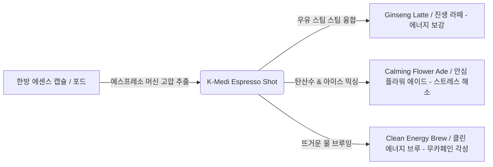

# 🌐 K-Medi Food 글로벌 세계화 및 차(Tea) 문화 창조 전략서
## (K-Medi Food Global Expansion & Coffee-Challenging Tea Culture Strategy)

본 문서는 MFCO(Medicinal Food Composition Ontology) 플랫폼의 궁합 추론 기술을 활용하여 K-Medi Food(한방 웰니스 푸드)를 글로벌 프리미엄 브랜드로 육성하고, 에스프레소 커피 시장과 대등하게 경쟁할 수 있는 차세대 한방 차(Tea) 문화를 창조하기 위한 획기적인 비즈니스 전략과 기술 융합 방안을 제시합니다.

---

## 1. K-Medi Food 세계화: "Wellness DNA Dining" 프랜차이즈

외국인들에게 다소 낯설고 의학적인 '한방(Oriental Medicine)'이라는 단어 대신, 현대적인 **'바이오 데이터 기반 개인 맞춤형 식단(Bio-Data Personalized Cuisine)'**으로 리브랜딩하여 글로벌 메가시티(뉴욕, 런던, 파리 등)의 프리미엄 웰니스 시장을 공략합니다.

```
[글로벌 매장 시나리오: 뉴욕 맨해튼 오피스가]
1. 고객 입장 (스마트 디바이스 연동 / 시차 적응, 피로도, 소화 기능 등 오늘 상태 입력)
2. MFCO AI 엔진 작동 -> 오늘 신체에 필요한 "Wellness DNA" 판정
3. 주문: "K-Medi Energy Bowl" (황기/인삼 베이스의 따뜻한 브루 육수를 끼얹은 프리미엄 덮밥)
4. 서빙: 전용 스마트 Q코드 카드가 부착되어 식재료 안전 성적과 생리 작용 기전 모바일 노출
```

### 💡 프리미엄 프랜차이즈 차별화 피처
* **글로벌 웰니스 보울 (Wellness Bowl) 표준화**:
  * 미국의 '스위트그린(Sweetgreen)'이나 샐러드 보울 매장처럼 대중적이되, 따뜻한 밥과 국물, 양질의 단백질(육류/어류), 웰니스 한방 에센스 소스가 조화된 **"Premium Korean Warm Bowl"** 형태로 제형을 규격화합니다.
* **디지털 이력 추적 카드 제공**:
  * 해외 소비자들이 가장 민감하게 생각하는 원재료 투명성을 확보하기 위해, 앞서 설계한 **Q코드 이력 추적 시스템**을 다국어(영어, 불어 등)로 제공하여 신뢰도를 극대화합니다.

---

## 2. 커피와 경쟁하는 차(Tea) 문화 창조: "Medi-Brew & Tea Espresso"

스타벅스로 대표되는 현대 에스프레소 커피 문화의 핵심은 **"빠른 제공(Speed), 세련된 라이프스타일(Lifestyle), 에너지 각성(Energy Boost)"**입니다. 한방 차가 커피와 경쟁하기 위해서는 고루한 전통 다도 방식을 깨고 테크놀로지와 힙한 트렌드를 융합해야 합니다.



### 획기적인 차별화 핵심 아이디어 (Coffee-Challenger Strategy)

#### ① 한방 에스프레소 샷 추출 ("Medi-Espresso Shot")
* **기술 융합**: 한약재와 꽃잎을 나노 입자로 미세 분쇄하여 전용 캡슐(Pod)로 제작한 뒤, 매장용 **고압 에스프레소 머신**을 통해 진한 액상 에센스 샷을 즉석에서 추출해 냅니다.
* **커피 대체 메뉴 라인업**:
  * **진생 라떼 (Ginseng Latte)**: 인삼과 황기 고압 샷 + 오트 밀크(우유 대체) + 대추 시럽. 커피의 카페인 부작용(가슴 두근거림, 불안) 없이 깊은 에너지를 충전하는 아침 시그니처 메뉴.
  * **클린 에너지 브루 (Clean Energy Brew)**: 맥문동, 오미자, 인삼(생맥산 온톨로지 기반) 샷을 탄산수와 믹싱한 아이스 음료. 무카페인 천연 각성 음료로 오후 업무 집중력을 올리는 아메리카노 대용.
  * **릴렉스 플라워 티 (Relax Flower Ade)**: 안심안정 온톨로지(산조인, 용안육, 국화 꽃) 샷 + 탄산수 + 허브 아로마. 불면과 불안을 겪는 현대인을 위한 나이트 캡(Night-cap) 음료.

#### ② "Medi-Barista" 및 웰니스 라운지 공간 브랜딩
* 전통 찻집의 조용하고 엄숙한 분위기를 탈피하여, 에스프레소 바와 유사한 속도감 있고 힙한 인테리어의 **"K-Medi Brew Bar"**로 브랜딩합니다.
* 바리스타가 웰니스 에센스 샷을 내리고 쉐이킹하는 다이내믹한 퍼포먼스를 보여줍니다.

---

## 3. 플랫폼 비즈니스 유통 스케일업 (Scalability Model)

이 문화적 아이디어를 전 세계 가맹점으로 복제하고 확장(Scaling)하는 플랫폼 기술적 기반입니다.

```
[제조 공장 (한글표시/HACCP)] ➡️ 캡슐 & 농축 액상 스틱 제조 ➡️ [글로벌 3PL 물류] ➡️ [해외 프랜차이즈 매장]
                                                                        ⬇
                                                           (가맹점주가 캡슐 머신에 넣어 3초 만에 추출)
```

1. **원스톱 캡슐 및 스틱 공급**:
   * 가맹점주가 원료를 직접 달이거나 배합할 필요 없이, 본사로부터 **"식품 규격 인증을 받은 웰니스 에센스 캡슐 및 액상 스틱"**만 공급받습니다. 이로써 전 세계 어느 매장에서나 **맛과 위생, 효능이 100% 동일하게 유지**됩니다.
2. **MFCO R&D 연계 라이선싱 비즈니스**:
   * 현지 글로벌 음료/카페 프랜차이즈(예: 스타벅스, 블루보틀 등)에 **"MFCO Wellness Essence Formula"** 라이선스를 제공하여, 그들의 메뉴에 웰니스 옵션(예: "Powered by MFCO Ginseng Add-on")을 추가하게 유도하는 **B2B 기술 라이선싱 모델**을 병행합니다.

---

## 4. 특허 청구항 확보 및 BM 특허화

* **청구 청구항 구성안**:
  * 생체 생리 데이터 또는 고객 상태 설문 데이터를 단말기로 수신하여 분석하는 단계.
  * 다차원 온톨로지 매핑 엔진이 수신된 데이터를 기반으로 무카페인 신체 활력 보강용 한방 허브 블렌딩 레시피를 도출하는 단계.
  * 도출된 레시피에 매핑되는 나노 입자 분쇄형 한방 캡슐 포드가 장착된 고압 에스프레소 추출 장치를 통해 웰니스 에센스 샷을 실시간 추출하여 음료 형태로 제공하는 단계.
  * 상기 캡슐 포드의 성적서 및 원산지 이력 정보를 Q코드를 매개로 소비자 모바일로 연동하여 검증을 표시하는 단계를 포함하는 웰니스 음료 프랜차이즈 운영 방법.
