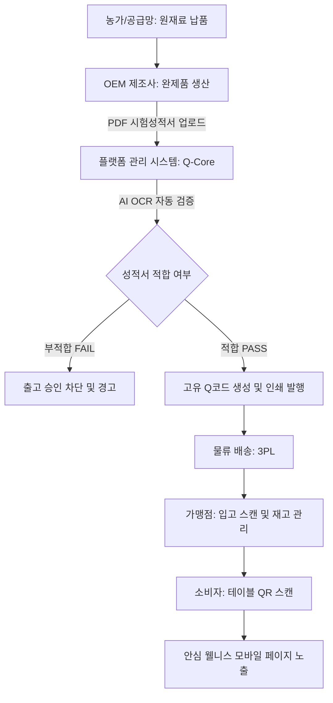

# 📋 Q코드 기반 원료 품질 및 이력 추적 시스템 구축 계획서
## (실제 사업 시작 직전 세부 실행 절차 및 로드맵)

본 문서는 MFCO(Medicinal Food Composition Ontology) 플랫폼 비즈니스 런칭 직전, 공급망의 투명성을 보장하고 소비자 신뢰도를 극대화하며 식품위생법/표시광고법 리스크를 원천 차단하기 위해 구축해야 하는 **Q코드(QR코드) 기반 품질 이력 추적 시스템**의 세부 실행 절차와 아키텍처를 정의합니다.

---

## 1. 전역 시스템 아키텍처 (Smart Q-Code Traceability Flow)

---

## 2. 사업 세부 실행 절차 (5단계 구축 로드맵)

### [단계 1] 공급망 연계 표준화 및 계약 조항 확립 (D-90 ~ D-60)
공급망 파트너사들과의 계약 단계에서 품질 데이터 제출 의무를 명문화하고 물리적 기준을 정립합니다.

* **[ ] OEM/ODM 공급 계약서 내 COA 제출 의무 조항 반영**
  * 생산된 매 배치(Batch/Lot)의 출하 시 국가 공인 인증기관의 시험·검사성적서(COA) 제출을 필수화하는 계약 조건 삽입.
  * 불합격 배치 발생 시 전량 회수 및 손해배상(PL 배상책임) 청구 규정 명시.
* **[ ] 원료별 잔류농약 및 유해물질 자체 수용 기준치(Threshold) 수립**
  * 식품위생법 기준치와 더불어 브랜드 자체 프리미엄 기준(예: 잔류농약 320종 완전 불검출, 중금속 기준치 대비 50% 이하 관리) 설계.
* **[ ] Batch/Lot 번호 표준 명명 규칙(Naming Convention) 확립**
  * 생산일자, 제조사 코드, 레시피/제품 코드가 조합된 고유 번호 체계 설계.
  * 예: `LOT-20260602-M01-K01A` (년월일 - 제조사 - 키트ID 및 버전)

---

### [단계 2] 데이터베이스 구축 및 검증 알고리즘 개발 (D-60 ~ D-30)
플랫폼 시스템(Q-Core) 내부의 데이터 모델을 설계하고, PDF 검사성적서를 자동으로 인식·검증하는 엔진을 개발합니다.

* **[ ] 품질 검증 데이터베이스 스키마 구축**
  * 아래 정의된 `COA_MASTER` 및 `BATCH_TRACE_MASTER` 테이블을 RDBMS에 생성하고 이력 관리 인덱스 튜닝.
* **[ ] PDF 성적서 파싱용 AI OCR 파이프라인 개발**
  * PDF 형식의 시험성적서 내에서 납(Pb), 카드뮴(Cd), 잔류농약 등의 텍스트와 수치를 추출하는 OCR 라이브러리 연동.
  * 성적서 수치와 기준치(Threshold)를 대조하여 자동으로 적합성(`PASS`/`FAIL`)을 판단하는 룰 엔진(Rule Engine) 탑재.
* **[ ] Q코드(QR코드) 생성기 및 라벨 인쇄용 API 연동**
  * 각 배치 정보와 해시값을 결합하여 고유 Q코드를 생성하고 이를 QR 이미지로 렌더링하는 API 구현.
  * 제조사 공장에서 바코드 라벨 프린터로 직접 인쇄할 수 있도록 표준 규격(라벨 사이즈 및 해상도) 템플릿 설계.

---

### [단계 3] 가맹점용 입고 및 재고 관리 시스템(POS/App) 개발 (D-30 ~ D-15)
가맹점에서 입고된 제품의 품질을 확인하고 효율적으로 재고를 순환시킬 수 있는 툴을 제공합니다.

* **[ ] 가맹점 관리자용 모바일 입고 스캔 기능 구현**
  * 매장에 입고된 에센스 박스 또는 낱개 제품의 Q코드를 스마트폰 카메라나 매장 POS 리더기로 스캔하여 시스템에 등록하는 UI 개발.
* **[ ] 선입선출(FIFO) 및 유통기한 관리 알고리즘 연동**
  * 가맹점용 관리 대시보드에 유통기한이 임박한 배치 상품을 최상단에 노출하고, 조리원에게 먼저 사용하도록 유도하는 스마트 알림 기능 구축.
* **[ ] 물류 배송(3PL) 파트너사 유통 이력 연동**
  * 택배/물류 배송 추적 API와 연동하여 원재료가 물류 센터에서 매장까지 콜드체인(필요시) 또는 상온 배송되는 이력을 연동 기록.

---

### [단계 4] 소비자용 안심 웰니스 모바일 페이지 개발 (D-15 ~ D-5)
고객이 매장에서 메뉴판 또는 테이블 QR을 스캔했을 때 보게 될 직관적이고 미려한 UI의 웹 페이지를 구축합니다.

* **[ ] 모바일 최적화 웹 페이지(Landing Page) UI/UX 개발**
  * **원재료 출처 정보**: 산지 정보 및 재배 농가 스토리라인 노출.
  * **안전 성적서 시각화**: 복잡한 수치 대신 "잔류농약 320종 불검출 안심 인증" 등 도식화된 그래프 및 공인성적서 원본 보기 다운로드 링크 제공.
  * **MFCO 온톨로지 시너지**: 추천 식단에 함유된 한방 약선 원재료들이 사용자의 피로 회복, 대사 정화 등에 작용하는 과학적 생리 기전 설명 일러스트 추가.
* **[ ] 매장 비치용 인쇄 매체 시안 제작**
  * 메뉴판 내 QR 코드 삽입 공간 설계.
  * 테이블 텐트(텐트 카드), 약선 키트 설명 리플릿에 대응 QR코드 인쇄 템플릿 제작.

---

### [단계 5] 통합 테스트 및 최종 런칭 (D-5 ~ D-Day)
비즈니스 개시 전 모든 프로세스의 실동 테스트를 수행하고 법적 리스크를 최종 점검합니다.

* **[ ] End-to-End 시나리오 시뮬레이션 및 부하 테스트**
  * 제조업체 공급 등록 ➡️ OCR 검증 ➡️ QR코드 라벨링 및 배송 ➡️ 가맹점 입고 ➡️ 최종 소비자 스캔의 전 과정을 가상의 목업 데이터를 활용해 최종 테스트.
* **[ ] 매장 점주 및 주방 인력용 매뉴얼 배포**
  * 제품 입고 시 스캔 요령, 보관 위치, 조리 시 투입 방법, 소비자 문의 대응 가이드라인 배포.
* **[ ] 특허 보완 및 포트폴리오 구축**
  * 런칭 시점의 실동 시스템 구조를 바탕으로 기존 BM 특허의 추가 청구항을 보완하여 최종 보완서 제출.

---

## 3. 데이터베이스 스키마 상세 정의

### 1) `COA_MASTER` (시험성적서 허용 기준 관리)
* **목적**: 각 원재료 카테고리별 국가 표준 안전 기준치 및 플랫폼 자체 내부 안심 기준치 저장.

| 필드명 (Field) | 데이터 타입 | 제약 조건 | 설명 |
| :--- | :--- | :--- | :--- |
| `MATERIAL_ID` | VARCHAR(20) | PK | 원료/제품 ID (예: `K01`, `I0001` 등) |
| `MATERIAL_NAME` | VARCHAR(100) | NOT NULL | 원재료/제품 한글명 |
| `LEAD_LIMIT` | DECIMAL(5,2) | NOT NULL | 납(Pb) 기준 한계치 (ppm 단위, 이하) |
| `CADMIUM_LIMIT` | DECIMAL(5,2) | NOT NULL | 카드뮴(Cd) 기준 한계치 (ppm 단위, 이하) |
| `ARSENIC_LIMIT` | DECIMAL(5,2) | NOT NULL | 비소(As) 기준 한계치 (ppm 단위, 이하) |
| `MERCURY_LIMIT` | DECIMAL(5,2) | NOT NULL | 수은(Hg) 기준 한계치 (ppm 단위, 이하) |
| `PESTICIDE_CHECK` | BOOLEAN | DEFAULT TRUE | 잔류농약 320종 검사 필수 여부 |
| `ALERT_LEVEL` | DECIMAL(5,2) | DEFAULT 0.8 | 법정 기준치 대비 자체 안전 알림 임계값 비율 |

### 2) `BATCH_TRACE_MASTER` (배치별 실시간 유통/이력 추적)
* **목적**: 공급사로부터 납품된 개별 제품 군의 검증 상태 및 유통 현황 관리.

| 필드명 (Field) | 데이터 타입 | 제약 조건 | 설명 |
| :--- | :--- | :--- | :--- |
| `Q_CODE` | VARCHAR(50) | PK | 고유 식별 해시 Q코드 (QR코드 텍스트) |
| `MATERIAL_ID` | VARCHAR(20) | FK | 원료/제품 ID (`COA_MASTER` 참조) |
| `BATCH_NO` | VARCHAR(30) | NOT NULL | 공급사 부여 생산 Lot/Batch 번호 |
| `MANUFACTURE_DATE` | DATE | NOT NULL | 제조 일자 |
| `EXPIRY_DATE` | DATE | NOT NULL | 유통 기한 |
| `OCR_VERIFY_STATUS`| VARCHAR(20) | DEFAULT 'PENDING'| 검증 상태 (`PENDING`, `PASS`, `FAIL`, `MANUAL`) |
| `COA_PDF_URL` | VARCHAR(255) | - | 공인기관 성적서 PDF 저장 경로 |
| `RAW_MATERIAL_ORIGIN`| TEXT | - | 원자재 산지 정보 (JSON 형식, 예: `{"구기자":"청양", "인삼":"풍기"}`) |
| `VERIFIED_AT` | TIMESTAMP | - | AI OCR 자동 검증 통과 완료 시각 |
| `LOGISTICS_STATUS` | VARCHAR(20) | DEFAULT 'SHIPPED'| 물류 상태 (`SHIPPED`, `IN_STORE`, `SOLD_OUT`) |

---

## 4. 특허 추가 청구항 활용 가이드 (BM 특허 연계)

본 계획서의 구조는 향후 특허(출원 번호 및 사안 연계)의 신규 청구항으로 추가하여 독점권을 확보하는 데 활용됩니다.

* **핵심 청구 요소**:
  1. 사용자 신체 상태 데이터를 온톨로지 매핑 엔진을 통해 처리하여 맞춤식 한방 약선 처방 데이터를 도출하는 단계.
  2. 도출된 맞춤 레시피에 결합하기 위해 공급망으로부터 제조 승인된 약선 포뮬러를 매칭하되, 공급사의 공인 시험성적서 데이터를 입력받아 안전성 기준을 통과한 배치 제품에만 고유 식별 Q코드(QR코드)를 발급하는 단계.
  3. 발급된 Q코드가 포장된 제품을 물류 체인을 통해 가맹점 일반음식점으로 배송하여 현장에서 요리와 결합하도록 하고, 최종 소비자가 테이블에 인쇄된 Q코드를 통해 원재료의 안전 적합 판정 데이터 및 기전 설명을 조회하도록 지원하는 단계.
