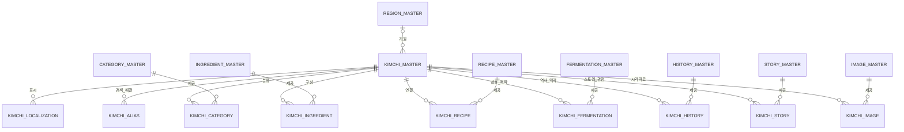

# KIMCHI_MASTER_SPEC

**버전:** 1.4 (Final Release Candidate)  
**상태:** 정식 기술 사양서 (Release Ready)  
**소유:** YM-LAB  
**최종 검토:** 2026-07-20  

## 1. 목적 (Purpose)

본 사양서는 YM-LAB 김치 지식 플랫폼의 핵심 엔티티인 `KIMCHI_MASTER` 데이터베이스의 기술 규격을 정의한다.

`KIMCHI_MASTER`는 다음 표준 역할을 수행하여야 한다 (MUST).
1. 단일 김치 개념(Kimchi Concept)의 고유 식별 및 정체성 정의
2. 도메인별 전문 MASTER 데이터베이스를 연결하는 Concept Hub 역할 수행
3. 다국어 현지화, AI 인덱싱 및 외부 API 연동을 위한 기준 데이터 규격 제공

## 2. 범위 (Scope)

### 2.1 포함 범위 (In-Scope)
본 사양서는 다음 항목의 데이터 규격 및 제약 조건을 규정한다 (SHALL).
- 김치 개념의 고유 식별자(`kimchi_id`), 대표 명칭(`canonical_name_ko`), URL slug 및 Lifecycle 관리
- 기원 범위(`origin_scope_code`), 대표 카테고리 매핑 및 기본 요약 정보
- 검증 상태(`verification_status`), 노출 범위(`public_visibility`), 워크플로우 상태(`workflow_status`) 메타데이터
- 다국어 표시명(`KIMCHI_LOCALIZATION`) 및 검색 별칭(`KIMCHI_ALIAS`)
- 연관 MASTER(`CATEGORY`, `INGREDIENT`, `RECIPE`, `FERMENTATION`, `HISTORY`, `STORY`, `IMAGE`) 간 Junction Table 구조
- 신규 도메인 MASTER 확장을 위한 표준 인터페이스 규격

### 2.2 제외 범위 (Out-of-Scope)
다음 항목은 본 사양서의 범위에서 제외하며, KIMCHI_MASTER가 직접 소유할 수 없다 (MUST NOT).
- 조리 절차 및 재료별 정량 (`RECIPE_MASTER` 소유)
- 발효 조건 및 성분 측정값 (`FERMENTATION_MASTER` 소유)
- 역사 고증 문헌 원문 및 상세 인용 데이터 (`HISTORY_MASTER` 소유)
- 스토리텔링 원고 및 미디어 콘텐츠 본문 (`STORY_MASTER` 소유)
- 이미지 파일 자산, URL, 생성 프롬프트 및 저작권 상세 (`IMAGE_MASTER` 소유)
- 물리적 RDBMS DDL, 스토리지 파티셔닝 및 API 구현 코드

## 3. 설계 원칙 (Design Principles)

1. **개념 단위 유일성:** 하나의 레코드는 독립된 하나의 김치 개념만 정의하여야 한다 (MUST). 레시피 단위 변형은 `RECIPE_MASTER`에서 관리하여야 한다 (MUST).
2. **최소 소유권 (Minimal Ownership):** `KIMCHI_MASTER`는 정체성, 대표 정보, 식별자, 운영 메타데이터만 직접 소유하여야 한다 (MUST).
3. **단일 소유권 (Single Ownership) & SSOT:** 모든 데이터 속성은 오직 하나의 전담 MASTER만 소유한다 (SHALL). MASTER 간 데이터 저장 및 소유권 중복을 금지하며 (MUST NOT), 외래키(FK)와 Junction Table로만 상호 연결하여야 한다 (MUST).
4. **Junction Table 분리:** 모든 다대다(M:N) 관계는 전용 Junction Table로 분리하여야 한다 (MUST). 단일 필드 내 다중 값 저장(Comma-separated)을 금지한다 (MUST NOT).
5. **한국어 기준 및 다국어 확장:** 기준 언어는 한국어(`ko-KR`)로 정의한다 (SHALL). 번역 및 현지화 텍스트는 `KIMCHI_LOCALIZATION`에서 독립 관리하여야 한다 (MUST).
6. **Publish Gate 준수:** [4.3 공개 조건 (Publish Gate)](#43-공개-조건-publish-gate)의 제약 조건을 전수 충족하는 레코드에 한하여 외부 노출을 허용하여야 한다 (MUST).
7. **통제된 어휘 (Controlled Vocabulary) 준수:** 분류 코드 및 상태값은 임의 텍스트 입력을 금지하며 (MUST NOT), 지정된 Enum/Code 규격을 따라야 한다 (MUST).
8. **불변 식별자 (Immutable ID):** 기본 식별자(`kimchi_id`)는 명칭, 카테고리, 언어 변경과 독립적으로 영구 유지되어야 한다 (MUST).
9. **소프트 삭제 (Soft Delete):** 공개 이력이 존재하는 레코드의 물리 삭제를 금지한다 (MUST NOT). 비활성화 시 `workflow_status = archived`로 전이하여야 한다 (MUST).
10. **하위 호환성 (Backward Compatibility):** 식별자, 테이블명, 필드명, Enum 값의 무단 변경을 금지하며 (MUST NOT), 스키마 변경 시 하위 호환성을 보장하여야 한다 (MUST).

### 3.1 데이터 소유권 매트릭스 (Ownership Matrix)

| 정보 영역 (Domain) | 책임 소유자 (Owner MASTER) | 소유 및 관리 범위 |
| :--- | :--- | :--- |
| **Identity (정체성)** | `KIMCHI_MASTER` | `kimchi_id`, 공식 한국어명, slug, 대표 분류 ID, 검증/운영 상태 메타데이터 |
| **Recipe (레시피)** | `RECIPE_MASTER` | 조리 절차, 레시피 단계별 텍스트, 재료별 정량/비율, 조리 시간, 난이도 |
| **Ingredient (재료)** | `INGREDIENT_MASTER` | 식재료 정의, 재료 고유 속성, 재료 분류체계 (김치 매핑은 Junction Table 소유) |
| **History (역사)** | `HISTORY_MASTER` | 역사적 기원설, 시대별 변천사, 문헌 기록, 고증 맥락 지식 |
| **Story (스토리)** | `STORY_MASTER` | 문화적 배경, 지역적 일화, 대중적 에피소드, 홍보/마케팅 스토리 텍스트 |
| **Image (이미지)** | `IMAGE_MASTER` | 이미지 파일 경로, URL, 해상도, 생성 프롬프트, 대체 텍스트(`alt_text`) |
| **Rights (저작권/권리)** | `RIGHTS_MASTER` | 지식 자산별 저작권자, 사용 범위, 라이선스 및 배포 조건 |
| **Source (출처/근거)** | `SOURCE_MASTER` | 고문헌, 논문, URL 등 사실 증빙 출처 및 참고 문헌 데이터 |

## 4. 데이터베이스 구조 (Database Structure)

### 4.1 논리 테이블 정의 (Logical Tables)

| Table | 역할 | Primary Key |
|---|---|---|
| `KIMCHI_MASTER` | 김치 개념의 정체성 및 메타데이터를 관리하는 중심 테이블 | `kimchi_id` |
| `KIMCHI_LOCALIZATION` | 언어별 표시명 및 설명 관리 | (`kimchi_id`, `language_code`) |
| `KIMCHI_ALIAS` | 별칭, 옛 이름, 로마자 표기, 검색어 관리 | `alias_id` |
| `KIMCHI_CATEGORY` | `CATEGORY_MASTER`와의 분류 매핑 Junction Table | (`kimchi_id`, `category_id`, `relation_type`) |
| `KIMCHI_INGREDIENT` | `INGREDIENT_MASTER`와의 재료 매핑 Junction Table | `kimchi_ingredient_id` |
| `KIMCHI_RECIPE` | `RECIPE_MASTER`와의 레시피 매핑 Junction Table | `kimchi_recipe_id` |
| `KIMCHI_FERMENTATION` | `FERMENTATION_MASTER`와의 발효 정보 매핑 Junction Table | `kimchi_fermentation_id` |
| `KIMCHI_HISTORY` | `HISTORY_MASTER`와의 역사 매핑 Junction Table | `kimchi_history_id` |
| `KIMCHI_STORY` | `STORY_MASTER`와의 스토리 매핑 Junction Table | `kimchi_story_id` |
| `KIMCHI_IMAGE` | `IMAGE_MASTER`와의 이미지 매핑 Junction Table | `kimchi_image_id` |

### 4.2 레코드 생명주기 (Lifecycle)

- **전이 순서:** 레코드는 `draft` → `in_review` → `approved` → `published` → `archived` 순서로 전이하여야 한다 (MUST).
- **반려 처리:** `in_review` 단계에서 반려 시 `rejected` 상태로 전이하며, 외부 노출을 금지한다 (MUST NOT).
- **보관 처리:** `published` 레코드는 물리 삭제할 수 없으며 (MUST NOT), `archived` 상태로 전이하여야 한다 (MUST). 레코드 대체 시 `replacement_kimchi_id`에 대체 식별자를 기재하여야 한다 (MUST).

### 4.3 공개 조건 (Publish Gate)

`public_visibility = public` 설정을 위해 다음 조건 전수를 동시에 충족하여야 한다 (MUST).
1. `Publish` 필수 지정 필드 전수 입력 완료
2. `verification_status = verified`
3. `workflow_status = published`
4. `localization_status = approved`인 `ko-KR` `KIMCHI_LOCALIZATION` 레코드 1개 이상 존재
5. active 상태의 `primary` `KIMCHI_CATEGORY` 관계 1개 정확히 존재

### 4.4 데이터 무결성 규칙 (Integrity Rules)

- **FK 참조 유효성:** 모든 외래키(FK)는 존재하는 active 상태의 참조 대상만 가리켜야 한다 (MUST).
- **카테고리 일치성:** `primary_category_id`는 active 상태인 `KIMCHI_CATEGORY`의 `relation_type = primary` 항목과 일치하여야 한다 (MUST).
- **포인터 검증:** `default_recipe_id` 및 `primary_image_id`는 각각 active 상태인 `KIMCHI_RECIPE` 및 `KIMCHI_IMAGE` 레코드와 매핑되어야 한다 (MUST).
- **순환 참조 금지:** `replacement_kimchi_id`는 자기 참조 및 순환 참조를 금지한다 (MUST NOT).
- **보관 타임스탬프:** `workflow_status = archived` 전이 시 `archived_at` 타임스탬프 입력은 필수이다 (MUST).

## 5. 필드 명세 (Field Definitions)

### 5.1 `KIMCHI_MASTER`

| Field Name | Type / Format | Required | 제약 및 규격 |
|---|---|---:|---|
| `kimchi_id` | string, `KIM-######` | Create | 기본 키(PK). 영구 불변 고유 식별자. |
| `canonical_name_ko` | Unicode text | Create | 김치 개념의 공식 한국어 명칭. |
| `canonical_slug` | lowercase ASCII slug | Create | URL/API용 표준 slug. 공개 후 변경 금지. |
| `record_type` | enum: `kimchi` | Create | 레코드 도메인 식별자. 고정값 `kimchi`. |
| `kimchi_family_code` | controlled code | Publish | 상위 계열 분류 코드 (`CATEGORY_MASTER` 참조). |
| `primary_category_id` | FK to `CATEGORY_MASTER` | Publish | 대표 카테고리 FK. active `primary` 관계와 일치 필수. |
| `origin_scope_code` | enum: `national`, `regional`, `local`, `household`, `unknown` | Create | 기원 범위 규정 코드. |
| `origin_region_id` | FK to future `REGION_MASTER` | Optional | 기원 지역 FK (미확정 시 NULL). |
| `distinguishing_feature_ko` | short Unicode text | Publish | 김치 식별용 한국어 핵심 특징 요약. |
| `canonical_summary_ko` | plain Unicode text | Publish | 공식 한국어 요약문. AI 인덱싱 및 기본 표기용. |
| `default_recipe_id` | FK to `RECIPE_MASTER` | Optional | 대표 레시피 FK. active `KIMCHI_RECIPE` 등록 필수. |
| `primary_image_id` | FK to `IMAGE_MASTER` | Optional | 대표 이미지 FK. active `KIMCHI_IMAGE` 등록 필수. |
| `representative_flag` | boolean | Create | 대표/입문용 김치 여부 플래그. |
| `verification_status` | enum: `unverified`, `researching`, `verified`, `disputed` | Create | 사실 검증 상태. 공개 시 `verified` 필수. |
| `evidence_summary` | short text | Optional | 검증 근거 및 제한사항 요약. |
| `workflow_status` | enum: `draft`, `in_review`, `approved`, `published`, `archived`, `rejected` | Create | Lifecycle 상태. 기본값 `draft`. |
| `public_visibility` | enum: `private`, `internal`, `public` | Create | 외부 노출 범위. `public` 설정 시 [4.3 Publish Gate](#43-공개-조건-publish-gate) 충족 필수. |
| `search_keywords` | normalized keyword collection | Optional | 편집 승인 검색 키워드 집합. |
| `ai_index_status` | enum: `not_queued`, `queued`, `indexed`, `stale`, `error` | Create | AI 검색 인덱스 상태. |
| `ai_indexed_at` | ISO 8601 UTC timestamp | Optional | AI 인덱스 최신 반영 시각. |
| `content_updated_at` | ISO 8601 UTC timestamp | Create | 공개 콘텐츠의 최종 변경 시각. |
| `created_at` | ISO 8601 UTC timestamp | Create | 레코드 생성 시각. |
| `created_by` | user/service identifier | Create | 레코드 생성 주체 식별자. |
| `updated_at` | ISO 8601 UTC timestamp | Create | 레코드 최종 수정 시각. |
| `updated_by` | user/service identifier | Create | 레코드 최종 수정 주체 식별자. |
| `record_version` | positive integer | Create | 낙관적 잠금용 버전 번호. 변경 시 1씩 증가. |
| `archived_at` | ISO 8601 UTC timestamp | Optional | 보관 처리 시각 (`workflow_status = archived` 시 필수). |
| `replacement_kimchi_id` | self-FK to `KIMCHI_MASTER` | Optional | 대체/병합 대상 `kimchi_id` (자기 참조 및 순환 금지). |
| `internal_note` | private text | Optional | 내부 편집 메모 (외부 API/AI 비노출). |

### 5.2 `KIMCHI_LOCALIZATION`

| Field Name | Type / Format | Required | 제약 및 규격 |
|---|---|---:|---|
| `kimchi_id` | FK to `KIMCHI_MASTER` | Create | 대상 김치 FK (복합 PK). |
| `language_code` | BCP 47 tag | Create | 언어/로케일 코드 (`ko-KR`, `en`, `ja` 등) (복합 PK). |
| `localized_name` | Unicode text | Create | 승인된 언어별 표시명. |
| `romanized_name` | Latin text | Optional | 로마자 표기 또는 음역. |
| `localized_slug` | lowercase ASCII slug | Optional | 언어별 URL slug. |
| `short_description` | plain Unicode text | Publish | 요약 설명 텍스트. |
| `long_description` | plain Unicode text | Optional | 상세 설명 텍스트. |
| `localization_status` | enum: `draft`, `reviewed`, `approved` | Create | 번역 검토 상태. 서빙 시 `approved` 필수. |
| `translated_by` | user/service identifier | Optional | 번역 생성 주체 식별자. |
| `reviewed_by` | user identifier | Optional | 번역 검수자 식별자 (`approved` 시 필수). |
| `updated_at` | ISO 8601 UTC timestamp | Create | 레코드 최종 수정 시각. |

### 5.3 `KIMCHI_ALIAS`

| Field Name | Type / Format | Required | 제약 및 규격 |
|---|---|---:|---|
| `alias_id` | string, `KAL-######` | Create | 별칭 불변 기본 키(PK). |
| `kimchi_id` | FK to `KIMCHI_MASTER` | Create | 연관 김치 FK. |
| `language_code` | BCP 47 tag | Create | 별칭 언어 코드. |
| `alias_text` | Unicode text | Create | 별칭, 옛 이름, 지역명, 음역 텍스트. |
| `normalized_alias` | normalized text | Create | 검색 및 중복 검증용 정규화 텍스트. |
| `alias_type` | enum: `alternate_name`, `regional_name`, `historical_name`, `spelling`, `romanization`, `search_term` | Create | 별칭 유형 구분 Enum. |
| `source_note` | short text or source ID | Optional | 별칭 근거 메모. |
| `status` | enum: `active`, `deprecated` | Create | 별칭 사용 상태 Enum. |

### 5.4 Junction Table 공통 및 개별 규칙

모든 Junction Table은 다음 공통 필드를 필수로 정의하여야 한다 (MUST).

| Common Field | Type / Format | Required | 제약 및 규격 |
|---|---|---:|---|
| `junction_id` | master-specific ID | Create | 불변 PK ([8. 식별자 규칙](#8-식별자-규칙-id-rules) Prefix 준수). |
| `kimchi_id` | FK to `KIMCHI_MASTER` | Create | 중심 김치 FK. |
| `target_id` | FK to target MASTER | Create | 전문 MASTER PK. |
| `relation_type` | controlled code | Create | 관계 유형 지정 코드. |
| `display_order` | non-negative integer | Create | 표출 순서 (기본값 `0`). |
| `link_status` | enum: `active`, `inactive` | Create | 관계 사용 여부 Enum. |
| `evidence_note` | short text or source ID | Optional | 관계 근거 메모. |
| `created_at` / `updated_at` | ISO 8601 UTC timestamps | Create | 생성 및 수정 시각. |

| Junction Table | Target ID | Allowed `relation_type` | 추가 필드 | 무결성 제약 규칙 |
|---|---|---|---|---|
| `KIMCHI_CATEGORY` | `category_id` | `primary`, `secondary`, `audience`, `seasonal`, `occasion` | 없음 | active `primary` 관계는 공개 레코드당 정확히 1개 존재 필수. |
| `KIMCHI_INGREDIENT` | `ingredient_id` | `base`, `main`, `seasoning`, `aromatic`, `seafood`, `liquid`, `garnish` | `importance_rank` | 재료 수량 저장을 금지하며, 개념적 역할 관계만 매핑한다. |
| `KIMCHI_RECIPE` | `recipe_id` | `canonical`, `traditional`, `regional`, `modern`, `vegan`, `quick`, `reference` | `applicability_note` | `default_recipe_id` 지정 시 optional `canonical` 관계 설정을 권장한다 (SHOULD). |
| `KIMCHI_FERMENTATION` | `fermentation_id` | `typical`, `traditional`, `regional`, `alternative`, `reference` | `applicability_note` | 발효 측정치(온도/기간)의 저장 및 소유를 금지한다 (MUST NOT). |
| `KIMCHI_HISTORY` | `history_id` | `origin`, `timeline`, `regional`, `ingredient_history`, `reference` | `claim_scope` | 고증 근거가 존재하는 `HISTORY_MASTER` 레코드만 매핑한다. |
| `KIMCHI_STORY` | `story_id` | `primary`, `cultural`, `human`, `seasonal`, `learning`, `campaign` | `audience_code` | 콘텐츠 관점 매핑이며 김치 정체성을 변경할 수 없다. |
| `KIMCHI_IMAGE` | `image_id` | `hero`, `thumbnail`, `process`, `ingredient`, `regional`, `archive`, `reference` | `alt_text` | 이미지 속성(URL/권리) 저장을 금지하며, `alt_text`를 필수 정의한다. |

### 5.5 향후 MASTER 확장 규격

신규 MASTER 추가 시 `KIMCHI_MASTER` 컬럼 추가를 금지하며 (MUST NOT), `KIMCHI_<DOMAIN>` 전용 Junction Table 신설로 확장하여야 한다 (MUST).
확장 예정 대상: `REGION_MASTER`, `SOURCE_MASTER`, `TAG_MASTER`, `NUTRITION_MASTER`, `ALLERGEN_MASTER`, `CONTENT_MASTER`, `PRODUCT_MASTER`, `EVENT_MASTER`, `RIGHTS_MASTER`

## 6. 관계 다이어그램 (Relationship Diagram)

## 7. 명명 규칙 (Naming Rules)

- **테이블명:** 영문 대문자 `SNAKE_CASE`를 적용하여야 한다 (MUST) (`KIMCHI_MASTER`).
- **필드명:** 영문 소문자 `snake_case`를 적용하여야 한다 (MUST) (`kimchi_id`).
- **식별자/외래키:** `*_id` 접미사를 사용하여야 한다 (MUST).
- **통제 어휘 코드:** `*_code` 접미사를 사용하여야 한다 (MUST).
- **타임스탬프:** `*_at` 접미사를 사용하여야 하며 (MUST), ISO 8601 UTC 포맷을 준수하여야 한다 (MUST).
- **불리언:** `*_flag` 접미사를 사용하여야 한다 (MUST).
- **상태값:** `*_status` 접미사를 사용하여야 한다 (MUST).
- **언어 코드:** BCP 47 표준을 준수하여야 한다 (MUST) (예: `ko-KR`, `en-US`).
- **Slug:** 영문 소문자 ASCII 및 하이픈(`-`)만 허용한다 (MUST).
- **데이터 포맷:** Plain text 저장을 원칙으로 하며 (MUST), HTML 태그 저장을 금지한다 (MUST NOT).
- **Enum 값:** 영문 소문자 ASCII를 사용하여야 하며 (MUST), 임의 변경을 금지한다 (MUST NOT).

## 8. 식별자 규칙 (ID Rules)

| Entity | Pattern | Example | 규칙 |
|---|---|---|---|
| Kimchi | `KIM-######` | `KIM-000001` | 순차 발급, zero-padding, 불변, 재사용 금지 |
| Kimchi alias | `KAL-######` | `KAL-000001` | 레코드별 불변 PK |
| Kimchi ingredient link | `KIG-######` | `KIG-000001` | 재료 매핑 불변 PK |
| Kimchi recipe link | `KRC-######` | `KRC-000001` | 레시피 매핑 불변 PK |
| Kimchi fermentation link | `KFM-######` | `KFM-000001` | 발효 매핑 불변 PK |
| Kimchi history link | `KHS-######` | `KHS-000001` | 역사 매핑 불변 PK |
| Kimchi story link | `KST-######` | `KST-000001` | 스토리 매핑 불변 PK |
| Kimchi image link | `KIM-IMG-######` | `KIM-IMG-000001` | 이미지 매핑 불변 PK |
| Kimchi category link | composite | `KIM-000001 / CAT-000010 / primary` | 매핑 조합당 active 레코드 1개 |

- **시맨틱 정보 포함 금지:** ID에 카테고리, 지역, 날짜 등 의미 정보를 포함할 수 없다 (MUST NOT).
- **발급 시점:** 레코드 저장 확정 시 발급하며, 누락 번호의 재사용을 금지한다 (MUST NOT).
- **물리 삭제 금지:** 외부 참조/공개 이력이 있는 ID는 물리 삭제를 금지하고 (MUST NOT), `archived` 상태로 보존하여야 한다 (MUST).

## 9. 미래 확장 전략 (Future Expansion Strategy)

### 9.1 다국어 파이프라인
- 기준 언어는 `ko-KR`로 정의한다.
- 타 언어 표시는 `KIMCHI_LOCALIZATION`에서 관리하며, `approved` 상태의 레코드만 공개 서빙하여야 한다 (MUST).
- AI 번역은 초안 작성용으로 제한하며 (MUST), 서빙 전 검수자의 승인이 필수이다 (MUST).

### 9.2 AI 검색 및 인덱스 파이프라인
- AI 검색 문서는 승인된 공개 데이터(`verified` & `published`)로만 생성하여야 한다 (MUST).
- 벡터 임베딩, 모델 파라미터, 인덱스 로그의 본 MASTER 내 저장을 금지한다 (MUST NOT).
- `content_updated_at` 및 관계 변경 시 `ai_index_status = stale`로 갱신하여 재색인을 트리거하여야 한다 (MUST).

### 9.3 API 연동 규격 제약
- Public API 엔드포인트 규격: `/v1/kimchi/{kimchi_id}` 또는 `/v1/kimchi/{canonical_slug}`
- API 노출 제외 대상: `internal_note`, draft localization, inactive link, 비공개 메타데이터 (MUST NOT)

### 9.4 마이그레이션 및 호환성
- **하위 호환 변경:** 선택 필드(Optional field) 추가는 호환 변경으로 처리한다.
- **파괴적 변경 (Breaking Change):** 필수 필드, ID 규격, Enum 값, 테이블명 변경 시 마이그레이션 계획 및 롤백 정책 수립을 의무화한다 (MUST).

## 10. QA 체크리스트 (QA Checklist)

모든 검사 항목은 객관적으로 즉시 검증 가능(Pass/Fail)하여야 한다 (MUST).

- [ ] **[소유성 검증]** 파일명이 `KIMCHI_MASTER_SPEC.md`이며 위치가 `01_PHASE1_KIMCHI/01_KIMCHI_MASTER/`에 존재하는가?
- [ ] **[단일 개념 검증]** 하나의 레코드가 정확히 하나의 독립 김치 개념만 정의하고 있는가?
- [ ] **[소유권 검증]** `KIMCHI_MASTER` 본문에 레시피, 발효, 미디어 등의 도메인 상세 지식이 포함되어 있지 않은가?
- [ ] **[Publish Gate 1]** 공개 대상 레코드의 active `primary` 카테고리 관계가 정확히 1개 존재하는가?
- [ ] **[Publish Gate 2]** `primary_category_id` 값과 active `KIMCHI_CATEGORY`의 `primary` 관계 카테고리가 일치하는가?
- [ ] **[Junction Table 검증]** 다대다(M:N) 관계 필드에 쉼표(,) 구분 멀티 밸류 저장이 존재하지 않는가?
- [ ] **[ID 규격 검증]** 모든 PK/FK가 지정된 Prefix 및 6자리 Zero-padding 규칙(`KIM-######` 등)을 준수하는가?
- [ ] **[무결성 검증]** 모든 외래키(FK) 참조 대상 레코드가 실제 존재하며 active/publishable 상태인가?
- [ ] **[Publish Gate 3]** 공개 레코드가 `Publish` 필수 필드 입력, `ko-KR` approved localization, `verification_status = verified`, `workflow_status = published`, `public_visibility = public` 조건을 전수 충족하는가?
- [ ] **[AI 데이터 검증]** 사람의 검수를 거치지 않은 AI 데이터가 `verified`, `approved`, `public` 상태로 등록되지 않았는가?
- [ ] **[상태 전이 검증]** 주요 콘텐츠 변경 시 `ai_index_status`가 `stale`로 자동 갱신되는가?
- [ ] **[동시성 검증]** 데이터 수정 시 `record_version` 및 `updated_at` 타임스탬프가 최신화되는가?
