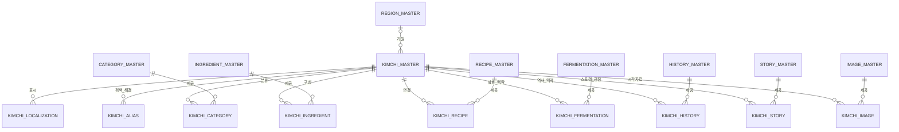

# KIMCHI_MASTER_SPEC

**버전:** 2.0  
**상태:** 검토용 신규 개정본  
**소유:** YM-LAB  
**기준 언어:** 한국어  
**작성일:** 2026-07-20

## 1. Purpose

`KIMCHI_MASTER`는 YM-LAB 김치 프로젝트의 핵심 기준 데이터베이스이다. 하나의 레코드는 하나의 독립적인 김치 개념을 의미한다. 예를 들어 배추김치, 깍두기, 지역성이 명확한 김치 변형은 각각 별도 김치 개념으로 관리할 수 있다.

`KIMCHI_MASTER`의 목적은 김치 개념을 안정적으로 식별하고, 다른 MASTER 데이터베이스와 일관되게 연결하며, 향후 다국어 콘텐츠, AI 검색, 자동화, API 연동까지 확장 가능한 중심 구조를 제공하는 것이다.

`KIMCHI_MASTER`는 김치의 정체성, 대표 정보, 검증 상태, 운영 상태를 소유한다. 재료, 조리법, 발효, 역사, 스토리, 이미지, 출처, 권리, 상품, 콘텐츠 같은 상세 지식은 각 전문 MASTER가 소유한다. 따라서 `KIMCHI_MASTER`는 상세 지식 저장소가 아니라 김치 개념을 연결하는 Concept Hub이다.

## 2. Scope

### 2.1 포함 범위

- 김치 개념의 고유 ID, 공식 한국어 이름, slug, record type
- 대표 분류, 기원 범위, 표준 지역 연결, 핵심 특징, 기준 요약
- lifecycle, 공개 범위, 검증 상태, 작성자, 수정자, 버전 등 운영 메타데이터
- 다국어 표시명, 별칭, 검색어, AI 검색 준비 상태
- `CATEGORY_MASTER`, `INGREDIENT_MASTER`, `RECIPE_MASTER`, `FERMENTATION_MASTER`, `HISTORY_MASTER`, `STORY_MASTER`, `IMAGE_MASTER`와의 관계 구조
- 향후 `REGION_MASTER`, `SOURCE_MASTER`, `CONTENT_MASTER`, `PRODUCT_MASTER`, `RIGHTS_MASTER`, `EVENT_MASTER` 및 추가 MASTER와 연결할 수 있는 확장 규칙

### 2.2 제외 범위

- 재료의 정확한 분량, 손질법, 조리 단계
- 발효 온도, 기간, 미생물, 산도, 염도 등 세부 측정값
- 역사 서술 전문, 상세 출처, 인용 원문
- 스토리 원고, 블로그 본문, SNS 콘텐츠, 캠페인 문안
- 이미지 파일, 이미지 URL, 이미지 프롬프트, 저작권 상세, 파생 이미지 정보
- 실제 데이터베이스, 스프레드시트, 템플릿, 데이터 파일, API 구현

## 3. Design Principles

1. 하나의 김치 개념은 하나의 레코드로 관리한다. 단순 레시피 차이는 `RECIPE_MASTER`에서 관리하고, 이름, 주재료, 제조 방식, 지역성, 계절성, 문화적 의미가 충분히 다를 때만 새 김치 레코드를 만든다.
2. `KIMCHI_MASTER`는 작고 권위 있게 유지한다. 김치의 정체성, 대표 정보, 검증 상태, 운영 상태만 직접 소유하고 전문 지식은 각 MASTER에 위임한다.
3. 다대다 관계는 반드시 연결 테이블로 관리한다. 여러 재료, 여러 레시피, 여러 이미지, 여러 스토리를 쉼표 목록으로 한 필드에 저장하지 않는다.
4. 한국어를 기준 언어로 삼되 다국어 확장을 전제로 설계한다. 공식 한국어 이름은 필수이며, 번역과 현지화 콘텐츠는 별도 localization 구조에서 관리한다.
5. 검증과 승인 상태를 명확히 기록한다. 검증되지 않은 정보는 작성할 수 있으나, 공개 또는 API 노출은 검증 및 승인된 레코드만 가능하다.
6. 분류와 상태값은 자유 입력보다 controlled vocabulary를 우선한다. 자유 텍스트는 설명과 맥락을 위한 용도로 사용한다.
7. AI 검색은 파생 기능으로 취급한다. AI index, embedding, search document는 승인된 공개 필드에서 재생성 가능해야 하며, 원본 MASTER를 대체하지 않는다.
8. ID는 이름, 언어, 폴더, 분류 변경과 독립적으로 안정적이어야 한다.
9. 삭제보다 비활성화와 보관을 우선한다. 참조 무결성과 과거 콘텐츠 호환성을 위해 공개 이력이 있는 레코드는 물리 삭제하지 않는다.
10. 기존 공개 계약은 가능한 한 유지한다. 필드 추가는 허용하되, 안정화된 ID, table name, field name, enum value의 변경은 migration 계획 없이는 금지한다.

## 4. Database Structure

### 4.1 논리 테이블

| Table | 역할 | Key |
|---|---|---|
| `KIMCHI_MASTER` | 하나의 공식 김치 개념을 관리하는 중심 테이블 | `kimchi_id` |
| `KIMCHI_LOCALIZATION` | 김치 1개와 언어 1개에 대한 표시명과 설명 관리 | (`kimchi_id`, `language_code`) |
| `KIMCHI_ALIAS` | 별칭, 지역명, 옛 이름, 로마자 표기, 검색어 관리 | `alias_id` |
| `KIMCHI_CATEGORY` | 김치와 `CATEGORY_MASTER`의 관계 관리 | (`kimchi_id`, `category_id`, `relation_type`) |
| `KIMCHI_INGREDIENT` | 김치와 `INGREDIENT_MASTER`의 재료 역할 관계 관리 | `kimchi_ingredient_id` |
| `KIMCHI_RECIPE` | 김치와 `RECIPE_MASTER`의 레시피 관계 관리 | `kimchi_recipe_id` |
| `KIMCHI_FERMENTATION` | 김치와 `FERMENTATION_MASTER`의 발효 정보 관계 관리 | `kimchi_fermentation_id` |
| `KIMCHI_HISTORY` | 김치와 `HISTORY_MASTER`의 역사 정보 관계 관리 | `kimchi_history_id` |
| `KIMCHI_STORY` | 김치와 `STORY_MASTER`의 콘텐츠 관점 관계 관리 | `kimchi_story_id` |
| `KIMCHI_IMAGE` | 김치와 `IMAGE_MASTER`의 이미지 관계 관리 | `kimchi_image_id` |

관계형 데이터베이스에서는 각 관계를 별도 junction table로 구현한다. no-code 도구에서는 동일한 필드와 제약을 가진 relation table로 구현할 수 있다. `KIMCHI_MASTER`에는 recipe step, ingredient quantity, fermentation measurement, citation body, image URL, story script를 저장하지 않는다.

### 4.2 레코드 생명주기

| 상태 | 의미 | 다음 허용 상태 |
|---|---|---|
| `draft` | 초안 작성 중 | `in_review`, `archived` |
| `in_review` | 검토 중 | `approved`, `rejected`, `draft` |
| `approved` | 공개 전 승인 완료 | `published`, `draft`, `archived` |
| `published` | 공개 가능 상태 | `archived` |
| `archived` | active 사용 종료 | 없음 |
| `rejected` | 검토 반려 | `draft`, `archived` |

`published` 상태의 레코드는 삭제하지 않고 `archived`로 전환한다. 병합 또는 대체가 필요한 경우 기존 `kimchi_id`는 보존하고 `replacement_kimchi_id`로 후속 레코드를 연결한다.

### 4.3 공개 조건

생성 시에는 Required 값이 `Create`인 필드만 필수이다. 공개 전에는 다음 조건을 모두 만족해야 한다.

- Required 값이 `Publish`인 필드가 모두 입력되어야 한다.
- `verification_status = verified`여야 한다.
- `workflow_status = published`여야 한다.
- `public_visibility = public`이어야 한다.
- 승인된 `ko-KR` localization이 1개 이상 있어야 한다.
- active `primary` category 관계가 정확히 1개 있어야 한다.
- 공개 대상 연결은 active 또는 publishable 상태의 target record만 참조해야 한다.

### 4.4 무결성 규칙

- 모든 FK는 존재하는 대상 레코드만 참조해야 한다.
- 공개 레코드의 FK는 active 또는 publishable 상태인 대상만 참조해야 한다.
- `primary_category_id`는 active `KIMCHI_CATEGORY`의 `relation_type = primary` 대상과 일치해야 한다.
- `default_recipe_id`가 있으면 동일 `recipe_id`가 active `KIMCHI_RECIPE`에도 존재해야 한다.
- `primary_image_id`가 있으면 동일 `image_id`가 active `KIMCHI_IMAGE`에도 존재해야 한다.
- `replacement_kimchi_id`는 자기 자신을 가리킬 수 없으며 순환 참조를 만들 수 없다.
- `archived_at`은 `workflow_status = archived`일 때 필수이며, 그 외 상태에서는 비워둔다.
- `public_visibility = public`은 `workflow_status = published`와 `verification_status = verified`일 때만 허용한다.
- `record_version`은 저장 가능한 변경이 발생할 때마다 증가해야 한다.

### 4.5 삭제 및 수정 정책

- 공개 이력이 없는 `draft` 레코드는 관리자 승인 후 물리 삭제할 수 있다.
- 공개 이력이 있는 레코드는 물리 삭제하지 않고 `archived` 처리한다.
- 잘못 생성된 관계 레코드는 공개 전에는 삭제할 수 있다.
- 공개 이력이 있는 관계 레코드는 삭제보다 `link_status = inactive`를 우선한다.
- `kimchi_id`는 생성 후 변경할 수 없다.
- `canonical_slug`는 공개 전에는 수정할 수 있으나, 공개 후에는 compatibility 영향 검토 후 수정한다.
- `canonical_name_ko` 변경은 이름 정정과 개념 변경을 구분해야 한다. 개념이 달라지는 경우 기존 레코드 수정이 아니라 새 `kimchi_id` 생성 또는 병합 절차를 검토한다.

## 5. Field Definitions

### 5.1 `KIMCHI_MASTER`

| Field Name | Type / Format | Required | 목적 및 규칙 |
|---|---|---:|---|
| `kimchi_id` | string, `KIM-######` | Create | 모든 내부 및 외부 참조에 사용하는 불변 기본 ID이다. |
| `canonical_name_ko` | Unicode text | Create | 김치 개념을 식별하는 공식 한국어 이름이다. 번역 표시명이 아니다. |
| `canonical_slug` | lowercase ASCII slug | Create | URL과 API에 사용할 수 있는 안정적인 slug이다. 공개 후 자동 변경하지 않는다. |
| `record_type` | enum: `kimchi` | Create | 이 테이블이 김치 개념만 포함하도록 보장하고, 향후 food concept 확장 가능성을 남긴다. |
| `kimchi_family_code` | controlled code | Publish | 배추류, 무류, 잎채소류, 물김치류 등 큰 계열을 나타낸다. 실제 vocabulary는 `CATEGORY_MASTER`가 관리한다. |
| `primary_category_id` | FK to `CATEGORY_MASTER` | Publish | 대표 탐색 카테고리이다. 반드시 `KIMCHI_CATEGORY`의 active `primary` 관계와 일치해야 한다. |
| `origin_scope_code` | enum: `national`, `regional`, `local`, `household`, `unknown` | Create | 기원 정보를 어느 범위까지 주장할 수 있는지 나타낸다. 근거 없는 세부 지역 단정을 방지한다. |
| `origin_region_id` | FK to future `REGION_MASTER` | Optional | 근거가 있는 경우 표준 지역을 연결한다. 불명확하거나 해당 없음이면 비워둔다. |
| `distinguishing_feature_ko` | short Unicode text | Publish | 이 김치를 구별하는 핵심 특징을 한국어로 짧게 설명한다. 검증되지 않은 홍보 문구를 넣지 않는다. |
| `canonical_summary_ko` | plain Unicode text | Publish | 기본 표시와 AI 검색에 사용할 검토된 한국어 요약이다. 다른 언어 요약은 `KIMCHI_LOCALIZATION`에서 관리한다. |
| `default_recipe_id` | FK to `RECIPE_MASTER` | Optional | 대표 레시피를 가리키는 편의 포인터이다. 반드시 `KIMCHI_RECIPE`에도 연결되어야 한다. |
| `primary_image_id` | FK to `IMAGE_MASTER` | Optional | 대표 이미지를 가리키는 편의 포인터이다. 권리, 파일, 프롬프트 정보는 `IMAGE_MASTER`가 소유한다. |
| `representative_flag` | boolean | Create | 입문용 또는 대표 콘텐츠에 사용할 수 있는 김치인지 표시한다. 문화적 우열을 뜻하지 않는다. |
| `verification_status` | enum: `unverified`, `researching`, `verified`, `disputed` | Create | 사실 검증 상태이다. 공개는 `verified` 상태에서만 가능하다. |
| `evidence_summary` | short text | Optional | 근거의 요약과 한계를 기록한다. 상세 출처는 `HISTORY_MASTER` 또는 향후 `SOURCE_MASTER`에서 관리한다. |
| `workflow_status` | enum: `draft`, `in_review`, `approved`, `published`, `archived`, `rejected` | Create | 작성, 검토, 승인, 공개, 보관 상태를 제어한다. 기본값은 `draft`이다. |
| `public_visibility` | enum: `private`, `internal`, `public` | Create | 노출 범위를 나타낸다. `public`은 `published`와 `verified`를 필요로 한다. |
| `search_keywords` | normalized keyword collection | Optional | 별칭으로 처리하기 어려운 편집 승인 검색어이다. 검색 개선에 사용한다. |
| `ai_index_status` | enum: `not_queued`, `queued`, `indexed`, `stale`, `error` | Create | AI 검색용 파생 문서 또는 embedding의 운영 상태이다. 편집 승인 상태가 아니다. |
| `ai_indexed_at` | ISO 8601 UTC timestamp | Optional | 현재 승인된 공개 표현이 마지막으로 AI index에 반영된 시각이다. |
| `content_updated_at` | ISO 8601 UTC timestamp | Create | 공개 콘텐츠에 영향을 주는 마지막 변경 시각이다. 재색인과 API cache invalidation 기준으로 사용한다. |
| `created_at` | ISO 8601 UTC timestamp | Create | 레코드 생성 시각이다. |
| `created_by` | user/service identifier | Create | 레코드를 생성한 사람 또는 서비스이다. |
| `updated_at` | ISO 8601 UTC timestamp | Create | 마지막 수정 시각이다. |
| `updated_by` | user/service identifier | Create | 마지막으로 수정한 사람 또는 서비스이다. |
| `record_version` | positive integer | Create | 동시 수정 충돌 방지를 위한 버전이다. 저장될 때마다 증가한다. |
| `archived_at` | ISO 8601 UTC timestamp | Optional | 레코드가 active 사용에서 제외된 시각이다. `workflow_status = archived`일 때 필수이다. |
| `replacement_kimchi_id` | self-FK to `KIMCHI_MASTER` | Optional | 병합 또는 대체된 경우 후속 김치 레코드를 연결한다. 단순 이름 변경에는 사용하지 않는다. |
| `internal_note` | private text | Optional | 내부 편집 메모이다. 공개 API, 검색 문서, AI prompt에는 포함하지 않는다. |

### 5.2 `KIMCHI_LOCALIZATION`

| Field Name | Type / Format | Required | 목적 및 규칙 |
|---|---|---:|---|
| `kimchi_id` | FK to `KIMCHI_MASTER` | Create | 현지화 대상 김치이다. |
| `language_code` | BCP 47 tag | Create | 언어 및 locale 코드이다. 예: `ko-KR`, `en`, `ja`. |
| `localized_name` | Unicode text | Create | 해당 언어에서 사용자에게 보여줄 승인된 이름이다. |
| `romanized_name` | Latin text | Optional | 로마자 표기 또는 문서화된 음역이다. 현지화 이름을 대체하지 않는다. |
| `localized_slug` | lowercase ASCII slug | Optional | 언어별 URL segment이다. 통합 기준 키는 여전히 `canonical_slug`이다. |
| `short_description` | plain Unicode text | Publish | 카드, 검색 결과, API summary에 사용할 짧은 설명이다. |
| `long_description` | plain Unicode text | Optional | 확장 설명이다. 상세 출처와 긴 서사는 각 소유 MASTER에서 관리한다. |
| `localization_status` | enum: `draft`, `reviewed`, `approved` | Create | 번역 및 검토 상태이다. 공개 출력은 `approved`만 가능하다. |
| `translated_by` | user/service identifier | Optional | 현지화 초안을 만든 사람 또는 서비스이다. |
| `reviewed_by` | user identifier | Optional | 언어와 문화적 적절성을 검토한 사람이다. `approved` 상태에서는 필수이다. |
| `updated_at` | ISO 8601 UTC timestamp | Create | localization 레코드의 마지막 수정 시각이다. |

### 5.3 `KIMCHI_ALIAS`

| Field Name | Type / Format | Required | 목적 및 규칙 |
|---|---|---:|---|
| `alias_id` | string, `KAL-######` | Create | 별칭 레코드의 불변 ID이다. |
| `kimchi_id` | FK to `KIMCHI_MASTER` | Create | 별칭이 연결되는 김치이다. |
| `language_code` | BCP 47 tag | Create | 별칭의 언어 코드이다. |
| `alias_text` | Unicode text | Create | 다른 이름, 지역명, 옛 이름, 철자 변형, 로마자 표기, 검색어이다. |
| `normalized_alias` | normalized text | Create | 중복 확인과 정확 검색을 위한 정규화 값이다. 표시용 값은 `alias_text`를 사용한다. |
| `alias_type` | enum: `alternate_name`, `regional_name`, `historical_name`, `spelling`, `romanization`, `search_term` | Create | 이 별칭이 유효한 이유를 나타낸다. |
| `source_note` | short text or source ID | Optional | 모호하거나 역사적인 별칭의 근거를 기록한다. |
| `status` | enum: `active`, `deprecated` | Create | 과거 표현을 검색 가능하게 보존하되 현재 이름처럼 표시하지 않기 위한 상태이다. |

### 5.4 MASTER 간 연결 필드

모든 연결 테이블은 아래 공통 필드를 가진다. `kimchi_id`와 대상 MASTER ID는 필수이다. 공개 가능한 연결은 active 또는 publishable 상태의 대상 레코드만 참조해야 한다.

| Common Field | Type / Format | Required | 목적 및 규칙 |
|---|---|---:|---|
| junction ID | master-specific immutable ID | Create | 연결 레코드의 기본 ID이다. ID prefix는 8장을 따른다. |
| `kimchi_id` | FK to `KIMCHI_MASTER` | Create | 중심 김치 레코드이다. |
| target master ID | FK to target MASTER | Create | 연결되는 전문 MASTER 레코드이다. |
| `relation_type` | table-specific controlled code | Create | 관계의 의미이다. 자유 입력 관계명은 사용하지 않는다. |
| `display_order` | non-negative integer | Create | API와 콘텐츠 표시 순서이다. 기본값은 `0`이다. |
| `link_status` | enum: `active`, `inactive` | Create | 관계를 삭제하지 않고 비활성화하기 위한 상태이다. |
| `evidence_note` | short text or source ID | Optional | 관계의 근거 또는 설명이다. |
| `created_at` / `updated_at` | ISO 8601 UTC timestamps | Create | 연결 레코드의 생성 및 수정 시각이다. |

| Junction Table | Target ID | Allowed `relation_type` | 추가 필수 필드 | 관계 규칙 |
|---|---|---|---|---|
| `KIMCHI_CATEGORY` | `category_id` | `primary`, `secondary`, `audience`, `seasonal`, `occasion` | 없음 | 공개 가능한 레코드는 active `primary` 관계가 정확히 1개여야 하며 `primary_category_id`와 일치해야 한다. |
| `KIMCHI_INGREDIENT` | `ingredient_id` | `base`, `main`, `seasoning`, `aromatic`, `seafood`, `liquid`, `garnish` | `importance_rank` | 재료 구성은 레시피마다 달라질 수 있으므로 수량이 아니라 개념상 역할을 연결한다. |
| `KIMCHI_RECIPE` | `recipe_id` | `canonical`, `traditional`, `regional`, `modern`, `vegan`, `quick`, `reference` | `applicability_note` | 하나의 김치는 여러 레시피를 가질 수 있다. optional `canonical` 관계는 `default_recipe_id`와 맞출 수 있다. |
| `KIMCHI_FERMENTATION` | `fermentation_id` | `typical`, `traditional`, `regional`, `alternative`, `reference` | `applicability_note` | 온도와 기간 같은 조건값은 `FERMENTATION_MASTER`가 소유한다. |
| `KIMCHI_HISTORY` | `history_id` | `origin`, `timeline`, `regional`, `ingredient_history`, `reference` | `claim_scope` | 역사적 주장과 맥락은 근거를 가진 `HISTORY_MASTER` 레코드와 연결한다. |
| `KIMCHI_STORY` | `story_id` | `primary`, `cultural`, `human`, `seasonal`, `learning`, `campaign` | `audience_code` | 스토리는 콘텐츠 관점을 제공하며 김치의 공식 정체성을 재정의하지 않는다. |
| `KIMCHI_IMAGE` | `image_id` | `hero`, `thumbnail`, `process`, `ingredient`, `regional`, `archive`, `reference` | `alt_text` | 이미지 권리, 파일 위치, 프롬프트, 파생 이미지는 `IMAGE_MASTER`가 소유한다. |

### 5.5 향후 MASTER 확장 계약

새 MASTER를 추가할 때는 `KIMCHI_MASTER`에 도메인별 컬럼을 계속 추가하지 않는다. 대신 `KIMCHI_<DOMAIN>` 형식의 전용 연결 테이블을 만든다. 이 연결 테이블은 공통 연결 필드를 따르고, 해당 도메인에 맞는 `relation_type` controlled vocabulary를 정의한다.

예상 확장 대상은 `REGION_MASTER`, `SOURCE_MASTER`, `TAG_MASTER`, `NUTRITION_MASTER`, `ALLERGEN_MASTER`, `CONTENT_MASTER`, `PRODUCT_MASTER`, `EVENT_MASTER`, `RIGHTS_MASTER`이다.

### 5.6 유일성 및 검증 규칙

| 대상 | 규칙 |
|---|---|
| `kimchi_id` | 전역 유일, 불변, 재사용 금지 |
| `canonical_slug` | `KIMCHI_MASTER` 내 유일 |
| `canonical_name_ko` | 단독 유일값으로 강제하지 않으며, 중복 후보 검토 기준으로 사용 |
| (`kimchi_id`, `language_code`) | `KIMCHI_LOCALIZATION`에서 유일 |
| (`kimchi_id`, `normalized_alias`, `language_code`) | active alias 기준 유일 권장 |
| (`kimchi_id`, `category_id`, `relation_type`) | active category 관계 기준 유일 |
| `primary` category | publishable record당 active 관계 정확히 1개 |

## 6. Relationship Diagram

`KIMCHI_MASTER`는 모든 정보를 직접 소유하는 테이블이 아니라 김치 개념을 식별하고 전문 MASTER를 연결하는 허브이다. 한 재료는 여러 김치에 연결될 수 있고, 하나의 김치는 여러 재료, 레시피, 발효 정보, 역사 기록, 스토리, 이미지를 가질 수 있다.

## 7. Naming Rules

- 테이블명은 uppercase `SNAKE_CASE`를 사용한다.
- 필드명은 영어 `snake_case`를 사용한다.
- ID와 foreign key는 `*_id`를 사용한다.
- controlled vocabulary 값은 `*_code`를 사용한다.
- timestamp는 `*_at`를 사용하며 ISO 8601 UTC 형식을 따른다.
- boolean은 `*_flag`를 사용한다.
- workflow나 운영 상태는 `*_status`를 사용한다.
- 기술 식별자에는 영문, 숫자, underscore만 사용한다.
- 공식 한국어 이름은 자연스러운 한국어 표기를 사용한다. 다른 표기와 띄어쓰기 변형은 `KIMCHI_ALIAS`에서 관리한다.
- 언어 코드는 BCP 47 형식을 사용한다. 예: `ko-KR`, `en`, `en-US`, `ja`.
- slug는 lowercase ASCII와 hyphen만 사용한다. 예: `baechu-kimchi`.
- MASTER field에는 HTML이 아닌 plain text를 저장한다.
- enum value는 lowercase ASCII를 사용하며, 기존 value는 migration 없이 변경하지 않는다.
- `canonical`, `primary`, `default`는 서로 구분해서 사용한다. `canonical`은 권위 있는 기준, `primary`는 대표 관계, `default`는 편의 포인터를 의미한다.

## 8. ID Rules

| Entity | Pattern | Example | 규칙 |
|---|---|---|---|
| Kimchi | `KIM-######` | `KIM-000001` | 순차 발급, zero-padding, 불변, 재사용 금지 |
| Kimchi alias | `KAL-######` | `KAL-000001` | 별칭마다 별도 불변 ID 부여 |
| Kimchi ingredient link | `KIG-######` | `KIG-000001` | 재료 연결 레코드 ID |
| Kimchi recipe link | `KRC-######` | `KRC-000001` | 레시피 연결 레코드 ID |
| Kimchi fermentation link | `KFM-######` | `KFM-000001` | 발효 정보 연결 레코드 ID |
| Kimchi history link | `KHS-######` | `KHS-000001` | 역사 정보 연결 레코드 ID |
| Kimchi story link | `KST-######` | `KST-000001` | 스토리 연결 레코드 ID |
| Kimchi image link | `KIM-IMG-######` | `KIM-IMG-000001` | 이미지 연결 레코드 ID |
| Kimchi category link | composite | `KIM-000001 / CAT-000010 / primary` | 김치, 카테고리, 관계 유형 조합당 active 레코드 1개 |

- ID에는 카테고리, 지역, 언어, 날짜, 이름을 넣지 않는다.
- ID는 레코드가 확정 저장된 뒤 발급한다. 중간 번호 누락은 허용하지만 재사용은 금지한다.
- 외부 서비스 ID는 향후 `EXTERNAL_IDENTIFIER` 구조에서 관리하고 `kimchi_id`를 대체하지 않는다.
- 병합 시 기존 레코드는 `archived` 처리하고 `replacement_kimchi_id`를 채운다.
- 공개 이력이 있는 ID는 물리 삭제하지 않는다.
- ID 발급 방식이 순차형에서 UUID 또는 ULID로 변경될 경우 기존 ID는 유지하고 신규 ID 정책만 별도 migration 문서에서 정의한다.

## 9. Future Expansion Strategy

### 9.1 확장 가능한 데이터 모델

`KIMCHI_MASTER`는 김치 정체성의 중심만 유지하고, 도메인별 세부 정보는 별도 MASTER와 연결 테이블로 확장한다. 이렇게 하면 레시피, 이미지, 연구 자료, 상품 정보가 늘어나도 핵심 김치 ID는 안정적으로 유지된다.

### 9.2 다국어 전략

프로젝트의 기준 언어는 한국어이다. `ko-KR` localization을 기준으로 관리하고, 다른 언어는 Translation Layer 또는 `KIMCHI_LOCALIZATION`에서 별도로 승인한다. AI 번역은 초안 작성에만 사용할 수 있으며, 공개에는 사람의 검토와 승인이 필요하다.

### 9.3 AI 검색 및 자동화

AI 검색 문서는 승인된 공개 필드, 승인된 localization, active alias, 공개 가능한 연결 요약을 기반으로 생성한다. embedding, chunk ID, model name, job log는 editorial master 안에 저장하지 않고 별도 검색/index 서비스에서 관리한다.

`content_updated_at` 또는 주요 연결 관계가 변경되면 `ai_index_status = stale`로 변경하고 재색인을 요청한다. 자동화는 키워드, 별칭, 요약, 번역 초안, 관계 후보, QA flag를 제안할 수 있지만 검증 상태 변경, 공개 승인, 번역 승인, 이미지 권리 승인은 사람이 수행해야 한다.

### 9.4 API 연동 준비

향후 API는 `/v1/kimchi/{kimchi_id}` 또는 `/v1/kimchi/{canonical_slug}`처럼 versioned endpoint로 제공할 수 있다. public API에는 안정적인 ID, locale별 표시 필드, relation type, `record_version`, `content_updated_at`, `verification_status`를 포함한다. `internal_note`, draft localization, inactive link, 비공개 정보는 제외한다.

### 9.5 migration 및 compatibility

- 새 optional field는 backward compatible change로 취급한다.
- 기존 required field, ID pattern, enum value, table name 변경은 breaking change로 취급한다.
- breaking change가 필요한 경우 migration note, affected field, old value, new value, migration rule, rollback rule을 문서화해야 한다.
- 공개 API 또는 자동화가 참조하는 field는 최소 1개 버전 동안 deprecated 상태로 병행 제공한다.
- `canonical_slug` 변경은 가능하면 피하고, 필요한 경우 redirect 또는 alias mapping을 별도 구조에서 관리한다.
- 신규 MASTER 추가는 기존 `KIMCHI_MASTER` field를 늘리는 방식보다 `KIMCHI_<DOMAIN>` junction table 추가를 우선한다.

### 9.6 향후 MASTER 연결 기준

| Future MASTER | 연결 방식 | `KIMCHI_MASTER`에 직접 저장하지 않을 정보 |
|---|---|---|
| `REGION_MASTER` | `origin_region_id` 또는 `KIMCHI_REGION` | 지역 계층, 좌표, 행정구역 이력 |
| `SOURCE_MASTER` | `KIMCHI_SOURCE` | 출처 원문, 인용, URL, 접근일 |
| `CONTENT_MASTER` | `KIMCHI_CONTENT` | 블로그, SNS, 영상 스크립트 전문 |
| `PRODUCT_MASTER` | `KIMCHI_PRODUCT` | 상품명, 가격, 판매처, 재고 |
| `RIGHTS_MASTER` | `KIMCHI_RIGHTS` 또는 IMAGE 연계 | 저작권 계약, 라이선스, 사용 제한 |
| `EVENT_MASTER` | `KIMCHI_EVENT` | 행사 일정, 캠페인 운영 정보 |

## 10. QA Checklist

- [ ] 파일명이 승인된 SPEC 파일명인지 확인한다.
- [ ] 하나의 레코드가 하나의 김치 개념만 의미하는지 확인한다.
- [ ] `KIMCHI_MASTER`에 도메인별 상세 지식이 들어가지 않았는지 확인한다.
- [ ] 공개 가능한 레코드에 active `primary` category가 정확히 1개 있는지 확인한다.
- [ ] `primary_category_id`와 `KIMCHI_CATEGORY`의 `primary` 관계가 일치하는지 확인한다.
- [ ] 다대다 관계를 단일 필드의 쉼표 목록으로 저장하지 않았는지 확인한다.
- [ ] 모든 ID가 정해진 prefix와 format을 따르는지 확인한다.
- [ ] ID가 재사용되지 않았는지 확인한다.
- [ ] FK가 존재하고 active 또는 publishable 상태인 대상만 참조하는지 확인한다.
- [ ] `Create` 필수 필드가 생성 시점에 모두 입력되었는지 확인한다.
- [ ] `Publish` 필수 필드가 공개 전 모두 입력되었는지 확인한다.
- [ ] `ko-KR` 기준 localization이 존재하는지 확인한다.
- [ ] 공개 localization의 `localization_status`가 `approved`인지 확인한다.
- [ ] 별칭에 `language_code`, `alias_type`, `normalized_alias`가 있는지 확인한다.
- [ ] 사실 정보가 검증되었고 필요한 근거 MASTER와 연결되었는지 확인한다.
- [ ] 검토되지 않은 AI 결과가 `verified`, `approved`, `public`으로 표시되지 않았는지 확인한다.
- [ ] public API 대상 필드에 내부 메모나 비공개 정보가 포함되지 않았는지 확인한다.
- [ ] 모든 연결 대상 MASTER 레코드가 active이고 유효한지 확인한다.
- [ ] public image 연결에 권리 상태와 `alt_text`가 있는지 확인한다.
- [ ] 콘텐츠 변경 시 `ai_index_status`가 `stale`로 전환되는지 확인한다.
- [ ] `record_version`, timestamp, actor field가 최신 상태인지 확인한다.
- [ ] breaking change가 필요한 경우 migration 및 compatibility note가 작성되었는지 확인한다.
- [ ] 검토와 승인 전에는 database, spreadsheet, template, data file을 생성하지 않았는지 확인한다.
