# 글로벌 김치 AI 지식 플랫폼 (Global Kimchi AI Knowledge Platform)
## Crow's Foot ERD (Entity Relationship Diagram) 명세서

```
Status      : FROZEN
Version     : 1.0.0
Owner       : YM-LAB
Approved By : Architecture Review
Date        : 2026-07-20
```

---

### 1. 개요 및 Cardinality 범례

본 문서는 **Architecture Freeze v1.0.0**에 의거하여 정립된 데이터베이스 엔티티 간 관계를 **Crow's Foot 표기법**으로 가시화한 명세서입니다.

#### Cardinality Legend (Crow's Foot 표기 규칙)
- `||--||` : Exactly One (1대 1)
- `||--o{` : Zero or Many (1대 N 필수 참조)
- `|o--o{` : Zero or Many (1대 N 옵션 참조)
- `}|--|{` : Many to Many (N대 M 관계)

---

### 2. 전체 데이터베이스 Crow's Foot ERD

```mermaid
erDiagram
    %% ==========================================
    %% 1. CORE META & MASTER DOMAIN (SSOT)
    %% ==========================================
    LANGUAGE_MASTER {
        varchar language_code PK
        varchar language_name_en
        varchar language_name_native
        boolean is_active
    }

    COUNTRY_MASTER {
        varchar country_code PK
        varchar country_name_en
        varchar default_language_code FK
    }

    LICENSE_MASTER {
        uuid license_id PK
        varchar license_code
        varchar license_name
        boolean commercial_use_allowed
    }

    AUTHOR_MASTER {
        uuid author_id PK
        varchar author_code
        varchar author_name
        varchar persona_type
        text writing_style_prompt
    }

    SOURCE_MASTER {
        uuid source_id PK
        varchar source_title
        varchar author_or_editor
        varchar source_type
        text citation_text
    }

    TAG_MASTER {
        uuid tag_id PK
        varchar tag_slug
        varchar tag_category
    }

    CATEGORY_MASTER {
        uuid category_id PK
        varchar category_code
        uuid parent_category_id FK
    }

    NUTRITION_MASTER {
        uuid nutrition_id PK
        numeric calories_kcal
        numeric sodium_mg
        bigint lactic_acid_bacteria_cfu_g
    }

    KIMCHI_MASTER {
        uuid kimchi_id PK
        varchar kimchi_code
        uuid category_id FK
        uuid nutrition_id FK
        int spiciness_level
        int salinity_level
        varchar seasonality
    }

    INGREDIENT_MASTER {
        uuid ingredient_id PK
        varchar ingredient_code
        varchar ingredient_type
        varchar scientific_name
    }

    RECIPE_MASTER {
        uuid recipe_id PK
        varchar recipe_code
        uuid kimchi_id FK
        varchar difficulty_level
        int preparation_time_minutes
    }

    FERMENTATION_MASTER {
        uuid fermentation_id PK
        uuid recipe_id FK
        varchar stage_name
        numeric ideal_temperature_celsius
        varchar dominant_bacteria
    }

    HISTORY_MASTER {
        uuid history_id PK
        uuid kimchi_id FK
        uuid source_id FK
        varchar era_code
        int historical_year_start
    }

    IMAGE_MASTER {
        uuid image_id PK
        varchar image_code
        text original_url
        uuid license_id FK
    }

    PAIRING_MASTER {
        uuid pairing_id PK
        uuid kimchi_id FK
        varchar paired_item_name_en
        varchar pairing_category
    }

    %% ==========================================
    %% 2. I18N TABLES (Multilingual Extension)
    %% ==========================================
    KIMCHI_MASTER_I18N {
        uuid kimchi_id PK,FK
        varchar language_code PK,FK
        varchar name
        text summary
    }

    HISTORY_MASTER_I18N {
        uuid history_id PK,FK
        varchar language_code PK,FK
        varchar title
        text historical_summary
    }

    RECIPE_STEP_I18N {
        uuid step_id PK
        uuid recipe_id FK
        int step_number
        varchar language_code FK
        text instruction
    }

    CATEGORY_MASTER_I18N {
        uuid category_id PK,FK
        varchar language_code PK,FK
        varchar category_name
    }

    INGREDIENT_MASTER_I18N {
        uuid ingredient_id PK,FK
        varchar language_code PK,FK
        varchar name
        text substitution_tip
    }

    TAG_MASTER_I18N {
        uuid tag_id PK,FK
        varchar language_code PK,FK
        varchar translated_tag_name
    }

    %% ==========================================
    %% 3. REFERENCE (JUNCTION) TABLES
    %% ==========================================
    KIMCHI_INGREDIENT_REF {
        uuid kimchi_id PK,FK
        uuid ingredient_id PK,FK
        varchar ingredient_role
        numeric standard_ratio_percent
    }

    CONTENT_KIMCHI_REF {
        uuid content_id PK,FK
        uuid kimchi_id PK,FK
    }

    CONTENT_RECIPE_REF {
        uuid content_id PK,FK
        uuid recipe_id PK,FK
    }

    CONTENT_HISTORY_REF {
        uuid content_id PK,FK
        uuid history_id PK,FK
    }

    CONTENT_IMAGE_REF {
        uuid content_id PK,FK
        uuid image_id PK,FK
        int display_order
        varchar caption_override
    }

    %% ==========================================
    %% 4. AI_ENGINE CONFIGURATION LAYER
    %% ==========================================
    AI_ENGINE_TEMPLATE {
        uuid template_id PK
        varchar template_code
        varchar target_channel
        text system_prompt
        text user_prompt_template
        jsonb output_schema
    }

    %% ==========================================
    %% 5. CONTENT DOMAIN & LOGS
    %% ==========================================
    CONTENT_MASTER {
        uuid content_id PK
        varchar content_type
        varchar title
        varchar language_code FK
        varchar target_country_code FK
        uuid author_id FK
        uuid template_id FK
        varchar status
        int version
    }

    CONTENT_BODY {
        uuid content_id PK,FK
        text body_markdown
        text body_html
        text audio_script
        varchar seo_title
    }

    CONTENT_GENERATION_LOG {
        uuid log_id PK
        uuid content_id FK
        varchar model_name
        text prompt_snapshot
        jsonb token_usage
    }

    PUBLISHING_LOG {
        uuid publishing_id PK
        uuid content_id FK
        varchar channel_name
        varchar external_post_id
        text external_url
        varchar publish_status
    }

    %% ==========================================
    %% 6. RELATIONSHIPS & CARDINALITY
    %% ==========================================
    LANGUAGE_MASTER ||--o{ COUNTRY_MASTER : "default_language"
    LICENSE_MASTER ||--o{ IMAGE_MASTER : "licenses"
    SOURCE_MASTER ||--o{ HISTORY_MASTER : "cited_in"
    
    CATEGORY_MASTER ||--o{ KIMCHI_MASTER : "categorizes"
    CATEGORY_MASTER ||--o{ CATEGORY_MASTER : "parent_category"
    NUTRITION_MASTER ||--o{ KIMCHI_MASTER : "nutrition_facts"

    KIMCHI_MASTER ||--o{ KIMCHI_MASTER_I18N : "translated_in"
    KIMCHI_MASTER ||--o{ RECIPE_MASTER : "cooked_by"
    KIMCHI_MASTER ||--o{ HISTORY_MASTER : "historical_origin"
    KIMCHI_MASTER ||--o{ PAIRING_MASTER : "pairs_with"

    KIMCHI_MASTER ||--o{ KIMCHI_INGREDIENT_REF : "contains"
    INGREDIENT_MASTER ||--o{ KIMCHI_INGREDIENT_REF : "used_in"
    INGREDIENT_MASTER ||--o{ INGREDIENT_MASTER_I18N : "translated_in"

    RECIPE_MASTER ||--o{ FERMENTATION_MASTER : "defines_fermentation"
    RECIPE_MASTER ||--o{ RECIPE_STEP_I18N : "has_steps"

    HISTORY_MASTER ||--o{ HISTORY_MASTER_I18N : "translated_in"
    CATEGORY_MASTER ||--o{ CATEGORY_MASTER_I18N : "translated_in"
    TAG_MASTER ||--o{ TAG_MASTER_I18N : "translated_in"

    AUTHOR_MASTER ||--o{ CONTENT_MASTER : "authors"
    LANGUAGE_MASTER ||--o{ CONTENT_MASTER : "written_in"
    COUNTRY_MASTER ||--o{ CONTENT_MASTER : "targeted_for"
    AI_ENGINE_TEMPLATE ||--o{ CONTENT_MASTER : "configures"

    CONTENT_MASTER ||--|| CONTENT_BODY : "has_body"
    CONTENT_MASTER ||--o{ CONTENT_GENERATION_LOG : "generates_logs"
    CONTENT_MASTER ||--o{ PUBLISHING_LOG : "publishes_to"

    CONTENT_MASTER ||--o{ CONTENT_KIMCHI_REF : "references_kimchi"
    KIMCHI_MASTER ||--o{ CONTENT_KIMCHI_REF : "referenced_in_content"

    CONTENT_MASTER ||--o{ CONTENT_RECIPE_REF : "references_recipe"
    RECIPE_MASTER ||--o{ CONTENT_RECIPE_REF : "referenced_in_content"

    CONTENT_MASTER ||--o{ CONTENT_HISTORY_REF : "references_history"
    HISTORY_MASTER ||--o{ CONTENT_HISTORY_REF : "referenced_in_content"

    CONTENT_MASTER ||--o{ CONTENT_IMAGE_REF : "references_image"
    IMAGE_MASTER ||--o{ CONTENT_IMAGE_REF : "referenced_in_content"
```



---

### 3. 도메인별 ERD 하이라이트

#### 3.1 SSOT Core Master & I18N Extension
- `KIMCHI_MASTER` 1 : N `KIMCHI_MASTER_I18N`
- `HISTORY_MASTER` 1 : N `HISTORY_MASTER_I18N`
- `INGREDIENT_MASTER` 1 : N `INGREDIENT_MASTER_I18N`
- **핵심**: Master 식별 키(UUID)를 기준 삼아 언어별 텍스트 데이터만 격리 수평 확장.

#### 3.2 Explicit Junction Reference Architecture
- `CONTENT_MASTER` N : M `KIMCHI_MASTER` via `CONTENT_KIMCHI_REF`
- `CONTENT_MASTER` N : M `RECIPE_MASTER` via `CONTENT_RECIPE_REF`
- `CONTENT_MASTER` N : M `HISTORY_MASTER` via `CONTENT_HISTORY_REF`
- `CONTENT_MASTER` N : M `IMAGE_MASTER` via `CONTENT_IMAGE_REF`
- **핵심**: Generic Polymorphic FK 무결성 손실을 방지하기 위해 RDBMS 수준 Foreign Key 제약 조건이 걸린 명시적 참조 테이블 배치.
