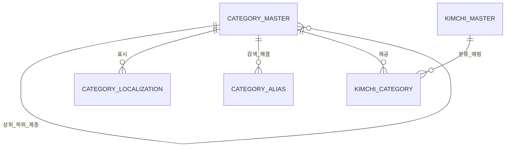

# CATEGORY_MASTER_SPEC

**버전:** 1.0  
**상태:** 정식 기술 사양서 (Release Ready)  
**소유:** YM-LAB  
**최종 검토:** 2026-07-20  

## 1. 목적 (Purpose)

본 사양서는 YM-LAB 김치 지식 플랫폼의 핵심 분류 계층 및 범주형 어휘(Taxonomy & Controlled Vocabulary)를 관리하는 `CATEGORY_MASTER` 데이터베이스의 기술 규격을 정의한다.

`CATEGORY_MASTER`는 다음 표준 역할을 수행하여야 한다 (MUST).
1. 김치 지식 플랫폼 전체에서 사용되는 카테고리 개념의 고유 식별 및 정체성 정의
2. 계통, 주재료 계열, 제조 방식, 기원 지역, 계절, 용도별 분류 계층 구조(Hierarchy) 관리
3. `KIMCHI_MASTER`를 포함한 타 MASTER 데이터베이스에 표준 통제 어휘(Controlled Vocabulary) 제공

## 2. 범위 (Scope)

### 2.1 포함 범위 (In-Scope)
본 사양서는 다음 항목의 데이터 규격 및 제약 조건을 규정한다 (SHALL).
- 카테고리 고유 식별자(`category_id`), 대표 명칭(`canonical_name_ko`), URL slug 및 계층 구조(`parent_category_id`, `depth_level`) 관리
- 카테고리 유형 분류(`category_type_code`), 정렬 순서(`display_order`), 기본 설명 데이터
- 노출 범위(`public_visibility`), 워크플로우 상태(`workflow_status`) 메타데이터
- 다국어 카테고리 표시명(`CATEGORY_LOCALIZATION`) 및 카테고리 검색 별칭(`CATEGORY_ALIAS`)
- `KIMCHI_MASTER`와의 분류 연관 관계(`KIMCHI_CATEGORY` Junction Table) 구조
- 타 도메인 MASTER와의 분류 연동을 위한 표준 카테고리 인터페이스 규격

### 2.2 제외 범위 (Out-of-Scope)
다음 항목은 본 사양서의 범위에서 제외하며, KIMCHI_MASTER가 직접 소유할 수 없다 (MUST NOT).
- 김치 개념 개별 레코드의 정체성 및 대표 정보 (`KIMCHI_MASTER` 소유)
- 식재료 고유 속성 및 재료 분류 체계 (`INGREDIENT_MASTER` 소유)
- 조리 절차 및 조리법 속성 (`RECIPE_MASTER` 소유)
- 분류 대상 레코드의 본문 콘텐츠 및 시각 미디어 자산

## 3. 설계 원칙 (Design Principles)

1. **분류 단위 유일성:** 하나의 레코드는 독립된 하나의 카테고리 개념만 정의하여야 한다 (MUST).
2. **최소 소유권 (Minimal Ownership):** `CATEGORY_MASTER`는 카테고리의 정체성, 계층 구조, 식별자, 정렬 순서, 운영 메타데이터만 직접 소유하여야 한다 (MUST).
3. **단일 소유권 (Single Ownership) & SSOT:** 모든 분류 속성은 오직 `CATEGORY_MASTER`만 소유한다 (SHALL). 타 MASTER에서 카테고리명을 이중 저장하는 것을 금지하며 (MUST NOT), 외래키(FK)와 Junction Table로만 상호 연결하여야 한다 (MUST).
4. **Junction Table 분리:** 타 MASTER와의 다대다(M:N) 매핑은 전용 Junction Table(`KIMCHI_CATEGORY` 등)로 분리하여야 한다 (MUST). 단일 필드 내 다중 카테고리 나열(Comma-separated)을 금지한다 (MUST NOT).
5. **계층 구조 안전성:** 자기 참조 외래키(`parent_category_id`)를 통한 다단계 계층을 지원하되, 순환 참조를 엄격히 금지한다 (MUST NOT).
6. **한국어 기준 및 다국어 확장:** 기준 언어는 한국어(`ko-KR`)로 정의한다 (SHALL). 번역 및 현지화 텍스트는 `CATEGORY_LOCALIZATION`에서 독립 관리하여야 한다 (MUST).
7. **통제된 어휘 (Controlled Vocabulary) 준수:** 카테고리 유형 코드 및 상태값은 임의 텍스트 입력을 금지하며 (MUST NOT), 지정된 Enum/Code 규격을 따라야 한다 (MUST).
8. **불변 식별자 (Immutable ID):** 기본 식별자(`category_id`)는 명칭 및 계층 이동과 독립적으로 영구 유지되어야 한다 (MUST).
9. **소프트 삭제 (Soft Delete):** 사용 이력이 존재하는 카테고리의 물리 삭제를 금지한다 (MUST NOT). 비활성화 시 `workflow_status = archived`로 전이하여야 한다 (MUST).
10. **하위 호환성 (Backward Compatibility):** 식별자, 테이블명, 필드명, Enum 값의 무단 변경을 금지하며 (MUST NOT), 스키마 변경 시 하위 호환성을 보장하여야 한다 (MUST).

### 3.1 데이터 소유권 매트릭스 (Ownership Matrix)

| 정보 영역 (Domain) | 책임 소유자 (Owner MASTER) | 소유 및 관리 범위 |
| :--- | :--- | :--- |
| **Taxonomy (분류 정체성)** | `CATEGORY_MASTER` | `category_id`, 공식 한국어명, slug, 카테고리 유형, 상위 카테고리 ID, depth, 정렬 순서, 운영 메타데이터 |
| **Category Localization** | `CATEGORY_LOCALIZATION` | 언어별 카테고리 표시명, 언어별 요약 설명, 번역 검토 상태 |
| **Category Alias** | `CATEGORY_ALIAS` | 카테고리 동의어, 옛 명칭, 로마자 표기, 검색용 정규화 키워드 |
| **Kimchi Category Relation** | `KIMCHI_CATEGORY` | `KIMCHI_MASTER`와 `CATEGORY_MASTER` 간 관계 매핑 (`primary`, `secondary` 등) |
| **Kimchi Identity** | `KIMCHI_MASTER` | 김치 개별 개념 정체성, 대표 카테고리 FK (`primary_category_id`) |

## 4. 데이터베이스 구조 (Database Structure)

### 4.1 논리 테이블 정의 (Logical Tables)

| Table | 역할 | Primary Key |
|---|---|---|
| `CATEGORY_MASTER` | 카테고리 개념의 정체성 및 계층 구조를 관리하는 중심 테이블 | `category_id` |
| `CATEGORY_LOCALIZATION` | 카테고리의 언어별 표시명 및 설명 관리 | (`category_id`, `language_code`) |
| `CATEGORY_ALIAS` | 카테고리 별칭, 옛 이름, 로마자 표기, 검색어 관리 | `alias_id` |
| `KIMCHI_CATEGORY` | `KIMCHI_MASTER`와의 분류 매핑 Junction Table | (`kimchi_id`, `category_id`, `relation_type`) |

### 4.2 레코드 생명주기 (Lifecycle)

- **전이 순서:** 레코드는 `draft` → `in_review` → `approved` → `published` → `archived` 순서로 전이하여야 한다 (MUST).
- **반려 처리:** `in_review` 단계에서 반려 시 `rejected` 상태로 전이하며, 외부 노출을 금지한다 (MUST NOT).
- **보관 처리:** `published` 레코드는 물리 삭제할 수 없으며 (MUST NOT), `archived` 상태로 전이하여야 한다 (MUST). 카테고리 통합 시 `replacement_category_id`에 대체 식별자를 기재하여야 한다 (MUST).

### 4.3 공개 조건 (Publish Gate)

`public_visibility = public` 설정을 위해 다음 조건 전수를 동시에 충족하여야 한다 (MUST).
1. `Publish` 필수 지정 필드 전수 입력 완료
2. `workflow_status = published`
3. `localization_status = approved`인 `ko-KR` `CATEGORY_LOCALIZATION` 레코드 1개 이상 존재
4. `parent_category_id`가 존재할 경우, 상위 카테고리 역시 `published` 상태여야 함

### 4.4 데이터 무결성 규칙 (Integrity Rules)

- **상위 카테고리 참조 유효성:** `parent_category_id`는 존재하는 active 상태의 `CATEGORY_MASTER` 레코드만 가리켜야 한다 (MUST).
- **순환 참조 금지:** `parent_category_id` 및 `replacement_category_id`는 자기 참조 및 순환 참조를 금지한다 (MUST NOT).
- **Depth 일치성:** 최상위 카테고리의 `depth_level`은 `0`이어야 하며, 하위 카테고리는 `parent.depth_level + 1`과 정확히 일치하여야 한다 (MUST).
- **보관 타임스탬프:** `workflow_status = archived` 전이 시 `archived_at` 타임스탬프 입력은 필수이다 (MUST).

## 5. 필드 명세 (Field Definitions)

### 5.1 `CATEGORY_MASTER`

| Field Name | Type / Format | Required | 제약 및 규격 |
|---|---|---:|---|
| `category_id` | string, `CAT-######` | Create | 기본 키(PK). 영구 불변 고유 식별자. |
| `canonical_name_ko` | Unicode text | Create | 카테고리의 공식 한국어 명칭. |
| `canonical_slug` | lowercase ASCII slug | Create | URL/API용 표준 slug. 공개 후 변경 금지. |
| `category_type_code` | controlled code | Create | 카테고리 유형 코드 (`family`, `method`, `region`, `season`, `occasion` 등). |
| `parent_category_id` | self-FK to `CATEGORY_MASTER` | Optional | 상위 카테고리 FK (최상위 분류 시 NULL). |
| `depth_level` | non-negative integer | Create | 계층 깊이 (최상위 `0`). |
| `display_order` | non-negative integer | Create | 동일 계층 내 표시 순서 (기본값 `0`). |
| `description_ko` | plain Unicode text | Publish | 카테고리에 대한 공식 한국어 설명. |
| `workflow_status` | enum: `draft`, `in_review`, `approved`, `published`, `archived`, `rejected` | Create | Lifecycle 상태. 기본값 `draft`. |
| `public_visibility` | enum: `private`, `internal`, `public` | Create | 외부 노출 범위. `public` 설정 시 [4.3 Publish Gate](#43-공개-조건-publish-gate) 충족 필수. |
| `created_at` | ISO 8601 UTC timestamp | Create | 레코드 생성 시각. |
| `created_by` | user/service identifier | Create | 레코드 생성 주체 식별자. |
| `updated_at` | ISO 8601 UTC timestamp | Create | 레코드 최종 수정 시각. |
| `updated_by` | user/service identifier | Create | 레코드 최종 수정 주체 식별자. |
| `record_version` | positive integer | Create | 낙관적 잠금용 버전 번호. 변경 시 1씩 증가. |
| `archived_at` | ISO 8601 UTC timestamp | Optional | 보관 처리 시각 (`workflow_status = archived` 시 필수). |
| `replacement_category_id` | self-FK to `CATEGORY_MASTER` | Optional | 대체/통합 대상 `category_id` (자기 참조 및 순환 금지). |
| `internal_note` | private text | Optional | 내부 편집 메모 (외부 API 비노출). |

### 5.2 `CATEGORY_LOCALIZATION`

| Field Name | Type / Format | Required | 제약 및 규격 |
|---|---|---:|---|
| `category_id` | FK to `CATEGORY_MASTER` | Create | 대상 카테고리 FK (복합 PK). |
| `language_code` | BCP 47 tag | Create | 언어/로케일 코드 (`ko-KR`, `en`, `ja` 등) (복합 PK). |
| `localized_name` | Unicode text | Create | 승인된 언어별 표시명. |
| `short_description` | plain Unicode text | Publish | 언어별 요약 설명 텍스트. |
| `localization_status` | enum: `draft`, `reviewed`, `approved` | Create | 번역 검토 상태. 서빙 시 `approved` 필수. |
| `translated_by` | user/service identifier | Optional | 번역 생성 주체 식별자. |
| `reviewed_by` | user identifier | Optional | 번역 검수자 식별자 (`approved` 시 필수). |
| `updated_at` | ISO 8601 UTC timestamp | Create | 레코드 최종 수정 시각. |

### 5.3 `CATEGORY_ALIAS`

| Field Name | Type / Format | Required | 제약 및 규격 |
|---|---|---:|---|
| `alias_id` | string, `CTA-######` | Create | 카테고리 별칭 불변 기본 키(PK). |
| `category_id` | FK to `CATEGORY_MASTER` | Create | 연관 카테고리 FK. |
| `language_code` | BCP 47 tag | Create | 별칭 언어 코드. |
| `alias_text` | Unicode text | Create | 동의어, 옛 이름, 음역 텍스트. |
| `normalized_alias` | normalized text | Create | 검색 및 중복 검증용 정규화 텍스트. |
| `alias_type` | enum: `synonym`, `historical_name`, `spelling`, `romanization`, `search_term` | Create | 별칭 유형 구분 Enum. |
| `status` | enum: `active`, `deprecated` | Create | 별칭 사용 상태 Enum. |

### 5.4 Junction Table 규격 (`KIMCHI_CATEGORY`)

`KIMCHI_MASTER`와의 매핑 관계는 아래 규격을 준수하여야 한다 (MUST).

| Common Field | Type / Format | Required | 제약 및 규격 |
|---|---|---:|---|
| `kimchi_id` | FK to `KIMCHI_MASTER` | Create | 중심 김치 FK (복합 PK). |
| `category_id` | FK to `CATEGORY_MASTER` | Create | 연관 카테고리 FK (복합 PK). |
| `relation_type` | controlled code | Create | 관계 유형 (`primary`, `secondary`, `audience`, `seasonal`, `occasion`) (복합 PK). |
| `display_order` | non-negative integer | Create | 표출 순서 (기본값 `0`). |
| `link_status` | enum: `active`, `inactive` | Create | 관계 사용 여부 Enum. |
| `created_at` / `updated_at` | ISO 8601 UTC timestamps | Create | 생성 및 수정 시각. |

## 6. 관계 다이어그램 (Relationship Diagram)

## 7. 명명 규칙 (Naming Rules)

- **테이블명:** 영문 대문자 `SNAKE_CASE`를 적용하여야 한다 (MUST) (`CATEGORY_MASTER`).
- **필드명:** 영문 소문자 `snake_case`를 적용하여야 한다 (MUST) (`category_id`).
- **식별자/외래키:** `*_id` 접미사를 사용하여야 한다 (MUST).
- **통제 어휘 코드:** `*_code` 접미사를 사용하여야 한다 (MUST).
- **타임스탬프:** `*_at` 접미사를 사용하여야 하며 (MUST), ISO 8601 UTC 포맷을 준수하여야 한다 (MUST).
- **언어 코드:** BCP 47 표준을 준수하여야 한다 (MUST) (예: `ko-KR`, `en-US`).
- **Slug:** 영문 소문자 ASCII 및 하이픈(`-`)만 허용한다 (MUST).
- **데이터 포맷:** Plain text 저장을 원칙으로 하며 (MUST), HTML 태그 저장을 금지한다 (MUST NOT).
- **Enum 값:** 영문 소문자 ASCII를 사용하여야 하며 (MUST), 임의 변경을 금지한다 (MUST NOT).

## 8. 식별자 규칙 (ID Rules)

| Entity | Pattern | Example | 규칙 |
|---|---|---|---|
| Category | `CAT-######` | `CAT-000001` | 순차 발급, zero-padding, 불변, 재사용 금지 |
| Category alias | `CTA-######` | `CTA-000001` | 레코드별 불변 PK |
| Kimchi category link | composite | `KIM-000001 / CAT-000010 / primary` | 매핑 조합당 active 레코드 1개 |

- **시맨틱 정보 포함 금지:** ID에 카테고리명, 날짜 등 의미 정보를 포함할 수 없다 (MUST NOT).
- **발급 시점:** 레코드 저장 확정 시 발급하며, 누락 번호의 재사용을 금지한다 (MUST NOT).
- **물리 삭제 금지:** 외부 참조/공개 이력이 있는 ID는 물리 삭제를 금지하고 (MUST NOT), `archived` 상태로 보존하여야 한다 (MUST).

## 9. 미래 확장 전략 (Future Expansion Strategy)

### 9.1 타 MASTER 카테고리 확장
- 본 `CATEGORY_MASTER`는 `KIMCHI_MASTER` 외에도 `INGREDIENT_MASTER`, `RECIPE_MASTER` 등 향후 모든 MASTER의 공통 카테고리 엔진으로 확장하여 활용할 수 있다.

### 9.2 마이그레이션 및 호환성
- **하위 호환 변경:** 선택 필드(Optional field) 추가는 호환 변경으로 처리한다.
- **파괴적 변경 (Breaking Change):** 필수 필드, ID 규격, Enum 값, 테이블명 변경 시 마이그레이션 계획 및 롤백 정책 수립을 의무화한다 (MUST).

## 10. QA 체크리스트 (QA Checklist)

모든 검사 항목은 객관적으로 즉시 검증 가능(Pass/Fail)하여야 한다 (MUST).

- [ ] **[소유성 검증]** 파일명이 `CATEGORY_MASTER_SPEC.md`이며 위치가 `01_PHASE1_KIMCHI/02_CATEGORY_MASTER/`에 존재하는가?
- [ ] **[단일 개념 검증]** 하나의 레코드가 정확히 하나의 카테고리 개념만 정의하고 있는가?
- [ ] **[계층 구조 검증]** `parent_category_id`에 자기 참조 및 순환 참조가 존재하지 않는가?
- [ ] **[Depth 일치 검증]** 최상위 카테고리의 `depth_level`이 0이며, 하위 카테고리가 `parent.depth_level + 1`과 일치하는가?
- [ ] **[Junction Table 검증]** `KIMCHI_MASTER`와의 다대다 매핑이 `KIMCHI_CATEGORY` 연결 테이블로 분리되어 있는가?
- [ ] **[ID 규격 검증]** 모든 PK/FK가 지정된 Prefix 및 6자리 Zero-padding 규칙(`CAT-######` 등)을 준수하는가?
- [ ] **[무결성 검증]** 모든 외래키(FK) 참조 대상 레코드가 실제 존재하며 active/publishable 상태인가?
- [ ] **[Publish Gate 검증]** 공개 카테고리가 `Publish` 필수 필드 입력, `ko-KR` approved localization, `workflow_status = published`, `public_visibility = public` 조건을 충족하는가?
- [ ] **[동시성 검증]** 데이터 수정 시 `record_version` 및 `updated_at` 타임스탬프가 최신화되는가?
