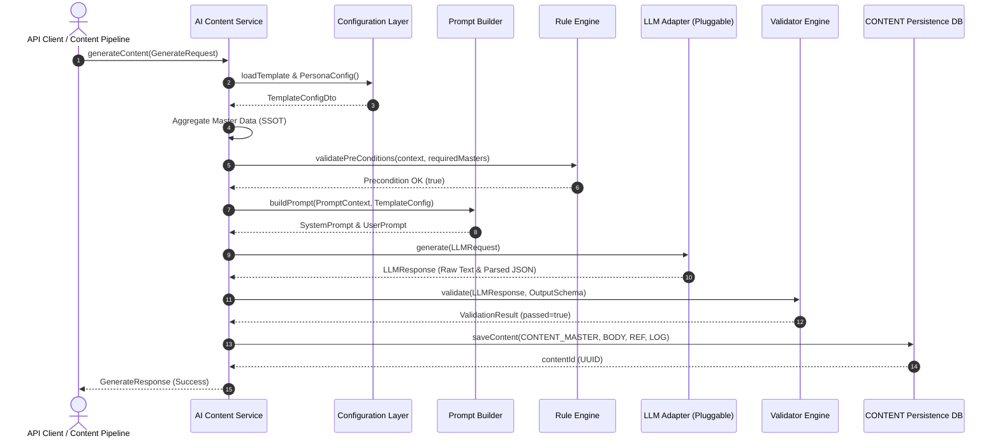

# 글로벌 김치 AI 지식 플랫폼 (Global Kimchi AI Knowledge Platform)
## AI_ENGINE 인터페이스 및 표준 계약 명세서 (v1.0.0 Baseline)

```
Status      : FROZEN
Version     : 1.0.0
Owner       : YM-LAB
Approved By : Architecture Review
Date        : 2026-07-20
```

---

### 1. Overview (개요 및 범위)

#### 1.1 목적
본 문서는 **Architecture Freeze v1.0.0**에 의거하여, `AI_ENGINE` 내부 구성 요소 간의 인터페이스 및 외부 서비스(API Layer)에서 `AI_ENGINE`을 호출할 때 준수해야 할 **언어 독립적(Language-Agnostic) 표준 계약(Interface Contract)**을 정의합니다.

#### 1.2 범위 및 구체화 언어
본 스펙은 Java, Python, TypeScript, Go 등 어떠한 구현 언어에서도 100% 동일하게 이식(Implements)될 수 있도록 메서드 서명, 파라미터, 반환 타입 및 DTO 규격을 정의합니다.

---

### 2. Core Interfaces 명세

```
┌──────────────────────────────────────────────────────────┐
│             Configuration Layer Interfaces               │
│  ┌────────────────────────┐  ┌────────────────────────┐  │
│  │ ITemplateConfiguration │  │  IPromptConfiguration  │  │
│  └────────────────────────┘  └────────────────────────┘  │
│  ┌────────────────────────┐  ┌────────────────────────┐  │
│  │ IPersonaConfiguration  │  │   IRuleConfiguration   │  │
│  └────────────────────────┘  └────────────────────────┘  │
└──────────────────────────────────────────────────────────┘
                            │
                            ▼
┌──────────────────────────────────────────────────────────┐
│               Execution Layer Interfaces                 │
│  ┌────────────────────────┐  ┌────────────────────────┐  │
│  │     IPromptBuilder     │  │      IRuleEngine       │  │
│  └────────────────────────┘  └────────────────────────┘  │
│  ┌────────────────────────┐  ┌────────────────────────┐  │
│  │       IValidator       │  │      ILLMAdapter       │  │
│  └────────────────────────┘  └────────────────────────┘  │
└──────────────────────────────────────────────────────────┘
```

---

### 3. DTO (Data Transfer Objects) 정의

#### 3.1 `GenerateRequest`
```typescript
interface GenerateRequest {
  targetKimchiId: string;        // UUID
  templateId: string;            // UUID
  languageCode: string;          // e.g. "en", "ko"
  targetCountryCode?: string;    // e.g. "US", "KR"
  authorId?: string;             // UUID (Author Persona)
  llmProviderHint?: string;      // e.g. "gemini-1.5-pro", "gpt-4o"
  overrideParameters?: Record<string, any>;
}
```

#### 3.2 `GenerateResponse`
```typescript
interface GenerateResponse {
  success: boolean;
  contentId: string;             // UUID
  title: string;
  summary: string;
  bodyMarkdown: string;
  seoTitle: string;
  seoDescription: string;
  seoKeywords: string[];
  validationReport: ValidationResult;
  tokenUsage: TokenUsageInfo;
  generatedAt: string;           // ISO 8601
}
```

#### 3.3 `PromptContext` & `GenerationContext`
```typescript
interface PromptContext {
  kimchiMaster: Record<string, any>;
  recipeMaster?: Record<string, any>;
  historyMaster?: Record<string, any>;
  ingredientMasters: Record<string, any>[];
  i18nTranslations: Record<string, any>;
  authorStylePrompt?: string;
}

interface GenerationContext {
  requestId: string;
  templateConfig: TemplateConfigDto;
  promptContext: PromptContext;
  assembledSystemPrompt: string;
  assembledUserPrompt: string;
}
```

#### 3.4 `LLMRequest` & `LLMResponse`
```typescript
interface LLMRequest {
  modelName: string;
  systemPrompt: string;
  userPrompt: string;
  temperature: number;
  topP: number;
  seed?: number;
  responseFormatJsonSchema?: Record<string, any>;
}

interface LLMResponse {
  rawOutputText: string;
  parsedJsonObject?: Record<string, any>;
  modelUsed: string;
  promptTokens: number;
  completionTokens: number;
  finishReason: string;
}
```

#### 3.5 `ValidationResult`
```typescript
interface ValidationResult {
  passed: boolean;
  score: number; // 0 ~ 100
  errors: ValidationErrorDetail[];
  warnings: ValidationWarningDetail[];
}

interface ValidationErrorDetail {
  validatorName: string; // e.g. "JsonSchemaValidator", "SEOValidator"
  errorCode: string;
  fieldPath?: string;
  message: string;
}
```

---

### 4. Interface Contract (메서드 명세)

#### 4.1 Execution Layer Interfaces

##### 1) `IPromptBuilder`
```typescript
interface IPromptBuilder {
  /**
   * Master 데이터와 Template Configuration을 결합하여 최종 LLM 프롬프트를 조립합니다.
   */
  buildPrompt(context: PromptContext, templateConfig: TemplateConfigDto): Promise<{
    systemPrompt: string;
    userPrompt: string;
  }>;
}
```

##### 2) `IRuleEngine`
```typescript
interface IRuleEngine {
  /**
   * 생성 전 필수 MASTER 조합 조건(required_masters) 및 비즈니스 매칭 규칙을 사전 검사합니다.
   */
  validatePreConditions(context: PromptContext, requiredMasters: string[]): Promise<boolean>;
}
```

##### 3) `ILLMAdapter` (Abstract Pluggable Adapter)
```typescript
interface ILLMAdapter {
  /**
   * 플러거블 LLM Provider(Gemini, OpenAI, Claude 등)로 추론을 요청합니다.
   */
  generate(request: LLMRequest): Promise<LLMResponse>;
}
```

##### 4) `IValidator` (Integrated Validation Service)
```typescript
interface IValidator {
  /**
   * LLM 추론 결과를 6대 검증 항목(JSON Schema, SEO, Markdown, Link, Asset, Policy)으로 통합 검증합니다.
   */
  validate(rawOutput: string, parsedJson: any, outputSchema: any): Promise<ValidationResult>;
}
```

---

### 5. Error Contract & Exception Code

| Exception Code | Exception Name | Description | Retryable |
| :--- | :--- | :--- | :--- |
| `ERR_AI_PRECONDITION_FAILED` | PreconditionFailedException | Rule Engine 검사 실패 (필수 Master 데이터 누락) | No |
| `ERR_AI_PROMPT_BUILD_FAILED` | PromptBuildException | Prompt Builder 동적 바인딩 에러 | No |
| `ERR_AI_LLM_TIMEOUT` | LLMTimeoutException | LLM 추론 응답 시간 초과 | **Yes (Max 3)** |
| `ERR_AI_LLM_PROVIDER_ERROR` | LLMProviderException | LLM API 5xx 오류 또는 Rate Limit | **Yes (Backoff)** |
| `ERR_AI_VALIDATION_FAILED` | ValidationFailedException | Validator 6대 검증 항목 규격 미달 | **Yes (Re-prompt)**|

---

### 6. Extension Points (향후 연계점)

- **AI Orchestrator (Reserved) 연계점**:
  - `GenerateRequest` 수신 시 `AI Orchestrator`가 `IPromptBuilder` → `IRuleEngine` → `ILLMAdapter` → `IValidator` 실행 순서와 Retry 횟수를 제어함.
- **Monitoring (Reserved) 연계점**:
  - `ILLMAdapter` 실행 직후 `LLMResponse.tokenUsage` 메트릭을 `IMonitoringCollector` 인터페이스로 비동기 전송.

---

### 7. Sequence Flow Diagram


