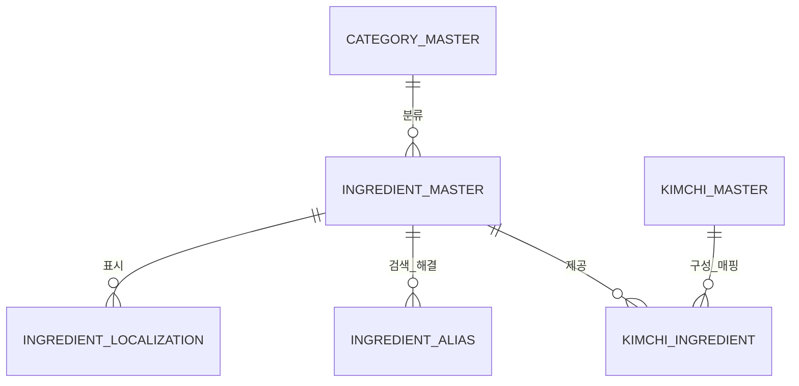

# INGREDIENT_MASTER_SPEC

**버전:** 1.0  
**상태:** 정식 기술 사양서 (Release Ready)  
**소유:** YM-LAB  
**최종 검토:** 2026-07-20  

## 1. 목적 (Purpose)

본 사양서는 YM-LAB 김치 지식 플랫폼의 핵심 식재료 정체성, 재료 고유 속성, 식재료 분류 및 메타데이터를 관리하는 `INGREDIENT_MASTER` 데이터베이스의 기술 규격을 정의한다.

`INGREDIENT_MASTER`는 다음 표준 역할을 수행하여야 한다 (MUST).
1. 배추, 무, 고춧가루, 젓갈, 마늘 등 김치 제조에 사용되는 개별 식재료 개념의 고유 식별 및 정체성 정의
2. 식재료 자체의 물리적/화학적 고유 속성(기본 맛, 제철, 보관 특성, 알레르기 유발 여부 등)의 원천 지식 소유
3. `KIMCHI_MASTER` 및 `RECIPE_MASTER` 등 타 MASTER 데이터베이스에 표준 식재료 식별자(`ingredient_id`) 및 연결(Junction Table) 규격 제공

## 2. 범위 (Scope)

### 2.1 포함 범위 (In-Scope)
본 사양서는 다음 항목의 데이터 규격 및 제약 조건을 규정한다 (SHALL).
- 식재료 고유 식별자(`ingredient_id`), 대표 명칭(`canonical_name_ko`), URL slug 및 재료 유형 코드(`ingredient_type_code`) 관리
- 표준 카테고리 매핑(`primary_category_id`), 대표 제철 계절(`seasonality_code`), 알레르기 메타데이터(`allergen_flag`)
- 검증 상태(`verification_status`), 노출 범위(`public_visibility`), 워크플로우 상태(`workflow_status`) 메타데이터
- 다국어 식재료 표시명(`INGREDIENT_LOCALIZATION`) 및 재료 별칭/이명/검색어(`INGREDIENT_ALIAS`)
- `KIMCHI_MASTER`와의 재료 매핑 관계(`KIMCHI_INGREDIENT` Junction Table) 및 `RECIPE_MASTER` 연동 규격
- 신규 도메인 MASTER 확장을 위한 표준 식재료 인터페이스 규격

### 2.2 제외 범위 (Out-of-Scope)
다음 항목은 본 사양서의 범위에서 제외하며, KIMCHI_MASTER가 직접 소유할 수 없다 (MUST NOT).
- 김치 개념 개별 레코드의 정체성 및 대표 정보 (`KIMCHI_MASTER` 소유)
- 특정 김치/레시피에서의 식재료 투입 정량, 비율, 절임/손질 상세 단계 (`RECIPE_MASTER` 소유)
- 발효 과정에서의 미생물 반응 및 산도/염도 변산 측정치 (`FERMENTATION_MASTER` 소유)
- 식재료 관련 역사 문헌 고증 데이터 및 스토리 원고 본문

## 3. 설계 원칙 (Design Principles)

1. **재료 단위 유일성:** 하나의 레코드는 독립된 하나의 식재료 개념만 정의하여야 한다 (MUST).
2. **최소 소유권 (Minimal Ownership):** `INGREDIENT_MASTER`는 식재료 고유의 정체성, 기본 속성, 식별자, 운영 메타데이터만 직접 소유하여야 한다 (MUST).
3. **단일 소유권 (Single Ownership) & SSOT:** 모든 식재료 속성은 오직 `INGREDIENT_MASTER`만 소유한다 (SHALL). 타 MASTER에서 재료명을 이중 저장하는 것을 금지하며 (MUST NOT), 외래키(FK)와 Junction Table로만 상호 연결하여야 한다 (MUST).
4. **Junction Table 분리:** 타 MASTER와의 다대다(M:N) 매핑은 전용 Junction Table(`KIMCHI_INGREDIENT` 등)로 분리하여야 한다 (MUST). 단일 필드 내 다중 재료 나열(Comma-separated) 및 특정 김치용 투입 정량 저장을 금지한다 (MUST NOT).
5. **한국어 기준 및 다국어 확장:** 기준 언어는 한국어(`ko-KR`)로 정의한다 (SHALL). 번역 및 현지화 텍스트는 `INGREDIENT_LOCALIZATION`에서 독립 관리하여야 한다 (MUST).
6. **Publish Gate 준수:** [4.3 공개 조건 (Publish Gate)](#43-공개-조건-publish-gate)의 제약 조건을 전수 충족하는 레코드에 한하여 외부 노출을 허용하여야 한다 (MUST).
7. **통제된 어휘 (Controlled Vocabulary) 준수:** 재료 유형 코드 및 상태값은 임의 텍스트 입력을 금지하며 (MUST NOT), 지정된 Enum/Code 규격을 따라야 한다 (MUST).
8. **불변 식별자 (Immutable ID):** 기본 식별자(`ingredient_id`)는 명칭 및 분류 변경과 독립적으로 영구 유지되어야 한다 (MUST).
9. **소프트 삭제 (Soft Delete):** 사용 이력이 존재하는 식재료의 물리 삭제를 금지한다 (MUST NOT). 비활성화 시 `workflow_status = archived`로 전이하여야 한다 (MUST).
10. **하위 호환성 (Backward Compatibility):** 식별자, 테이블명, 필드명, Enum 값의 무단 변경을 금지하며 (MUST NOT), 스키마 변경 시 하위 호환성을 보장하여야 한다 (MUST).

### 3.1 데이터 소유권 매트릭스 (Ownership Matrix)

| 정보 영역 (Domain) | 책임 소유자 (Owner MASTER) | 소유 및 관리 범위 |
| :--- | :--- | :--- |
| **Ingredient Identity (재료 정체성)** | `INGREDIENT_MASTER` | `ingredient_id`, 공식 한국어명, slug, 재료 유형, 대표 카테고리 ID, 제철, 알레르기 여부, 검증/운영 상태 메타데이터 |
| **Ingredient Localization** | `INGREDIENT_LOCALIZATION` | 언어별 식재료 표시명, 언어별 요약 설명, 번역 검토 상태 |
| **Ingredient Alias** | `INGREDIENT_ALIAS` | 식재료 이명, 방언명, 옛 명칭, 로마자 표기, 검색용 정규화 키워드 |
| **Kimchi Ingredient Relation** | `KIMCHI_INGREDIENT` | `KIMCHI_MASTER`와 `INGREDIENT_MASTER` 간 개념적 역할 매핑 (`base`, `main`, `seasoning` 등) 및 `importance_rank` |
| **Recipe Ingredient Quantity** | `RECIPE_MASTER` | 특정 레시피에서의 식재료 투입 단위, 정량/비율, 투입 순서, 손질 방식 |

## 4. 데이터베이스 구조 (Database Structure)

### 4.1 논리 테이블 정의 (Logical Tables)

| Table | 역할 | Primary Key |
|---|---|---|
| `INGREDIENT_MASTER` | 식재료 개념의 정체성 및 고유 속성을 관리하는 중심 테이블 | `ingredient_id` |
| `INGREDIENT_LOCALIZATION` | 식재료의 언어별 표시명 및 설명 관리 | (`ingredient_id`, `language_code`) |
| `INGREDIENT_ALIAS` | 식재료 별칭, 방언명, 옛 이름, 로마자 표기, 검색어 관리 | `alias_id` |
| `KIMCHI_INGREDIENT` | `KIMCHI_MASTER`와의 재료 매핑 Junction Table | `kimchi_ingredient_id` |

### 4.2 레코드 생명주기 (Lifecycle)

- **전이 순서:** 레코드는 `draft` → `in_review` → `approved` → `published` → `archived` 순서로 전이하여야 한다 (MUST).
- **반려 처리:** `in_review` 단계에서 반려 시 `rejected` 상태로 전이하며, 외부 노출을 금지한다 (MUST NOT).
- **보관 처리:** `published` 레코드는 물리 삭제할 수 없으며 (MUST NOT), `archived` 상태로 전이하여야 한다 (MUST). 재료 통합 시 `replacement_ingredient_id`에 대체 식별자를 기재하여야 한다 (MUST).

### 4.3 공개 조건 (Publish Gate)

`public_visibility = public` 설정을 위해 다음 조건 전수를 동시에 충족하여야 한다 (MUST).
1. `Publish` 필수 지정 필드 전수 입력 완료
2. `verification_status = verified`
3. `workflow_status = published`
4. `localization_status = approved`인 `ko-KR` `INGREDIENT_LOCALIZATION` 레코드 1개 이상 존재
5. active 상태의 `primary_category_id` 매핑 1개 존재

### 4.4 데이터 무결성 규칙 (Integrity Rules)

- **카테고리 참조 유효성:** `primary_category_id`는 존재하는 active 상태의 `CATEGORY_MASTER` 레코드만 가리켜야 한다 (MUST).
- **순환 참조 금지:** `replacement_ingredient_id`는 자기 참조 및 순환 참조를 금지한다 (MUST NOT).
- **수량 저장 금지:** `INGREDIENT_MASTER` 및 `KIMCHI_INGREDIENT` 내 식재료 정량(g, ml 등) 저장을 금지한다 (MUST NOT).
- **보관 타임스탬프:** `workflow_status = archived` 전이 시 `archived_at` 타임스탬프 입력은 필수이다 (MUST).

## 5. 필드 명세 (Field Definitions)

### 5.1 `INGREDIENT_MASTER`

| Field Name | Type / Format | Required | 제약 및 규격 |
|---|---|---:|---|
| `ingredient_id` | string, `ING-######` | Create | 기본 키(PK). 영구 불변 고유 식별자. |
| `canonical_name_ko` | Unicode text | Create | 식재료의 공식 한국어 명칭. |
| `canonical_slug` | lowercase ASCII slug | Create | URL/API용 표준 slug. 공개 후 변경 금지. |
| `ingredient_type_code` | controlled code | Create | 재료 유형 코드 (`main_crop`, `vegetable`, `seasoning`, `salted_seafood`, `fish_sauce`, `herb`, `liquid`, `sweetener`, `other`). |
| `primary_category_id` | FK to `CATEGORY_MASTER` | Publish | 대표 식재료 카테고리 FK. |
| `seasonality_code` | enum: `spring`, `summer`, `autumn`, `winter`, `all_year`, `unknown` | Create | 대표 제철 계절 규정 코드. |
| `allergen_flag` | boolean | Create | 주요 알레르기 유발 물질 포함 여부 플래그 (기본값 `false`). |
| `distinguishing_feature_ko` | short Unicode text | Publish | 식재료 식별용 한국어 핵심 특징 요약. |
| `canonical_summary_ko` | plain Unicode text | Publish | 공식 한국어 요약문. AI 인덱싱 및 기본 표기용. |
| `verification_status` | enum: `unverified`, `researching`, `verified`, `disputed` | Create | 사실 검증 상태. 공개 시 `verified` 필수. |
| `workflow_status` | enum: `draft`, `in_review`, `approved`, `published`, `archived`, `rejected` | Create | Lifecycle 상태. 기본값 `draft`. |
| `public_visibility` | enum: `private`, `internal`, `public` | Create | 외부 노출 범위. `public` 설정 시 [4.3 Publish Gate](#43-공개-조건-publish-gate) 충족 필수. |
| `created_at` | ISO 8601 UTC timestamp | Create | 레코드 생성 시각. |
| `created_by` | user/service identifier | Create | 레코드 생성 주체 식별자. |
| `updated_at` | ISO 8601 UTC timestamp | Create | 레코드 최종 수정 시각. |
| `updated_by` | user/service identifier | Create | 레코드 최종 수정 주체 식별자. |
| `record_version` | positive integer | Create | 낙관적 잠금용 버전 번호. 변경 시 1씩 증가. |
| `archived_at` | ISO 8601 UTC timestamp | Optional | 보관 처리 시각 (`workflow_status = archived` 시 필수). |
| `replacement_ingredient_id` | self-FK to `INGREDIENT_MASTER` | Optional | 대체/통합 대상 `ingredient_id` (자기 참조 및 순환 금지). |
| `internal_note` | private text | Optional | 내부 편집 메모 (외부 API 비노출). |

### 5.2 `INGREDIENT_LOCALIZATION`

| Field Name | Type / Format | Required | 제약 및 규격 |
|---|---|---:|---|
| `ingredient_id` | FK to `INGREDIENT_MASTER` | Create | 대상 식재료 FK (복합 PK). |
| `language_code` | BCP 47 tag | Create | 언어/로케일 코드 (`ko-KR`, `en`, `ja` 등) (복합 PK). |
| `localized_name` | Unicode text | Create | 승인된 언어별 표시명. |
| `short_description` | plain Unicode text | Publish | 언어별 요약 설명 텍스트. |
| `localization_status` | enum: `draft`, `reviewed`, `approved` | Create | 번역 검토 상태. 서빙 시 `approved` 필수. |
| `translated_by` | user/service identifier | Optional | 번역 생성 주체 식별자. |
| `reviewed_by` | user identifier | Optional | 번역 검수자 식별자 (`approved` 시 필수). |
| `updated_at` | ISO 8601 UTC timestamp | Create | 레코드 최종 수정 시각. |

### 5.3 `INGREDIENT_ALIAS`

| Field Name | Type / Format | Required | 제약 및 규격 |
|---|---|---:|---|
| `alias_id` | string, `IAL-######` | Create | 식재료 별칭 불변 기본 키(PK). |
| `ingredient_id` | FK to `INGREDIENT_MASTER` | Create | 연관 식재료 FK. |
| `language_code` | BCP 47 tag | Create | 별칭 언어 코드. |
| `alias_text` | Unicode text | Create | 이명, 방언명, 옛 이름, 음역 텍스트. |
| `normalized_alias` | normalized text | Create | 검색 및 중복 검증용 정규화 텍스트. |
| `alias_type` | enum: `alternate_name`, `dialect_name`, `historical_name`, `spelling`, `romanization`, `search_term` | Create | 별칭 유형 구분 Enum. |
| `status` | enum: `active`, `deprecated` | Create | 별칭 사용 상태 Enum. |

### 5.4 Junction Table 규격 (`KIMCHI_INGREDIENT`)

`KIMCHI_MASTER`와의 매핑 관계는 아래 규격을 준수하여야 한다 (MUST).

| Common Field | Type / Format | Required | 제약 및 규격 |
|---|---|---:|---|
| `kimchi_ingredient_id` | string, `KIG-######` | Create | 불변 기본 키(PK). |
| `kimchi_id` | FK to `KIMCHI_MASTER` | Create | 중심 김치 FK. |
| `ingredient_id` | FK to `INGREDIENT_MASTER` | Create | 연관 식재료 FK. |
| `relation_type` | controlled code | Create | 개념적 역할 지정 코드 (`base`, `main`, `seasoning`, `aromatic`, `seafood`, `liquid`, `garnish`). |
| `importance_rank` | non-negative integer | Create | 김치 내 재료의 상대적 중요도 순위 (기본값 `1`). |
| `display_order` | non-negative integer | Create | 표출 순서 (기본값 `0`). |
| `link_status` | enum: `active`, `inactive` | Create | 관계 사용 여부 Enum. |
| `evidence_note` | short text or source ID | Optional | 관계 근거 메모. |
| `created_at` / `updated_at` | ISO 8601 UTC timestamps | Create | 생성 및 수정 시각. |

## 6. 관계 다이어그램 (Relationship Diagram)

## 7. 명명 규칙 (Naming Rules)

- **테이블명:** 영문 대문자 `SNAKE_CASE`를 적용하여야 한다 (MUST) (`INGREDIENT_MASTER`).
- **필드명:** 영문 소문자 `snake_case`를 적용하여야 한다 (MUST) (`ingredient_id`).
- **식별자/외래키:** `*_id` 접미사를 사용하여야 한다 (MUST).
- **통제 어휘 코드:** `*_code` 접미사를 사용하여야 한다 (MUST).
- **타임스탬프:** `*_at` 접미사를 사용하여야 하며 (MUST), ISO 8601 UTC 포맷을 준수하여야 한다 (MUST).
- **언어 코드:** BCP 47 표준을 준수하여야 한다 (MUST) (예: `ko-KR`, `en-US`).
- **Slug:** 영문 소문자 ASCII 및 하이픈(`-`)만 허용한다 (MUST).
- **데이터 포맷:** Plain text 저장을 원칙으로 하며 (MUST), HTML 태그 저장을 금지한다 (MUST NOT).
- **Enum 값:** 영문 소문자 ASCII를 사용하여야 하며 (MUST), 임의 변경을 금지한다 (MUST NOT).

## 8. 식별자 규칙 (ID Rules)

| Entity | Pattern | Example | 규칙 |
|---|---|---|---|
| Ingredient | `ING-######` | `ING-000001` | 순차 발급, zero-padding, 불변, 재사용 금지 |
| Ingredient alias | `IAL-######` | `IAL-000001` | 레코드별 불변 PK |
| Kimchi ingredient link | `KIG-######` | `KIG-000001` | 재료 매핑 불변 PK |

- **시맨틱 정보 포함 금지:** ID에 재료명, 날짜 등 의미 정보를 포함할 수 없다 (MUST NOT).
- **발급 시점:** 레코드 저장 확정 시 발급하며, 누락 번호의 재사용을 금지한다 (MUST NOT).
- **물리 삭제 금지:** 외부 참조/공개 이력이 있는 ID는 물리 삭제를 금지하고 (MUST NOT), `archived` 상태로 보존하여야 한다 (MUST).

## 9. 미래 확장 전략 (Future Expansion Strategy)

### 9.1 RECIPE_MASTER와의 연동 규격
- 본 `INGREDIENT_MASTER`는 `RECIPE_MASTER`에서 개별 레시피 제조 시 필요한 식재료 기준 마스터로 참조되며, 구체적인 정량 및 절임/손질 정보는 레시피 전용 매핑 테이블에서 관리한다.

### 9.2 마이그레이션 및 호환성
- **하위 호환 변경:** 선택 필드(Optional field) 추가는 호환 변경으로 처리한다.
- **파괴적 변경 (Breaking Change):** 필수 필드, ID 규격, Enum 값, 테이블명 변경 시 마이그레이션 계획 및 롤백 정책 수립을 의무화한다 (MUST).

## 10. QA 체크리스트 (QA Checklist)

모든 검사 항목은 객관적으로 즉시 검증 가능(Pass/Fail)하여야 한다 (MUST).

- [ ] **[소유성 검증]** 파일명이 `INGREDIENT_MASTER_SPEC.md`이며 위치가 `01_PHASE1_KIMCHI/03_INGREDIENT_MASTER/`에 존재하는가?
- [ ] **[단일 개념 검증]** 하나의 레코드가 정확히 하나의 식재료 개념만 정의하고 있는가?
- [ ] **[수량 저장 제외 검증]** `INGREDIENT_MASTER` 및 `KIMCHI_INGREDIENT`에 식재료 정량/비율 수치가 저장되어 있지 않은가?
- [ ] **[Junction Table 검증]** `KIMCHI_MASTER`와의 다대다 매핑이 `KIMCHI_INGREDIENT` 연결 테이블로 분리되어 있는가?
- [ ] **[ID 규격 검증]** 모든 PK/FK가 지정된 Prefix 및 6자리 Zero-padding 규칙(`ING-######`, `KIG-######` 등)을 준수하는가?
- [ ] **[무결성 검증]** 모든 외래키(FK) 참조 대상 레코드가 실제 존재하며 active/publishable 상태인가?
- [ ] **[Publish Gate 검증]** 공개 식재료가 `Publish` 필수 필드 입력, `ko-KR` approved localization, `verification_status = verified`, `workflow_status = published`, `public_visibility = public` 조건을 충족하는가?
- [ ] **[동시성 검증]** 데이터 수정 시 `record_version` 및 `updated_at` 타임스탬프가 최신화되는가?
