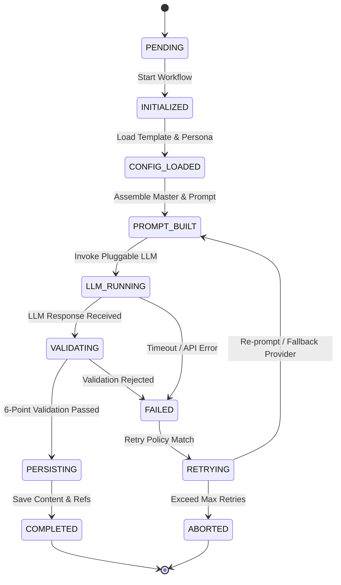
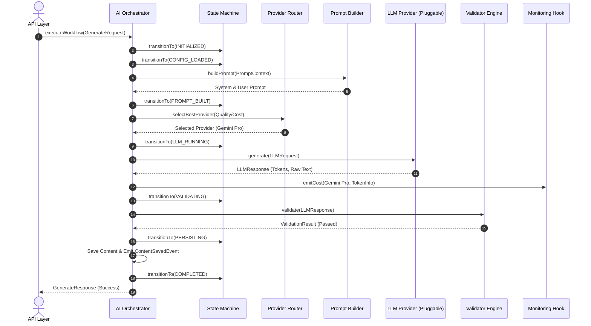

# 글로벌 김치 AI 지식 플랫폼 (Global Kimchi AI Knowledge Platform)
## AI Orchestrator 상세 설계 명세서 (Reserved Architecture)

```
Status      : RESERVED (Future Extension via RFC)
Version     : 1.0.0 Baseline
Owner       : YM-LAB
Approved By : Architecture Review
Date        : 2026-07-20
```

> [!IMPORTANT]
> **RESERVED ARCHITECTURE NOTICE**  
> 본 명세서는 **v1.0.0의 직접 구현 대상이 아니며**, 향후 엔터프라이즈 대규모 운영 및 복잡한 워크플로우 제어를 위해 사전 정의된 **예약 아키텍처(Reserved Architecture)**입니다. 향후 **v1.1.0 이상의 버전에서 RFC 승인 절차를 거쳐 활성화**됩니다.

---

### 1. Overview (필요성 및 목적)

`AI Orchestrator`는 단일 LLM 추론 호출을 넘어, **전체 AI 생태계의 워크플로우 상태(State), 트랜잭션, 재시도(Retry), 에러 복구(Recovery), 라우팅(Routing) 및 비동기 이벤트를 중앙 통제하는 오케스트레이션 엔진**입니다.

```
┌──────────────────────────────────────────────────────────┐
│                    AI Orchestrator                       │
│                                                          │
│  ┌────────────────────┐  ┌────────────────────────────┐  │
│  │ Workflow Controller│  │   State Machine Engine     │  │
│  └────────────────────┘  └────────────────────────────┘  │
│  ┌────────────────────┐  ┌────────────────────────────┐  │
│  │ OrchestrationPolicy│  │   Provider Router          │  │
│  └────────────────────┘  └────────────────────────────┘  │
│  ┌────────────────────┐  ┌────────────────────────────┐  │
│  │   Event Dispatcher │  │   Monitoring Hook          │  │
│  └────────────────────┘  └────────────────────────────┘  │
└──────────────────────────────────────────────────────────┘
```

---

### 2. Workflow State Machine

AI 파이프라인의 모든 생성 작업은 명확한 **유한 상태 기계(Finite State Machine)**로 관리되며, 모든 상태 전이는 이벤트를 발생시킵니다.



#### State Definitions
- **`PENDING`**: 오케스트레이션 큐 대기 상태
- **`INITIALIZED`**: 워크플로우 생성 및 컨텍스트 초기화
- **`CONFIG_LOADED`**: Configuration Layer 데이터 로딩 완료
- **`PROMPT_BUILT`**: Master 데이터 결합 및 최종 프롬프트 빌드 완료
- **`LLM_RUNNING`**: Pluggable LLM Provider 추론 실행 중
- **`VALIDATING`**: Validator 6대 통합 검증 서비스 실행 중
- **`PERSISTING`**: DB 트랜잭션 (Master, Body, Ref, Log) 저장 중
- **`COMPLETED`**: 생성 성공 완결
- **`FAILED`**: 일시적 오류 발생
- **`RETRYING`**: Retry / Fallback Provider 재시도 디스패치 중
- **`ABORTED`**: 재시도 횟수 초과로 인한 워크플로우 최종 중단

---

### 3. Workflow Controller

Workflow Controller는 모듈 간 호출 순서와 의존성을 스레드 안전(Thread-Safe)하게 스케줄링합니다.

1. **Configuration Loader**: `Template`, `Prompt`, `Persona`, `Rule` 로드
2. **Master Aggregator**: `KIMCHI`, `RECIPE`, `HISTORY` 등 SSOT 데이터 추출
3. **Prompt Builder**: 프롬프트 동적 컴파일
4. **Rule Engine**: 사전 제약 및 비즈니스 규칙 검사
5. **LLM Adapter**: Pluggable LLM 호출
6. **Validator Engine**: 6대 검증 실행
7. **Content Persistence**: RDBMS 트랜잭션 커밋

---

### 4. Orchestration Policy (운영 핵심 정책)

| 정책 항목 | 가이드라인 및 서식 | 비고 |
| :--- | :--- | :--- |
| **Generation Timeout** | 전체 파이프라인 최대 60초, 단일 LLM 호출 최대 30초 | 초과 시 TimeoutException |
| **Retry Count** | LLM 네트워크 오류 시 최대 3회, Re-prompt 검증 실패 시 최대 2회 | Exponential Backoff 적용 |
| **Parallel Execution** | 다국어(i18n) 동시 생성 시 최대 5개 언어 병렬 렌더링 지원 | Thread Pool Isolation |
| **Fallback Rule** | 주 LLM (e.g. Gemini Pro) 장애 시 보조 LLM (e.g. Claude / OpenAI) 자동 우회 | Circuit Breaker 연동 |
| **Circuit Breaker** | 특정 LLM Provider 5분 간 에러율 50% 초과 시 10분 간 해당 Provider 차단 | Health Monitoring |
| **Idempotency** | `(kimchi_id, template_id, language_code, version)` 중복 호출 시 캐시/기존 Result 반환 | Idempotency Key 사용 |
| **Priority Queue** | 에디터 수동 요청(High) vs 배치 자동 생성(Low) 우선순위 큐 격리 | Priority Scheduler |
| **Cancellation** | 클라이언트 취소 요청 시 진행 중인 LLM API HTTP Connection 즉시 Abort | Context Cancellation |

---

### 5. Retry Policy & Fallback Cascade

```
[LLM Call Failed / Timeout]
           │
           ▼ (Retry 1~3 with Backoff)
 [Same Provider Retry] ──(Success)──> [To Validation]
           │
           ▼ (Exceed Retry Count)
 [Fallback Provider Routing]
 (Gemini Pro → Claude 3.5 Sonnet → GPT-4o → Local Mistral)
           │
           ▼ (All Providers Failed)
 [State: ABORTED & Emit Alarm]
```

---

### 6. Provider Routing (동적 LLM 선택 엔진)

Orchestrator는 작업의 특성에 따라 최적의 LLM Provider를 라우팅합니다.

- **Cost-Optimized**: 숏폼 스크립트, 단순 번역 → Gemini Flash / GPT-4o-mini
- **Quality-Optimized**: 학술 역사 고문헌, 조리 명인 칼럼 → Claude 3.5 Sonnet / Gemini Pro
- **Latency-Optimized**: 실시간 대시보드 프리뷰 → Local LLM / Fast Adapter
- **Availability-Based**: 서비스 가동률(Uptime) 기반 라우팅

---

### 7. Multi-Step Generation Pipeline

단일 생성이 아닌 5단계 연쇄 파이프라인(Chained Workflow)을 지원합니다.

```
Step 1. SEO & Title Generation
   │
   ▼
Step 2. Main Article Body Generation
   │
   ▼
Step 3. Q&A / FAQ Extraction
   │
   ▼
Step 4. Meta Tags & Keywords Generation
   │
   ▼
Step 5. AI Image Generation Prompting
```

---

### 8. Agent Workflow Extension (Multi-Agent Support)

향후 자율형 Multi-Agent 생성 생태계 지원을 위한 확장 포인트(Extension Points)입니다.

- **`Planner Agent`**: 지식 공백 탐지 및 생성 주제 계획
- **`Research Agent`**: `HISTORY_MASTER` 및 학술 논문 정보 수집
- **`Writer Agent`**: 콘텐츠 본문 초안 작성
- **`Reviewer Agent`**: 팩트 체크 및 톤앤매너 감수
- **`Validator Agent`**: 6대 최종 규격 검증

---

### 9. Event Model (도메인 이벤트 명세)

모든 워크플로우 상태 변경 시 발송되는 비동기 이벤트입니다.

- `GenerationStartedEvent`: 생성 워크플로우 시작
- `PromptBuiltEvent`: 프롬프트 빌드 완료
- `LLMCompletedEvent`: LLM 추론 완료 및 토큰 사용량 측정
- `ValidationFailedEvent`: 검증 실패 및 사유 발송
- `ContentSavedEvent`: DB 저장 및 content_id 생성 완료
- `PublishingRequestedEvent`: Publishing Queue로 배포 요청 전송

---

### 10. Monitoring Hook

Step 6 (Reserved Monitoring)과 실시간 연계되는 Telemetry Hook 인터페이스입니다.

```typescript
interface IMonitoringHook {
  emitMetric(metricName: string, value: number, tags: Record<string, string>): void;
  emitTrace(traceId: string, spanName: string, durationMs: number): void;
  emitAudit(action: string, actor: string, details: Record<string, any>): void;
  emitCost(modelName: string, promptTokens: number, completionTokens: number, estimatedCostUsd: number): void;
}
```

---

### 11. End-to-End Sequence Diagram


