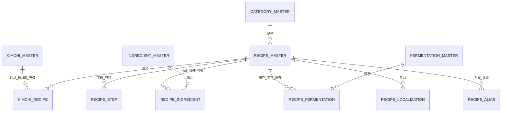

# RECIPE_MASTER_SPEC

**버전:** 1.0  
**상태:** 정식 기술 사양서 (Release Ready)  
**소유:** YM-LAB  
**최종 검토:** 2026-07-20  

## 1. 목적 (Purpose)

본 사양서는 YM-LAB 김치 지식 플랫폼의 구체적인 김치 제조 방법, 조리 단계별 가이드, 재료 투입 정량 및 연관 마스터(`INGREDIENT_MASTER`, `FERMENTATION_MASTER`, `CATEGORY_MASTER`)와의 조리 조합 지식을 통합 관리하는 `RECIPE_MASTER` 데이터베이스의 기술 규격을 정의한다.

`RECIPE_MASTER`는 다음 표준 역할을 수행하여야 한다 (MUST).
1. 김치 조리법 개별 레코드(`recipe_id`)의 고유 식별 및 정체성 정의
2. 구체적인 조리 순서(Step-by-step), 재료별 투입 정량/단위, 절임 및 손질법 지식 원천 소유
3. `KIMCHI_MASTER` 하위에 연결되어 실용적인 조리 지식을 제공하고, `INGREDIENT_MASTER`, `FERMENTATION_MASTER`, `CATEGORY_MASTER`를 조리 맥락으로 종합 구성하는 중추 역할 수행

## 2. 범위 (Scope)

### 2.1 포함 범위 (In-Scope)
본 사양서는 다음 항목의 데이터 규격 및 제약 조건을 규정한다 (SHALL).
- 레시피 고유 식별자(`recipe_id`), 대표 명칭(`canonical_name_ko`), URL slug 및 레시피 유형 코드(`recipe_type_code`)
- 조리 난이도(`difficulty_code`), 준비/절임 소요시간, 조리 소요시간, 기준 생산량(`serving_yield_description_ko`)
- 조리 단계별 수순 및 설명 데이터 (`RECIPE_STEP`)
- 재료 정량/단위/손질법 매핑 데이터 (`RECIPE_INGREDIENT` Junction Table)
- 추천 발효 조건 매핑 데이터 (`RECIPE_FERMENTATION` Junction Table)
- 대표 레시피 카테고리 매핑 (`primary_category_id`)
- 검증 상태(`verification_status`), 노출 범위(`public_visibility`), 워크플로우 상태(`workflow_status`) 메타데이터
- 다국어 레시피 표시명(`RECIPE_LOCALIZATION`) 및 레시피 별칭/검색어(`RECIPE_ALIAS`)
- `KIMCHI_MASTER`와의 레시피 연관 관계(`KIMCHI_RECIPE` Junction Table)

### 2.2 제외 범위 (Out-of-Scope)
다음 항목은 본 사양서의 범위에서 제외하며, KIMCHI_MASTER가 직접 소유할 수 없다 (MUST NOT).
- 김치 개념 개별 레코드의 대표 정체성 및 문화적/공식 요약 정보 (`KIMCHI_MASTER` 소유)
- 식재료 자체의 고유 속성, 대표 제철, 알레르기 원천 메타데이터 (`INGREDIENT_MASTER` 소유)
- 발효 과정의 생화학적 메커니즘, 균주, 미생물 연구 측정치 (`FERMENTATION_MASTER` 소유)
- 역사 문헌 고증 원문 및 구체적인 에세이/스토리 본문

## 3. 설계 원칙 (Design Principles)

1. **레시피 단위 유일성:** 하나의 레코드는 독립되고 구체적인 조리법 하나만 정의하여야 한다 (MUST).
2. **최소 소유권 (Minimal Ownership):** `RECIPE_MASTER`는 조리 수순, 정량 단위, 난이도, 소요 시간만 소유하여야 한다 (MUST).
3. **단일 소유권 (Single Ownership) & SSOT:** 식재료 정의는 `INGREDIENT_MASTER`, 발효 규격은 `FERMENTATION_MASTER`, 분류 체계는 `CATEGORY_MASTER`가 소유한다 (SHALL). `RECIPE_MASTER`는 이를 조리 정량과 단계 맥락으로 매핑하여 참조하여야 한다 (MUST).
4. **Junction Table 분리:** `RECIPE_INGREDIENT` (재료 정량), `RECIPE_FERMENTATION` (발효 매핑), `KIMCHI_RECIPE` (김치 매핑)를 전용 Junction Table로 분리하여야 한다 (MUST).
5. **한국어 기준 및 다국어 확장:** 기준 언어는 한국어(`ko-KR`)로 정의한다 (SHALL). 번역 및 현지화 텍스트는 `RECIPE_LOCALIZATION`에서 독립 관리하여야 한다 (MUST).
6. **Publish Gate 준수:** [4.3 공개 조건 (Publish Gate)](#43-공개-조건-publish-gate)의 제약 조건을 전수 충족하는 레코드에 한하여 외부 노출을 허용하여야 한다 (MUST).
7. **통제된 어휘 (Controlled Vocabulary) 준수:** 레시피 유형, 난이도, 단위 코드 등 상태값은 임의 텍스트 입력을 금지하며 (MUST NOT), 지정된 Enum/Code 규격을 따라야 한다 (MUST).
8. **불변 식별자 (Immutable ID):** 기본 식별자(`recipe_id`)는 명칭 및 분류 변경과 독립적으로 영구 유지되어야 한다 (MUST).
9. **소프트 삭제 (Soft Delete):** 사용 이력이 존재하는 레코드의 물리 삭제를 금지한다 (MUST NOT). 비활성화 시 `workflow_status = archived`로 전이하여야 한다 (MUST).
10. **하위 호환성 (Backward Compatibility):** 식별자, 테이블명, 필드명, Enum 값의 무단 변경을 금지하며 (MUST NOT), 스키마 변경 시 하위 호환성을 보장하여야 한다 (MUST).

### 3.1 데이터 소유권 매트릭스 (Ownership Matrix)

| 정보 영역 (Domain) | 책임 소유자 (Owner MASTER) | 소유 및 관리 범위 |
| :--- | :--- | :--- |
| **Recipe Identity (레시피 정체성)** | `RECIPE_MASTER` | `recipe_id`, 공식 한국어명, slug, 레시피 유형, 난이도, 소요시간, 생산량, 검증/운영 메타데이터 |
| **Recipe Steps (조리 단계)** | `RECIPE_STEP` | 단계 번호(`step_number`), 단계별 조리 설명, 절임/세척/양념 치대기 등 작업 지침 |
| **Recipe Ingredient Quantity** | `RECIPE_INGREDIENT` | 특정 레시피에서의 식재료 투입 정량, 단위(g, ml, 포기 등), 손질법, 투입 순서 (`ingredient_id` FK 참조) |
| **Recipe Fermentation Link** | `RECIPE_FERMENTATION` | 특정 레시피의 추천 발효 프로세스 및 조건 매핑 (`fermentation_id` FK 참조) |
| **Recipe Category Link** | `CATEGORY_MASTER` | 레시피 분류 FK (`primary_category_id`) |
| **Kimchi Recipe Relation** | `KIMCHI_RECIPE` | `KIMCHI_MASTER`와 `RECIPE_MASTER` 간 관계 매핑 (`canonical`, `traditional`, `regional` 등) |

## 4. 데이터베이스 구조 (Database Structure)

### 4.1 논리 테이블 정의 (Logical Tables)

| Table | 역할 | Primary Key |
|---|---|---|
| `RECIPE_MASTER` | 레시피 개념의 정체성 및 메타데이터를 관리하는 중심 테이블 | `recipe_id` |
| `RECIPE_STEP` | 레시피의 조리 단계별 수순 및 지침 관리 테이블 | (`recipe_id`, `step_number`) |
| `RECIPE_INGREDIENT` | 레시피별 식재료 투입 정량, 단위, 손질법 매핑 Junction Table | `recipe_ingredient_id` |
| `RECIPE_FERMENTATION` | 레시피별 추천 발효 조건 매핑 Junction Table | `recipe_fermentation_id` |
| `RECIPE_LOCALIZATION` | 레시피의 언어별 표시명 및 조리 요약 관리 | (`recipe_id`, `language_code`) |
| `RECIPE_ALIAS` | 레시피 별칭 및 검색어 관리 | `alias_id` |
| `KIMCHI_RECIPE` | `KIMCHI_MASTER`와의 레시피 매핑 Junction Table | `kimchi_recipe_id` |

### 4.2 레코드 생명주기 (Lifecycle)

- **전이 순서:** 레코드는 `draft` → `in_review` → `approved` → `published` → `archived` 순서로 전이하여야 한다 (MUST).
- **반려 처리:** `in_review` 단계에서 반려 시 `rejected` 상태로 전이하며, 외부 노출을 금지한다 (MUST NOT).
- **보관 처리:** `published` 레코드는 물리 삭제할 수 없으며 (MUST NOT), `archived` 상태로 전이하여야 한다 (MUST). 레코드 대체 시 `replacement_recipe_id`에 대체 식별자를 기재하여야 한다 (MUST).

### 4.3 공개 조건 (Publish Gate)

`public_visibility = public` 설정을 위해 다음 조건 전수를 동시에 충족하여야 한다 (MUST).
1. `Publish` 필수 지정 필드 전수 입력 완료
2. `verification_status = verified`
3. `workflow_status = published`
4. 최소 1개 이상의 active `RECIPE_STEP` 레코드 및 1개 이상의 active `RECIPE_INGREDIENT` 레코드 존재
5. `localization_status = approved`인 `ko-KR` `RECIPE_LOCALIZATION` 레코드 1개 이상 존재

### 4.4 데이터 무결성 규칙 (Integrity Rules)

- **식재료 참조 유효성:** `RECIPE_INGREDIENT` 내 모든 `ingredient_id`는 존재하는 active 상태의 `INGREDIENT_MASTER` 레코드만 가리켜야 한다 (MUST).
- **발효 참조 유효성:** `RECIPE_FERMENTATION` 내 모든 `fermentation_id`는 존재하는 active 상태의 `FERMENTATION_MASTER` 레코드만 가리켜야 한다 (MUST).
- **조리 단계 일관성:** `RECIPE_STEP`의 `step_number`는 `1`부터 시작하는 연속된 순차 정수여야 한다 (MUST).
- **순환 참조 금지:** `replacement_recipe_id`는 자기 참조 및 순환 참조를 금지한다 (MUST NOT).
- **보관 타임스탬프:** `workflow_status = archived` 전이 시 `archived_at` 타임스탬프 입력은 필수이다 (MUST).

## 5. 필드 명세 (Field Definitions)

### 5.1 `RECIPE_MASTER`

| Field Name | Type / Format | Required | 제약 및 규격 |
|---|---|---:|---|
| `recipe_id` | string, `REC-######` | Create | 기본 키(PK). 영구 불변 고유 식별자. |
| `canonical_name_ko` | Unicode text | Create | 레시피의 공식 한국어 명칭. |
| `canonical_slug` | lowercase ASCII slug | Create | URL/API용 표준 slug. 공개 후 변경 금지. |
| `recipe_type_code` | controlled code | Create | 레시피 유형 코드 (`traditional`, `regional`, `modern`, `vegan`, `quick`, `commercial`, `experimental`). |
| `primary_category_id` | FK to `CATEGORY_MASTER` | Publish | 대표 카테고리 FK. |
| `difficulty_code` | enum: `easy`, `medium`, `hard`, `expert` | Create | 조리 난이도 구분 코드. |
| `prep_time_minutes` | non-negative integer | Publish | 준비/절임 소요시간 (분 단위). |
| `cook_time_minutes` | non-negative integer | Publish | 버무림/조리 소요시간 (분 단위). |
| `serving_yield_description_ko` | short Unicode text | Publish | 기준 생산량 설명 (예: 배추 2포기 / 4kg 기준). |
| `verification_status` | enum: `unverified`, `researching`, `verified`, `disputed` | Create | 사실 검증 상태. 공개 시 `verified` 필수. |
| `workflow_status` | enum: `draft`, `in_review`, `approved`, `published`, `archived`, `rejected` | Create | Lifecycle 상태. 기본값 `draft`. |
| `public_visibility` | enum: `private`, `internal`, `public` | Create | 외부 노출 범위. `public` 설정 시 [4.3 Publish Gate](#43-공개-조건-publish-gate) 충족 필수. |
| `created_at` | ISO 8601 UTC timestamp | Create | 레코드 생성 시각. |
| `created_by` | user/service identifier | Create | 레코드 생성 주체 식별자. |
| `updated_at` | ISO 8601 UTC timestamp | Create | 레코드 최종 수정 시각. |
| `updated_by` | user/service identifier | Create | 레코드 최종 수정 주체 식별자. |
| `record_version` | positive integer | Create | 낙관적 잠금용 버전 번호. 변경 시 1씩 증가. |
| `archived_at` | ISO 8601 UTC timestamp | Optional | 보관 처리 시각 (`workflow_status = archived` 시 필수). |
| `replacement_recipe_id` | self-FK to `RECIPE_MASTER` | Optional | 대체/통합 대상 `recipe_id` (자기 참조 및 순환 금지). |
| `internal_note` | private text | Optional | 내부 편집 메모 (외부 API 비노출). |

### 5.2 `RECIPE_STEP`

| Field Name | Type / Format | Required | 제약 및 규격 |
|---|---|---:|---|
| `recipe_id` | FK to `RECIPE_MASTER` | Create | 연관 레시피 FK (복합 PK). |
| `step_number` | positive integer | Create | 조리 순번 (1부터 시작하는 순차 정수) (복합 PK). |
| `step_title_ko` | short Unicode text | Publish | 단계별 요약 제목 (예: 배추 절이기, 양념장 만들기). |
| `instruction_ko` | plain Unicode text | Publish | 단계별 상세 조리 지침 본문. |
| `tip_ko` | short Unicode text | Optional | 조리 시 주의사항 및 팁. |

### 5.3 `RECIPE_INGREDIENT` (Junction Table)

| Field Name | Type / Format | Required | 제약 및 규격 |
|---|---|---:|---|
| `recipe_ingredient_id` | string, `RING-######` | Create | 기본 키(PK). 영구 불변 고유 식별자. |
| `recipe_id` | FK to `RECIPE_MASTER` | Create | 연관 레시피 FK. |
| `ingredient_id` | FK to `INGREDIENT_MASTER` | Create | 투입 식재료 FK. |
| `quantity_amount` | positive decimal | Publish | 식재료 투입 정량 수치 (예: `200.0`, `2.0`). |
| `quantity_unit_code` | controlled code | Publish | 정량 단위 코드 (`g`, `kg`, `ml`, `l`, `piece`, `cup`, `tbsp`, `tsp`, `pinch`, `to_taste`). |
| `preparation_note_ko` | short Unicode text | Optional | 재료 손질 지침 (예: 굵게 다짐, 4등분 절임). |
| `addition_order` | non-negative integer | Create | 재료 투입 순서 (기본값 `1`). |

### 5.4 `RECIPE_FERMENTATION` (Junction Table)

| Field Name | Type / Format | Required | 제약 및 규격 |
|---|---|---:|---|
| `recipe_fermentation_id` | string, `RFM-######` | Create | 기본 키(PK). 영구 불변 고유 식별자. |
| `recipe_id` | FK to `RECIPE_MASTER` | Create | 연관 레시피 FK. |
| `fermentation_id` | FK to `FERMENTATION_MASTER` | Create | 추천 발효 조건 FK. |
| `applicability_note_ko` | short Unicode text | Optional | 발효 적용 맥락 설명 (예: 저온 숙성 권장). |

### 5.5 `RECIPE_LOCALIZATION` & `RECIPE_ALIAS`

`RECIPE_LOCALIZATION`은 언어별 표시명 및 조리 요약문(`short_description`)을 관리하며, `RECIPE_ALIAS` (`RAL-######`)는 레시피 별칭 및 검색어를 관리한다.

### 5.6 `KIMCHI_RECIPE` (Junction Table)

`KIMCHI_MASTER`와의 매핑 관계는 아래 규격을 준수하여야 한다 (MUST).

| Common Field | Type / Format | Required | 제약 및 규격 |
|---|---|---:|---|
| `kimchi_recipe_id` | string, `KRC-######` | Create | 불변 기본 키(PK). |
| `kimchi_id` | FK to `KIMCHI_MASTER` | Create | 중심 김치 FK. |
| `recipe_id` | FK to `RECIPE_MASTER` | Create | 연관 레시피 FK. |
| `relation_type` | controlled code | Create | 관계 유형 (`canonical`, `traditional`, `regional`, `modern`, `vegan`, `quick`, `reference`). |
| `applicability_note` | short Unicode text | Optional | 레시피 적용 맥락 서술. |
| `display_order` | non-negative integer | Create | 표출 순서 (기본값 `0`). |
| `link_status` | enum: `active`, `inactive` | Create | 관계 사용 여부 Enum. |

## 6. 관계 다이어그램 (Relationship Diagram)

## 7. 명명 규칙 (Naming Rules)

- **테이블명:** 영문 대문자 `SNAKE_CASE`를 적용하여야 한다 (MUST) (`RECIPE_MASTER`, `RECIPE_STEP`, `RECIPE_INGREDIENT`).
- **필드명:** 영문 소문자 `snake_case`를 적용하여야 한다 (MUST) (`recipe_id`).
- **식별자/외래키:** `*_id` 접미사를 사용하여야 한다 (MUST).
- **통제 어휘 코드:** `*_code` 접미사를 사용하여야 한다 (MUST).
- **타임스탬프:** `*_at` 접미사를 사용하여야 하며 (MUST), ISO 8601 UTC 포맷을 준수하여야 한다 (MUST).
- **언어 코드:** BCP 47 표준을 준수하여야 한다 (MUST) (예: `ko-KR`, `en-US`).
- **Slug:** 영문 소문자 ASCII 및 하이픈(`-`)만 허용한다 (MUST).
- **데이터 포맷:** Plain text 저장을 원칙으로 하며 (MUST), HTML 태그 저장을 금지한다 (MUST NOT).
- **Enum 값:** 영문 소문자 ASCII를 사용하여야 하며 (MUST), 임의 변경을 금지한다 (MUST NOT).

## 8. 식별자 규칙 (ID Rules)

| Entity | Pattern | Example | 규칙 |
|---|---|---|---|
| Recipe | `REC-######` | `REC-000001` | 순차 발급, zero-padding, 불변, 재사용 금지 |
| Recipe ingredient link | `RING-######` | `RING-000001` | 재료 정량 매핑 불변 PK |
| Recipe fermentation link | `RFM-######` | `RFM-000001` | 발효 매핑 불변 PK |
| Recipe alias | `RAL-######` | `RAL-000001` | 레시피 별칭 불변 PK |
| Kimchi recipe link | `KRC-######` | `KRC-000001` | 김치 레시피 매핑 불변 PK |

- **시맨틱 정보 포함 금지:** ID에 레시피명, 날짜 등 의미 정보를 포함할 수 없다 (MUST NOT).
- **발급 시점:** 레코드 저장 확정 시 발급하며, 누락 번호의 재사용을 금지한다 (MUST NOT).
- **물리 삭제 금지:** 외부 참조/공개 이력이 있는 ID는 물리 삭제를 금지하고 (MUST NOT), `archived` 상태로 보존하여야 한다 (MUST).

## 9. 미래 확장 전략 (Future Expansion Strategy)

### 9.1 HISTORY_MASTER 및 STORY_MASTER와의 연동 규격
- 향후 특정 역사적 고증 레시피는 `HISTORY_MASTER`와 연결하며, 특정 에세이/캠페인 조리법은 `STORY_MASTER`와 전용 연결 구조로 확장한다.

### 9.2 마이그레이션 및 호환성
- **하위 호환 변경:** 선택 필드(Optional field) 추가는 호환 변경으로 처리한다.
- **파괴적 변경 (Breaking Change):** 필수 필드, ID 규격, Enum 값, 테이블명 변경 시 마이그레이션 계획 및 롤백 정책 수립을 의무화한다 (MUST).

## 10. QA 체크리스트 (QA Checklist)

모든 검사 항목은 객관적으로 즉시 검증 가능(Pass/Fail)하여야 한다 (MUST).

- [ ] **[소유성 검증]** 파일명이 `RECIPE_MASTER_SPEC.md`이며 위치가 `01_PHASE1_KIMCHI/04_RECIPE_MASTER/`에 존재하는가?
- [ ] **[단일 개념 검증]** 하나의 레코드가 정확히 하나의 구체적인 조리법만 정의하고 있는가?
- [ ] **[조리 단계 검증]** 레코드에 최소 1개 이상의 active `RECIPE_STEP`이 존재하며 `step_number`가 1부터 순차 입력되어 있는가?
- [ ] **[재료 정량 검증]** `RECIPE_INGREDIENT`에 투입 수량과 단위가 명시되어 있으며 참조된 `ingredient_id`가 유효한가?
- [ ] **[발효 조건 검증]** `RECIPE_FERMENTATION`에 참조된 `fermentation_id`가 유효한가?
- [ ] **[Junction Table 검증]** `KIMCHI_MASTER`와의 다대다 매핑이 `KIMCHI_RECIPE` 연결 테이블로 분리되어 있는가?
- [ ] **[ID 규격 검증]** 모든 PK/FK가 지정된 Prefix 및 6자리 Zero-padding 규칙(`REC-######`, `RING-######`, `RFM-######`, `KRC-######` 등)을 준수하는가?
- [ ] **[무결성 검증]** 모든 외래키(FK) 참조 대상 레코드가 실제 존재하며 active/publishable 상태인가?
- [ ] **[Publish Gate 검증]** 공개 레시피가 `Publish` 필수 필드 입력, `ko-KR` approved localization, `verification_status = verified`, `workflow_status = published`, `public_visibility = public` 조건을 충족하는가?
- [ ] **[동시성 검증]** 데이터 수정 시 `record_version` 및 `updated_at` 타임스탬프가 최신화되는가?
