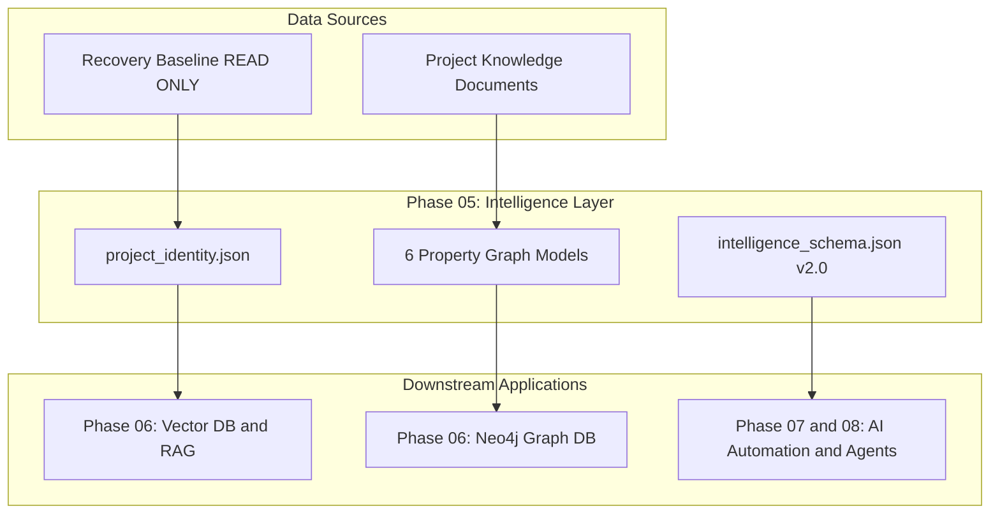

# YM-LAB PROJECT Phase 05 Intelligence Layer Master Report

> **Purpose**: Human Overview Report  
> **Version**: `v0.5.0`  
> **Verification Status**: ✅ **VERIFIED** (9/9 Checks Passed)  

---

## 1. Executive Summary

Phase 05 Project Intelligence Layer는 복원된 3,524개 파일과 프로젝트 문서로부터 **컴퓨터와 AI가 시맨틱하게 추론할 수 있는 지식 레이어**를 완숙 구축하는 단계입니다. 본 레이어는 머신데이터(JSON)와 사람이 읽는 오버뷰(Markdown)를 명확히 분리하여, Phase 06 Knowledge Engine 구축의 견고한 시맨틱 기반을 제공합니다.

---

## 2. Architecture

---

## 3. Deliverables Summary

- **Total Assets**: **14** 건 (`200_PROJECT_INTELLIGENCE/intelligence/`)
- **Graph Models**: **6** 개 (`project_graph`, `dependency_graph`, `concept_map`, `knowledge_map`, `task_graph`, `module_relationship`)
- **Knowledge Documents**: **19** 개 인덱싱
- **Terminology**: **15** 개 정규화 용어
- **Intelligence Files**: **14** 개 (JSON 13종 + Markdown 1종)

---

## 4. Verification Summary

- **Status**: ✅ **9/9 PASS** (VERIFIED)
- **Checklist**:
  1. JSON Syntax Validation: **PASS**
  2. Missing Evidence Check: **PASS**
  3. Orphan Nodes Check: **PASS**
  4. Graph Integrity Check: **PASS**
  5. Circular Dependencies Check: **PASS**
  6. Duplicate Concepts Check: **PASS**
  7. AI Context Integrity Check: **PASS**
  8. Phase 06 Compatibility Check: **PASS**
  9. Reference Integrity Check: **PASS**

---

## 5. Risks

1. **Vendor Dependencies Noise**: `node_modules` (3,337개 파일) 패키지 노이즈 분리 관리 필요.
2. **Legacy Duplicate Archives**: 백업 엑셀 중복 파일(154개)의 지식 단일화(Canonical Mapping) 필요.
3. **Unclassified Assets**: 단일 키워드 자산(108개)의 지속적 세부 정제.
4. **Vector Store Delay**: Vector DB 및 RAG 구축 지연 시 시맨틱 검색 성능 제한.
5. **Graph Query Scalability**: 향후 Neo4j 도입 시 Cypher 쿼리 스키마 확장성 확보 필요.

---

## 6. Remaining Work

- **Phase 06 (Knowledge Engine)**: ChromaDB/Pinecone Vector DB 임베딩 및 Neo4j Graph DB 파이프라인 구축.
- **Phase 07 (AI Automation)**: 자율 CI/CD 및 지식 갱신 자동화 파이프라인 수립.
- **Phase 08 (Autonomous Operations & Commercial)**: 자율 AI 에이전트 및 B2C/B2B 상용화 생태계 구동.

---

## 7. Conclusion

Phase 05 Project Intelligence Layer는 9대 시맨틱 전수 검증을 통과하여 **완전한 검증(Verified)** 상태에 달성했습니다. 기계 데이터(JSON)와 인적 오버뷰(Markdown)의 명확한 역할 분담을 통해 Phase 06 Knowledge Engine으로 진입할 완전한 준비를 마쳤습니다.
