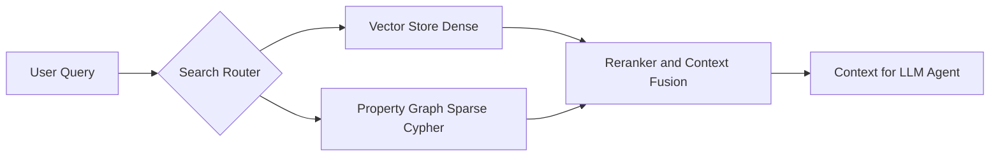

# YM-LAB Hybrid RAG Search Architecture

> **Document Purpose**: Search System Specification  

---

## 1. Hybrid Retrieval Model

Knowledge Engine은 Dense Vector Similarity Search와 Sparse Graph Property Matching을 결합한 **Hybrid Retrieval System**을 사용합니다.

