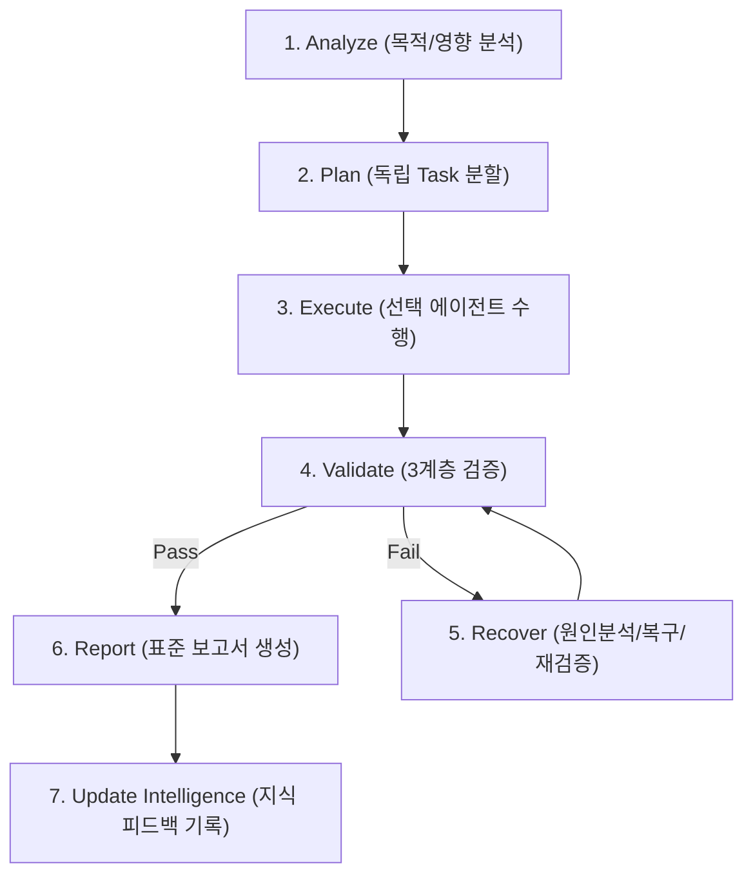

# YM-LAB Standard 7-Step Automation Workflow

> **Phase**: Phase 07  

---

## 1. The 7-Step Sequence Pipeline

---

## 2. Mandatory Pipeline Rules

- **Execute Prior Plan FORBIDDEN**: Plan 없이 Execute를 절대 실행하지 않는다.
- **Recover Loop**: Validation 실패 시 Recover 단계를 수행하고 반드시 재검증한다.
- **Report Validation**: 검증되지 않은 결과는 절대로 보고서로 제출하지 않는다.
