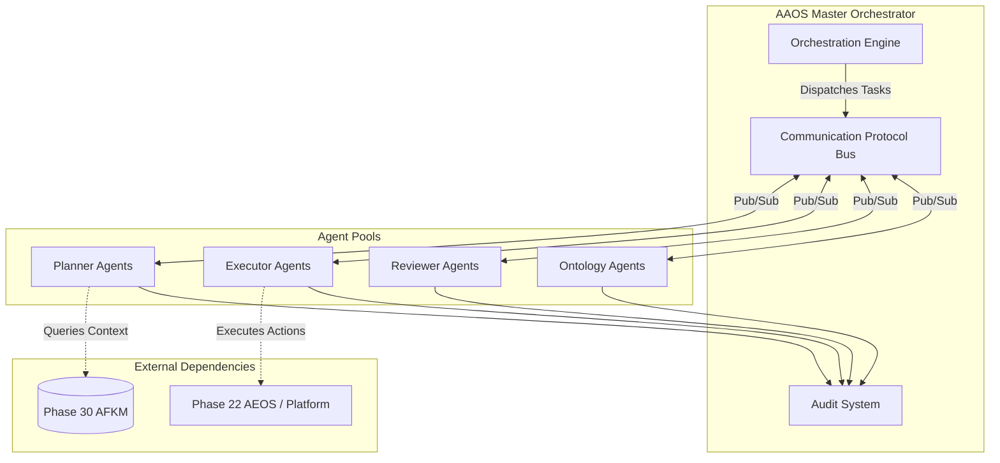

# 01_AGENT_ARCHITECTURE.md

## Phase 31 – AI Autonomous Agent Orchestration System (AAOS)

**Version** : v3.9.0  
**Status** : Active  
**Architecture Level** : AI Agent Orchestration Layer  
**Architecture Standard** : ADF v3.1  
**Date (UTC)** : 2026-07-23  

---

## 1. Executive Summary & Vision

The **AI Autonomous Agent Orchestration System (AAOS)** establishes the single authoritative framework for managing, directing, and monitoring AI agents within the **YM-LAB Enterprise Ecosystem**. Operating as an intelligence orchestration overlay on top of the **Phase 30 AI Federated Knowledge Mesh (AFKM)**, AAOS manages the complete lifecycle of autonomous multi-agent workflows, ensuring that agents collaborate efficiently, securely, and within strict governance boundaries.

---

## 2. Architectural Principles

1. **Autonomous yet Governed**: Agents operate with high autonomy using LLM-based reasoning, but are strictly bounded by declarative governance and permission models.
2. **Federated Knowledge Integration**: Agents seamlessly pull context from the **AFKM**, ensuring access to the latest Q-Code ontologies and Phase 00~30 baseline data.
3. **Decoupled Orchestration**: The Orchestration Engine handles routing, state management, and error recovery, freeing individual agents to focus entirely on task execution.
4. **Observable by Design**: Every agent action, prompt generation, tool execution, and state transition is immutably logged into the Agent Audit System.

---

## 3. High-Level Architecture Topology

---

## 4. Core Architecture Components

### 4.1 Orchestration Engine
The central nervous system of AAOS. It parses high-level user intents, breaks them into task DAGs (Directed Acyclic Graphs), and assigns them to the optimal agent pools.

### 4.2 Agent Node (Worker)
A standardized containerized runtime for a single AI agent. Includes:
- **LLM Gateway Interface**: Abstracts the underlying foundation model.
- **Tool Executor**: Safely executes Python, Bash, or API tools based on granted permissions.
- **Memory Context Window**: Local short-term memory synchronized with the AFKM.

### 4.3 Communication Protocol Bus
A real-time, event-driven messaging layer utilizing publish-subscribe patterns to allow agents to pass intermediate outputs and consensus voting messages without tightly coupling their runtimes.

---

## 5. Self Review & Validation

| Validation Item | Required Standard | Result |
|---|---|---|
| Architecture Integrity | High-level components defined | PASS |
| Governance Compliance | ADF v3.1 Header & Format | PASS |
| Cross Reference Integrity | Phase 30 AFKM referenced | PASS |

---

**[End of Document]**
