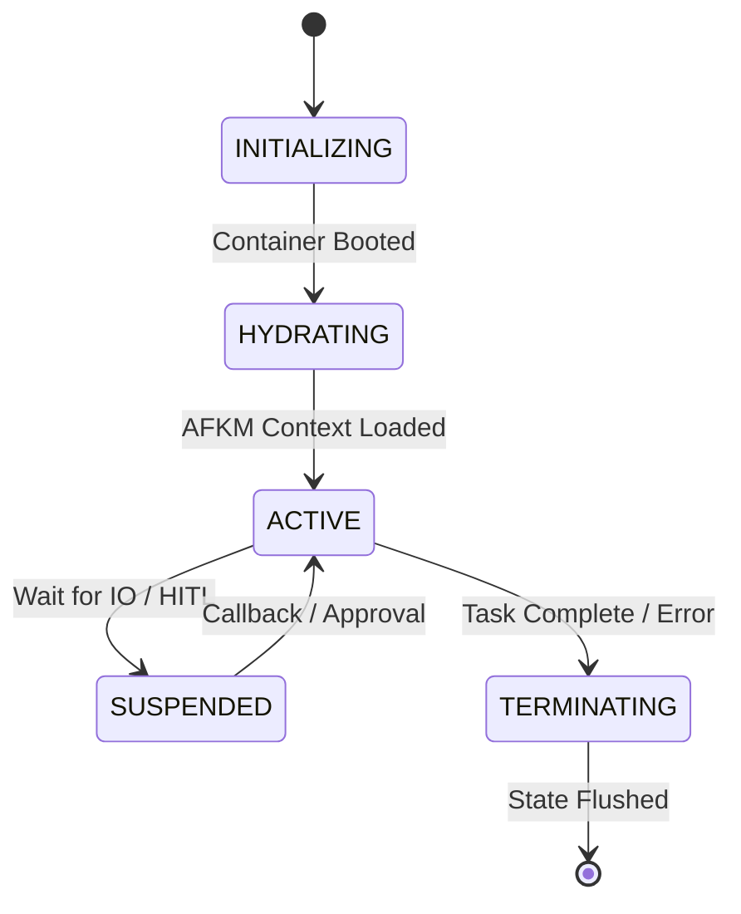

# 04_AGENT_LIFECYCLE.md

## Phase 31 – AI Autonomous Agent Orchestration System (AAOS)

**Version** : v3.9.0  
**Status** : Active  
**Architecture Level** : AI Agent Orchestration Layer  
**Architecture Standard** : ADF v3.1  
**Date (UTC)** : 2026-07-23  

---

## 1. Executive Summary

The **Agent Lifecycle** document defines the deterministic state machine that governs the birth, operational lifespan, and termination of every AI agent within the AAOS. Ensuring a predictable lifecycle is critical for resource management, context isolation, and avoiding zombie processes.

---

## 2. Standard Agent State Machine

---

## 3. Lifecycle Phases

### 3.1 Initializing & Hydrating (Bootstrapping)
- **Container Allocation**: A standardized sandbox (Docker/Kubernetes pod) is provisioned via the underlying **Phase 22 AEOS**.
- **Hydration**: The agent pulls requisite context (e.g., Q-Code Ontologies, previous Phase architecture rules) from the **Phase 30 AFKM**. 
- **Tool Provisioning**: Specific tools (API endpoints, shell access) are mounted into the sandbox based on the **Agent Permission Model (Deliverable 03)**.

### 3.2 Active (Execution)
- **OODA Loop**: The agent continuously cycles through Observe, Orient, Decide, and Act phases to solve its assigned Task DAG.
- **State Emitting**: Telemetry and audit logs are continuously flushed to the **Agent Audit System**.

### 3.3 Suspended (Hibernation)
- **HITL Pause**: If an agent requests access to a production database or attempts a mutation outside its WR boundary, the engine forces a SUSPENDED state.
- **Async Wait**: The agent hibernates while waiting for long-running batch jobs (e.g., BigQuery pipeline) to complete.

### 3.4 Terminating (Cleanup)
- **Graceful Shutdown**: The agent flushes all local memory back to the AFKM if applicable, finalizes its audit log string, and gracefully exits.
- **Forced Eviction**: The Orchestrator kills the container if a fatal timeout or security violation occurs.

---

## 4. Self Review & Validation

| Validation Item | Required Standard | Result |
|---|---|---|
| Lifecycle Validation | State machine explicitly defined | PASS |
| Governance Compliance | ADF v3.1 Header & Format | PASS |

---

**[End of Document]**
