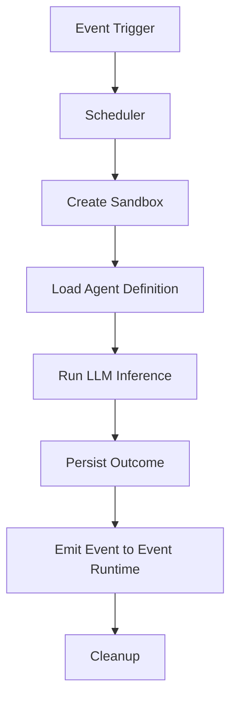

# AGENT_RUNTIME.md

## Agent Runtime & Execution Model

### 1. Goal
Provide a **sandboxed, high‑throughput execution environment** for AI agents, ensuring isolation, resource quota enforcement, and deterministic behavior.

### 2. Architecture
```
Agent Runtime
 ├─ Scheduler (K8s Job/Argo Workflows)
 ├─ Sandbox Container (Docker + gVisor)
 ├─ Resource Quota Manager
 ├─ LLM Provider Adapter
 └─ Agent State Store (Redis)
```
*Each agent runs in its own container with a minimal OS image; gVisor isolates system calls.*

### 3. Key Concepts
| Concept | Description |
|---------|-------------|
| **Agent Definition** | Declarative YAML (`agent.yaml`) describing model, tools, and trigger events. |
| **Execution Sandbox** | Docker image with `gVisor` + limited SYS calls; prevents data leakage. |
| **Resource Quotas** | CPU/Memory limits per pod; token‑bucket for LLM API calls. |
| **Autoscaling** | Horizontal Pod Autoscaler based on queue length (K8s). |
| **State Persistence** | Agent’s short‑term state persisted in Redis (TTL = 5 min). |
| **Fault Isolation** | Crash of one container does not affect others; restart policy = `OnFailure`. |

### 4. Lifecycle Flow


### 5. Security & Compliance
- **IAM**: Agent runtime pods inherit the Runtime Manager service account; least‑privilege policies defined in `SECURITY_RUNTIME.md`.
- **Secret Access**: Secrets injected via Vault side‑car; never written to disk.
- **Audit**: Every execution logs to `RUNTIME_MONITORING.md` and emits an immutable event to the Event Bus.

### 6. Cross‑Reference Links
- Master Architecture: [AERP_MASTER_ARCHITECTURE.md](file:///C:/Users/car13/.gemini/antigravity-ide/brain/49a37dfb-8f31-41e4-abcc-cfb650cba1f9/AERP_MASTER_ARCHITECTURE.md)
- Runtime Manager: [RUNTIME_MANAGER.md](file:///C:/Users/car13/.gemini/antigravity-ide/brain/49a37dfb-8f31-41e4-abcc-cfb650cba1f9/RUNTIME_MANAGER.md)
- Memory Runtime: [MEMORY_RUNTIME.md](file:///C:/Users/car13/.gemini/antigravity-ide/brain/49a37dfb-8f31-41e4-abcc-cfb650cba1f9/MEMORY_RUNTIME.md)
- Tool Runtime: [TOOL_RUNTIME.md](file:///C:/Users/car13/.gemini/antigravity-ide/brain/49a37dfb-8f31-41e4-abcc-cfb650cba1f9/TOOL_RUNTIME.md)
- Event Runtime: [EVENT_RUNTIME.md](file:///C:/Users/car13/.gemini/antigravity-ide/brain/49a37dfb-8f31-41e4-abcc-cfb650cba1f9/EVENT_RUNTIME.md)
- Security Runtime: [SECURITY_RUNTIME.md](file:///C:/Users/car13/.gemini/antigravity-ide/brain/49a37dfb-8f31-41e4-abcc-cfb650cba1f9/SECURITY_RUNTIME.md)
- Monitoring: [RUNTIME_MONITORING.md](file:///C:/Users/car13/.gemini/antigravity-ide/brain/49a37dfb-8f31-41e4-abcc-cfb650cba1f9/RUNTIME_MONITORING.md)

---
*This document is intentionally high‑level; implementation details (Dockerfile, Helm chart) can be added later.*
