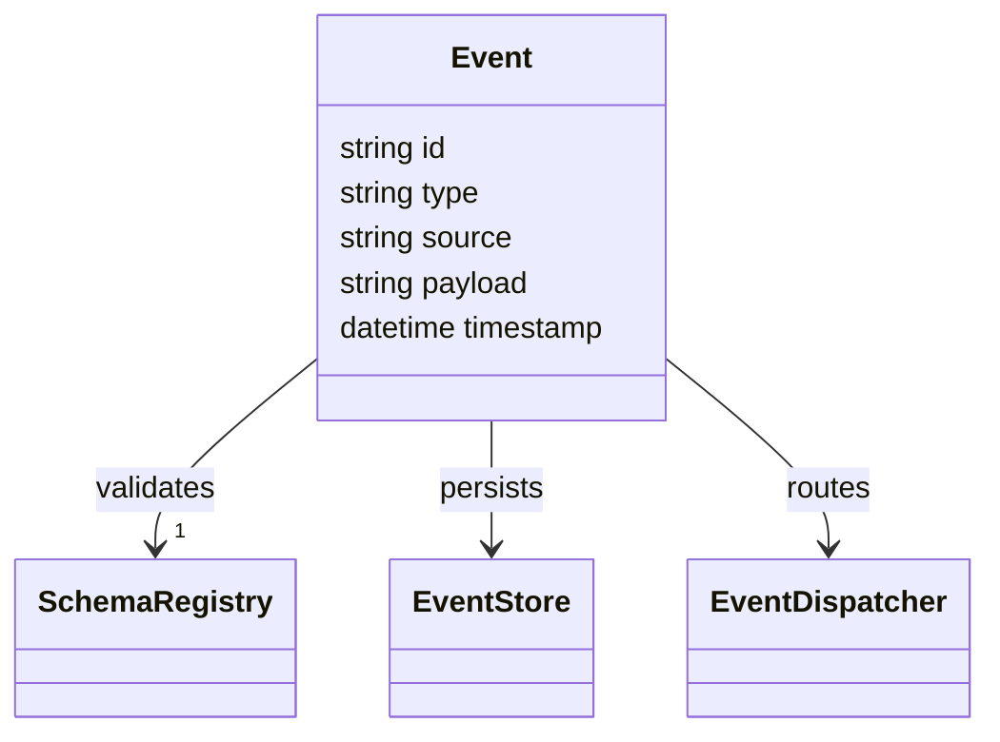

# EVENT_RUNTIME.md

## Event Runtime & Event Processing Architecture

### 1. Goal
Provide a **reliable, ordered, and scalable** event backbone that connects agents, tools, and external systems across the AI Enterprise Runtime Platform (AERP).

### 2. Core Components
| Component | Role |
|-----------|------|
| **Event Bus** | Pub/Sub backbone for decoupled communication (Google Cloud Pub/Sub or Apache Kafka). |
| **Event Dispatcher** | Listens to the bus, routes events to appropriate runtimes (Agent, Tool, Memory). |
| **Event Store** | Durable log of all events for replay and audit (Cloud Storage + BigQuery). |
| **Schema Registry** | Centralised JSON schema definitions for each event type (Confluent Schema Registry style). |
| **Replay Service** | Re‑processes past events for state reconstruction or debugging. |

### 3. Event Model

### 4. Delivery Guarantees
- **At‑Least‑Once** delivery for critical events (e.g., security alerts).  
- **Exactly‑Once** for idempotent state updates (e.g., memory writes) using deduplication keys.

### 5. Ordering & Partitioning
- Events are partitioned by **source** (agent, tool, external) to preserve intra‑source order.  
- Cross‑source ordering is not guaranteed – consumers must handle eventual consistency.

### 6. Failure Handling
- **Dead‑Letter Queue** – undeliverable events are sent here for manual inspection.  
- **Retry Policy** – exponential back‑off up to 5 attempts before dead‑letter.

### 7. Security Considerations (see `SECURITY_RUNTIME.md`)
- All messages are encrypted in‑flight (TLS) and at rest (KMS‑encrypted topics).  
- Access is controlled via IAM roles scoped to event types.

### 8. Monitoring (see `RUNTIME_MONITORING.md`)
- Pub/Sub metrics: `message_publish_count`, `message_delivery_latency`.  
- Alert on dead‑letter queue growth > 100 messages.

### 9. Cross‑Reference Links
- Master Architecture: [AERP_MASTER_ARCHITECTURE.md](file:///C:/Users/car13/.gemini/antigravity-ide/brain/49a37dfb-8f31-41e4-abcc-cfb650cba1f9/AERP_MASTER_ARCHITECTURE.md)
- Runtime Manager: [RUNTIME_MANAGER.md](file:///C:/Users/car13/.gemini/antigravity-ide/brain/49a37dfb-8f31-41e4-abcc-cfb650cba1f9/RUNTIME_MANAGER.md)
- Agent Runtime: [AGENT_RUNTIME.md](file:///C:/Users/car13/.gemini/antigravity-ide/brain/49a37dfb-8f31-41e4-abcc-cfb650cba1f9/AGENT_RUNTIME.md)
- Tool Runtime: [TOOL_RUNTIME.md](file:///C:/Users/car13/.gemini/antigravity-ide/brain/49a37dfb-8f31-41e4-abcc-cfb650cba1f9/TOOL_RUNTIME.md)
- Security Runtime: [SECURITY_RUNTIME.md](file:///C:/Users/car13/.gemini/antigravity-ide/brain/49a37dfb-8f31-41e4-abcc-cfb650cba1f9/SECURITY_RUNTIME.md)
- Monitoring: [RUNTIME_MONITORING.md](file:///C:/Users/car13/.gemini/antigravity-ide/brain/49a37dfb-8f31-41e4-abcc-cfb650cba1f9/RUNTIME_MONITORING.md)
- Recovery System: [RECOVERY_SYSTEM.md](file:///C:/Users/car13/.gemini/antigravity-ide/brain/49a37dfb-8f31-41e4-abcc-cfb650cba1f9/RECOVERY_SYSTEM.md)

---
*Further details (schema examples, topic naming conventions) can be added as needed.*
