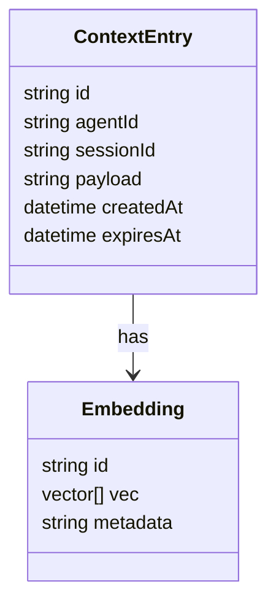

# MEMORY_RUNTIME.md

## Memory Runtime & Management System

### 1. Objective
Provide **low‑latency, durable, and versioned** storage for agent context, embeddings, and persistent state across executions while respecting ADF v3.1 data‑retention policies.

### 2. Storage Layers
| Layer | Use‑Case | Technology |
|-------|----------|------------|
| **Hot Cache** | Short‑term session context, token limits | Redis (cluster mode) |
| **Vector Store** | Semantic similarity search for embeddings | Milvus (or PGVector) |
| **Relational Store** | Structured metadata, audit logs | PostgreSQL (Cloud SQL) |
| **Backup Archive** | Long‑term retention, rollback | Cloud Storage (WASABI) |

### 3. Data Model

### 4. Consistency Guarantees
- **Hot Cache** – eventual consistency (TTL‑based eviction).  
- **Vector Store** – strong read‑after‑write for retrieval.  
- **Relational Store** – ACID transactions for audit trails.

### 5. Retention & Eviction
- **Session TTL**: 30 min of inactivity → auto‑evict from Redis.  
- **Embedding TTL**: 90 days by default; configurable per project.  
- **Archival**: Daily snapshots to Cloud Storage; retained per compliance policy (e.g., 1 year).

### 6. Access Patterns (via Tool Runtime)
- `GET /memory/context/{sessionId}` → Redis cache.  
- `POST /memory/embedding` → Milvus bulk insert.  
- `SELECT * FROM metadata WHERE agent_id = ?` → PostgreSQL.

### 7. Cross‑Reference Links
- Master Architecture: [AERP_MASTER_ARCHITECTURE.md](file:///C:/Users/car13/.gemini/antigravity-ide/brain/49a37dfb-8f31-41e4-abcc-cfb650cba1f9/AERP_MASTER_ARCHITECTURE.md)
- Runtime Manager: [RUNTIME_MANAGER.md](file:///C:/Users/car13/.gemini/antigravity-ide/brain/49a37dfb-8f31-41e4-abcc-cfb650cba1f9/RUNTIME_MANAGER.md)
- Agent Runtime: [AGENT_RUNTIME.md](file:///C:/Users/car13/.gemini/antigravity-ide/brain/49a37dfb-8f31-41e4-abcc-cfb650cba1f9/AGENT_RUNTIME.md)
- Tool Runtime: [TOOL_RUNTIME.md](file:///C:/Users/car13/.gemini/antigravity-ide/brain/49a37dfb-8f31-41e4-abcc-cfb650cba1f9/TOOL_RUNTIME.md)
- Security Runtime: [SECURITY_RUNTIME.md](file:///C:/Users/car13/.gemini/antigravity-ide/brain/49a37dfb-8f31-41e4-abcc-cfb650cba1f9/SECURITY_RUNTIME.md)
- Monitoring: [RUNTIME_MONITORING.md](file:///C:/Users/car13/.gemini/antigravity-ide/brain/49a37dfb-8f31-41e4-abcc-cfb650cba1f9/RUNTIME_MONITORING.md)
- Recovery System: [RECOVERY_SYSTEM.md](file:///C:/Users/car13/.gemini/antigravity-ide/brain/49a37dfb-8f31-41e4-abcc-cfb650cba1f9/RECOVERY_SYSTEM.md)

---
*The document can be expanded with concrete schema definitions and backup scripts as needed.*
