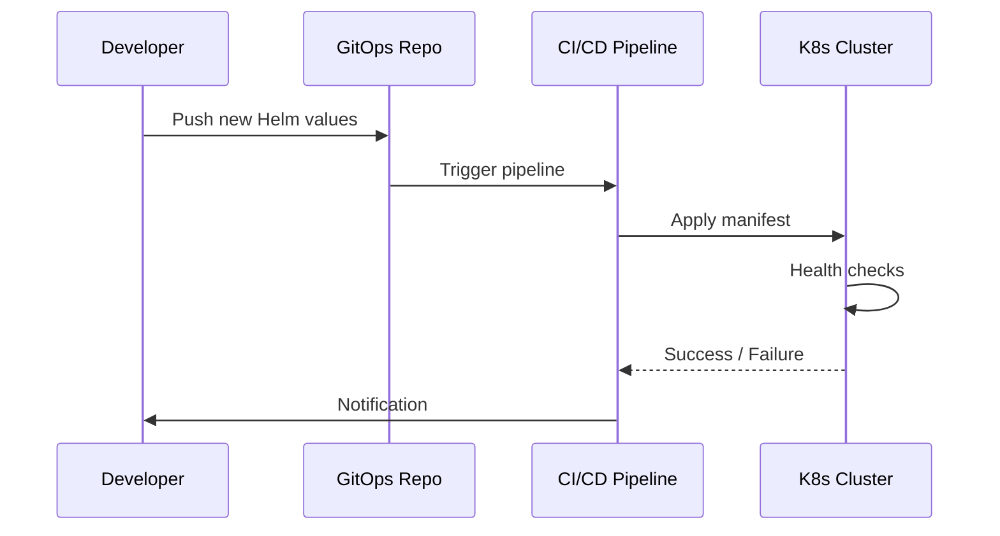

# RUNTIME_MANAGER.md

## Runtime Manager & Lifecycle Design

### 1. Purpose
Manage the full life‑cycle of the AI Enterprise Runtime Platform (AERP) – from deployment, versioning, scaling, to graceful shutdown. Acts as the single source of truth for component configuration.

### 2. Responsibilities
| Responsibility | Description |
|----------------|-------------|
| **Orchestration** | Deploys/updates all runtime components via Helm charts on a Kubernetes cluster. |
| **Version Control** | Maintains semantic version numbers for each component; supports blue/green and canary releases. |
| **Configuration Management** | Centralises config in a Git‑Ops repository; leverages `kustomize` overlays for dev/stage/prod. |
| **Health Checks** | Periodic probes (readiness/liveness) for every sub‑runtime; integrates with `RUNTIME_MONITORING.md`. |
| **Rollback** | Triggers the **Recovery System** on failure; stores previous successful manifests. |
| **Audit Trail** | Emits immutable audit events to the **Event Runtime** for governance compliance. |

### 3. Deployment Workflow

### 4. Lifecycle States
- **Pending** – Manifest staged but not applied.
- **Running** – All components healthy.
- **Updating** – New version being rolled out.
- **Failed** – Health check error; triggers rollback.
- **Terminated** – Resources de‑provisioned.

### 5. Upgrade Procedure
1. Increment component version in `values.yaml`.
2. Submit PR → Merge triggers CI.
3. CI performs **canary** rollout (5 % traffic).
4. If metrics in **RUNTIME_MONITORING.md** are stable, increase rollout to 100 %.
5. On any anomaly, invoke **RECOVERY_SYSTEM.md** to rollback.

### 6. Cross‑Reference Links
- Master Architecture: [AERP_MASTER_ARCHITECTURE.md](file:///C:/Users/car13/.gemini/antigravity-ide/brain/49a37dfb-8f31-41e4-abcc-cfb650cba1f9/AERP_MASTER_ARCHITECTURE.md)
- Agent Runtime: [AGENT_RUNTIME.md](file:///C:/Users/car13/.gemini/antigravity-ide/brain/49a37dfb-8f31-41e4-abcc-cfb650cba1f9/AGENT_RUNTIME.md)
- Memory Runtime: [MEMORY_RUNTIME.md](file:///C:/Users/car13/.gemini/antigravity-ide/brain/49a37dfb-8f31-41e4-abcc-cfb650cba1f9/MEMORY_RUNTIME.md)
- Tool Runtime: [TOOL_RUNTIME.md](file:///C:/Users/car13/.gemini/antigravity-ide/brain/49a37dfb-8f31-41e4-abcc-cfb650cba1f9/TOOL_RUNTIME.md)
- Event Runtime: [EVENT_RUNTIME.md](file:///C:/Users/car13/.gemini/antigravity-ide/brain/49a37dfb-8f31-41e4-abcc-cfb650cba1f9/EVENT_RUNTIME.md)
- Security Runtime: [SECURITY_RUNTIME.md](file:///C:/Users/car13/.gemini/antigravity-ide/brain/49a37dfb-8f31-41e4-abcc-cfb650cba1f9/SECURITY_RUNTIME.md)
- Monitoring: [RUNTIME_MONITORING.md](file:///C:/Users/car13/.gemini/antigravity-ide/brain/49a37dfb-8f31-41e4-abcc-cfb650cba1f9/RUNTIME_MONITORING.md)
- Recovery System: [RECOVERY_SYSTEM.md](file:///C:/Users/car13/.gemini/antigravity-ide/brain/49a37dfb-8f31-41e4-abcc-cfb650cba1f9/RECOVERY_SYSTEM.md)

---
*All sections are deliberately concise; additional operational details can be expanded later.*
