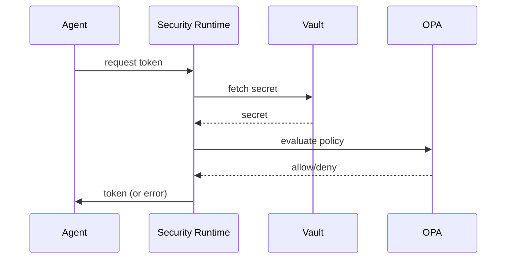

# SECURITY_RUNTIME.md

## Runtime Security & Access Control Design

### 1. Objective
Define **uniform security controls** for every runtime component (Agent, Memory, Tool, Event, etc.) ensuring confidentiality, integrity, and auditability in line with ADF v3.1 governance.

### 2. Security Domains
| Domain | Controls |
|--------|----------|
| **Identity & Access Management (IAM)** | Centralised IAM using Google Cloud IAM; least‑privilege roles per service account (Runtime Manager, Agent Runtime, Tool Runtime, etc.). |
| **Authentication** | Service‑to‑service auth via **workload identity federation**; short‑lived tokens injected by Vault side‑car. |
| **Authorization** | Policy‑as‑code using **Open Policy Agent (OPA)**. Policies stored in a Git‑Ops repo and enforced at entry points (Webhook for K8s). |
| **Secret Management** | All secrets (API keys, DB passwords) stored in **HashiCorp Vault**; secrets fetched at container start and never written to disk. |
| **Network Security** | Egress‑only VPC service controls; internal traffic via **mutual TLS**; external tool calls go through the **Tool Runtime proxy** which adds auth headers. |
| **Audit & Logging** | Every security‑relevant action (token issuance, secret access, policy decision) emits an immutable audit event to the **Event Runtime** (topic `security.audit`). |
| **Data‑in‑Transit Encryption** | TLS 1.3 for all HTTP/gRPC; optional **mTLS** for internal micro‑services. |
| **Compliance** | Automated checks against ADF v3.1 security checklist (see `RUNTIME_MONITORING.md` for alerts). |

### 3. Role Matrix (example)
| Role | Permissions |
|------|-------------|
| `runtime-manager-sa` | `roles/container.admin`, `roles/resourcemanager.projectIamAdmin` |
| `agent-runtime-sa` | `roles/run.invoker`, `roles/secretmanager.secretAccessor` |
| `tool-runtime-sa` | `roles/secretmanager.secretAccessor`, `roles/pubsub.publisher` |
| `event-runtime-sa` | `roles/pubsub.publisher`, `roles/pubsub.subscriber` |
| `monitoring-sa` | `roles/monitoring.viewer`, `roles/logging.viewer` |

### 4. Security Workflow Example

### 5. Incident Response
1. **Detect** – Alert from `RUNTIME_MONITORING.md` on anomalous auth failures.  
2. **Contain** – Revoke compromised service account via IAM.  
3. **Investigate** – Pull audit events from `EVENT_RUNTIME` dead‑letter.  
4. **Recover** – Rotate secrets in Vault; redeploy affected pods.

### 6. Cross‑Reference Links
- Master Architecture: [AERP_MASTER_ARCHITECTURE.md](file:///C:/Users/car13/.gemini/antigravity-ide/brain/49a37dfb-8f31-41e4-abcc-cfb650cba1f9/AERP_MASTER_ARCHITECTURE.md)
- Runtime Manager: [RUNTIME_MANAGER.md](file:///C:/Users/car13/.gemini/antigravity-ide/brain/49a37dfb-8f31-41e4-abcc-cfb650cba1f9/RUNTIME_MANAGER.md)
- Monitoring: [RUNTIME_MONITORING.md](file:///C:/Users/car13/.gemini/antigravity-ide/brain/49a37dfb-8f31-41e4-abcc-cfb650cba1f9/RUNTIME_MONITORING.md)
- Recovery System: [RECOVERY_SYSTEM.md](file:///C:/Users/car13/.gemini/antigravity-ide/brain/49a37dfb-8f31-41e4-abcc-cfb650cba1f9/RECOVERY_SYSTEM.md)

---
*The document can be expanded with concrete OPA policies and sample Vault paths.*
