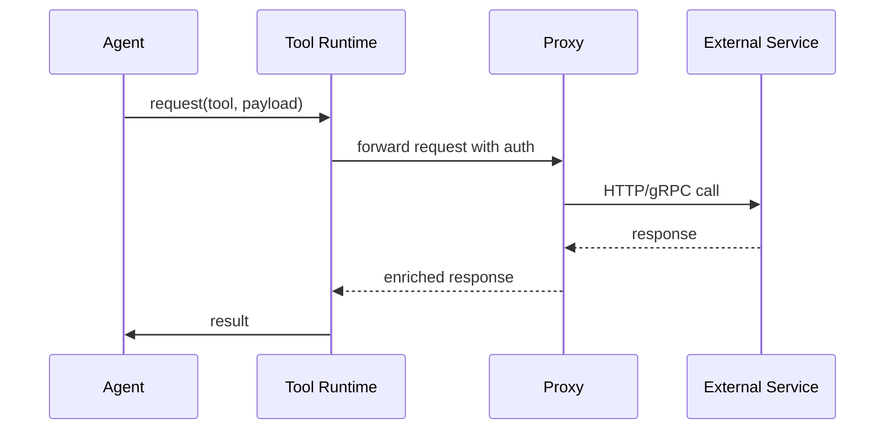

# TOOL_RUNTIME.md

## Tool Runtime & External Integration Architecture

### 1. Purpose
Standardise how the AERP interacts with **external tools and services** (search engines, databases, SaaS APIs) while enforcing authentication, rate‑limiting, and failure handling.

### 2. Core Patterns
| Pattern | Description |
|---------|-------------|
| **Adapter** | Thin wrapper that translates the platform‑wide request schema to the tool‑specific API. |
| **Proxy Service** | Centralised HTTP/gRPC proxy that injects OAuth tokens or API keys from Vault. |
| **Circuit Breaker** | Prevents cascading failures; falls back to cached responses or graceful degradation. |
| **Rate Limiter** | Token‑bucket per‑tool; configurable quotas stored in Redis. |
| **Observability Hook** | Each call emits a trace/span and a log entry (see `RUNTIME_MONITORING.md`). |

### 3. Interaction Flow

### 4. Security & Secrets
- Secrets loaded from **Vault** at pod start via side‑car.  
- No secret ever appears in container logs; all logs are sanitized (see `SECURITY_RUNTIME.md`).

### 5. Error Handling
- **Transient errors** → automatic retries with exponential back‑off (max 3 attempts).  
- **Permanent errors** → circuit‑breaker opens; subsequent calls receive a *fallback* payload defined per tool.

### 6. Cross‑Reference Links
- Master Architecture: [AERP_MASTER_ARCHITECTURE.md](file:///C:/Users/car13/.gemini/antigravity-ide/brain/49a37dfb-8f31-41e4-abcc-cfb650cba1f9/AERP_MASTER_ARCHITECTURE.md)
- Runtime Manager: [RUNTIME_MANAGER.md](file:///C:/Users/car13/.gemini/antigravity-ide/brain/49a37dfb-8f31-41e4-abcc-cfb650cba1f9/RUNTIME_MANAGER.md)
- Security Runtime: [SECURITY_RUNTIME.md](file:///C:/Users/car13/.gemini/antigravity-ide/brain/49a37dfb-8f31-41e4-abcc-cfb650cba1f9/SECURITY_RUNTIME.md)
- Monitoring: [RUNTIME_MONITORING.md](file:///C:/Users/car13/.gemini/antigravity-ide/brain/49a37dfb-8f31-41e4-abcc-cfb650cba1f9/RUNTIME_MONITORING.md)
- Recovery System: [RECOVERY_SYSTEM.md](file:///C:/Users/car13/.gemini/antigravity-ide/brain/49a37dfb-8f31-41e4-abcc-cfb650cba1f9/RECOVERY_SYSTEM.md)

---
*Implementation details (Dockerfile, Helm values) can be added in a later iteration.*
