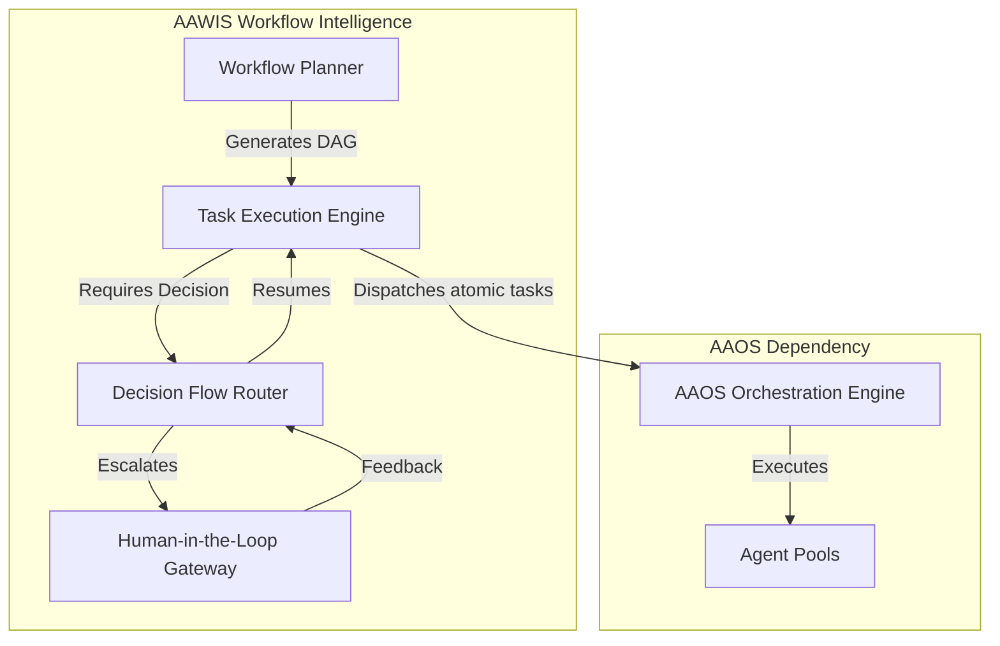

# 01_WORKFLOW_ARCHITECTURE.md

## Phase 32 – AI Autonomous Workflow Intelligence System (AAWIS)

**Version** : v3.10.0  
**Status** : Active  
**Architecture Level** : AI Workflow Orchestration Layer  
**Architecture Standard** : ADF v3.1  
**Date (UTC)** : 2026-07-23  

---

## 1. Executive Summary & Vision

The **AI Autonomous Workflow Intelligence System (AAWIS)** establishes the overarching architecture for Enterprise AI Agent Workflow Planning, Task Execution, Process Automation, Decision Flow, and Human-in-the-Loop collaboration. Building upon the foundational capabilities of Phase 31 AAOS, AAWIS transitions from basic agent orchestration to complex, multi-stage, stateful workflow intelligence.

---

## 2. Architectural Principles

1. **Workflow Centricity**: All tasks are encapsulated within directed, intelligent workflows.
2. **Human-in-the-Loop (HITL) Integration**: Critical decision nodes seamlessly integrate human approval or intervention.
3. **Adaptive Execution**: Workflows dynamically adjust execution paths based on real-time task outcomes and AFKM context.
4. **End-to-End Automation**: Process automation bridges the gap between atomic agent actions and enterprise-scale objectives.

---

## 3. High-Level Architecture Topology

---

## 4. Self Review & Validation

| Validation Item | Required Standard | Result |
|---|---|---|
| Architecture Integrity | High-level workflow components defined | PASS |
| Governance Compliance | ADF v3.1 Header & Format | PASS |
| Cross Reference Integrity | Phase 31 AAOS referenced | PASS |

---

**[End of Document]**
