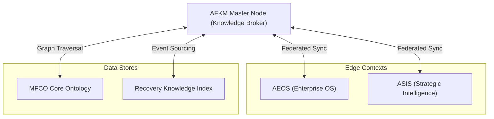

# 01_AFKM_MASTER_ARCHITECTURE.md

> **Document Type**: Base Architecture Document  
> **Phase**: Phase 30 (AI Federated Knowledge Mesh, AFKM)  
> **ADF Governance Version**: ADF v3.1  
> **Repository Release Version**: v3.9.0  
> **Status**: Closed & Frozen  

---

## 1. Executive Summary

The **AI Federated Knowledge Mesh (AFKM)** establishes the Enterprise Ecosystem's distributed knowledge integration layer. Building upon the AI Application Framework (AAF, Phase 29), AFKM enables fully decoupled, federated knowledge sharing, routing, and synchronization across all autonomous agents, user applications, and downstream platforms.

---

## 2. Core Architecture Philosophy

1. **Federation over Centralization**: Knowledge is distributed closer to compute edges and specialized agent pools, rather than bottlenecked in a single monolithic store.
2. **Dynamic Routing**: Agents broadcast and subscribe to knowledge updates dynamically via the Mesh Topology.
3. **Immutable Synchronization**: Multi-node states are synchronized using the robust SSOT (Single Source of Truth) mechanisms established in earlier phases, governed by ADF v3.1.

---

## 3. High-Level Mesh Topology

---

## 4. Architectural Boundaries

- **Upstream**: Inherits AI Application Framework (AAF) APIs and routing standards.
- **Downstream**: Dictates data payloads for Edge Computing and Multi-Region Cloud deployments.
- **Independence**: Does not mutate existing Phase 22–29 architectures; operates purely as an overlay communication mesh.

---

**[End of Document]**
