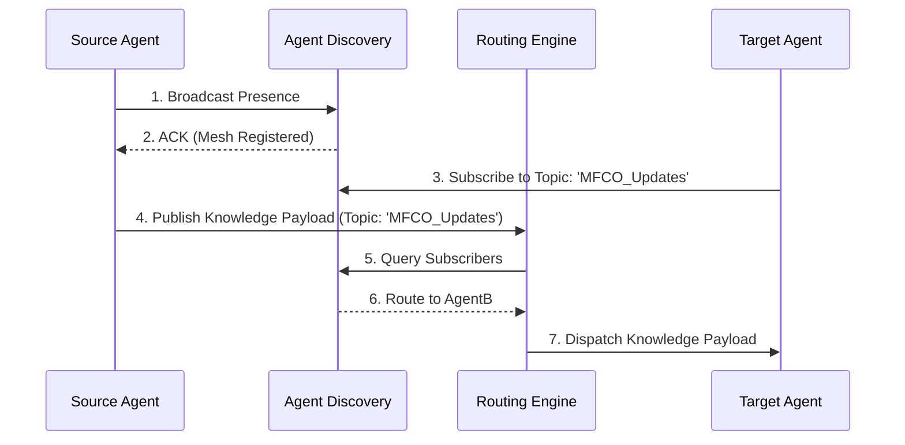

# 04_COMPONENT_ARCHITECTURE.md

> **Document Type**: Component Architecture  
> **Phase**: Phase 30 (AI Federated Knowledge Mesh, AFKM)  
> **ADF Governance Version**: ADF v3.1  
> **Repository Release Version**: v3.9.0  
> **Status**: Closed & Frozen  

---

## 1. Core Component Breakdown

The AFKM consists of three major architectural components that operate independently but cohesively under the AAF standard.

### 1.1 Agent Discovery Service (ADS)
- **Role**: Maintains a dynamic registry of all active agents (AEOS, ASIS, AERP, etc.) in the ecosystem.
- **Function**: Handles agent heartbeat, capability registration, and lifecycle management.

### 1.2 Knowledge Routing Engine (KRE)
- **Role**: The core message broker for the Mesh Topology.
- **Function**: Receives serialized knowledge payloads, evaluates routing rules, and dispatches data to the appropriate agent sub-meshes.
- **Design Pattern**: Publish-Subscribe (Pub/Sub) combined with Semantic Topic Matching.

### 1.3 Synchronization Strategy Controller (SSC)
- **Role**: Ensures SSOT consistency across federated nodes.
- **Function**: Implements Vector Clock synchronization and Conflict-free Replicated Data Types (CRDTs) for localized cache reconciliation.

---

## 2. Component Interaction Sequence

---

**[End of Document]**
