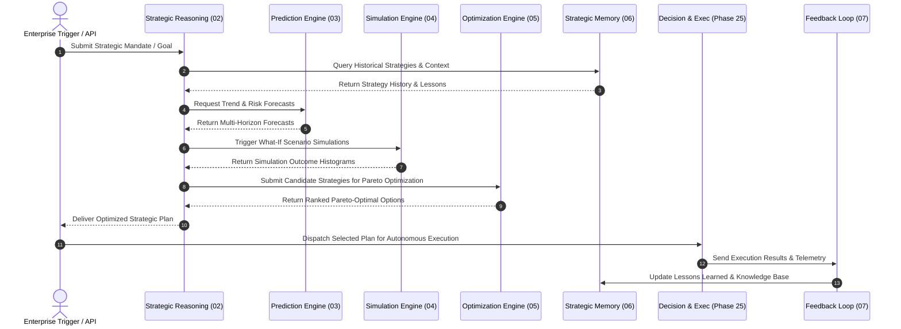
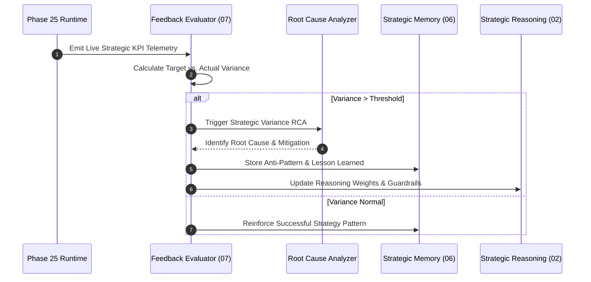

# 09_SEQUENCE_DIAGRAMS.md

## Phase 26 – AI Autonomous Strategic Intelligence System (ASIS)

**Version** : v3.4.0
**Status** : Closed & Frozen
**Architecture Level** : Core Intelligence Layer
**Architecture Standard** : ADF v3.1
**Date (UTC)** : 2026-07-22

---

## 1. Purpose

Provide Mermaid sequence diagrams illustrating end-to-end interactions across ASIS components, Phase 25 AEDES, and external triggers during strategic reasoning, prediction, simulation, optimization, and feedback cycles.

---

## 2. Sequence Diagrams

### 2.1 End-to-End Strategic Intelligence Flow

---

### 2.2 Closed-Loop Feedback & Learning Cycle

---

## 3. Self Review & Validation

| Validation Item | Status | Result |
|-----------------|--------|--------|
| Architecture Consistency | Compliant | PASS |
| Diagram Syntax & Readability | Verified | PASS |
| End-to-End Coverage | Complete | PASS |
| Traceability to Master Standard | Mapped | PASS |

---

## 4. References

- [01_ASIS_ARCHITECTURE.md](01_ASIS_ARCHITECTURE.md)
- [08_API_INTERFACE.md](08_API_INTERFACE.md)
- Phase 25 `03_EXECUTION_ENGINE.md`

---

## 5. Version History

| Version | Date (UTC) | Author | Description |
|---------|------------|--------|-------------|
| v3.4.0 | 2026-07-22 | Antigravity (AI) | Initial release. Sequence Diagrams generated. |
