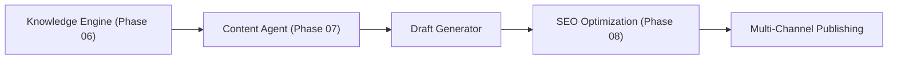

# YM-LAB Automated Content Pipeline

```mermaid
flowchart LR
    KBase["Knowledge Engine (Phase 06)"] --> AIPlanner["Content Agent (Phase 07)"]
    AIPlanner --> DraftGen["Draft Generator"]
    DraftGen --> SEOCheck["SEO Optimization (Phase 08)"]
    SEOCheck --> AutoPublish["Multi-Channel Publishing"]
```
