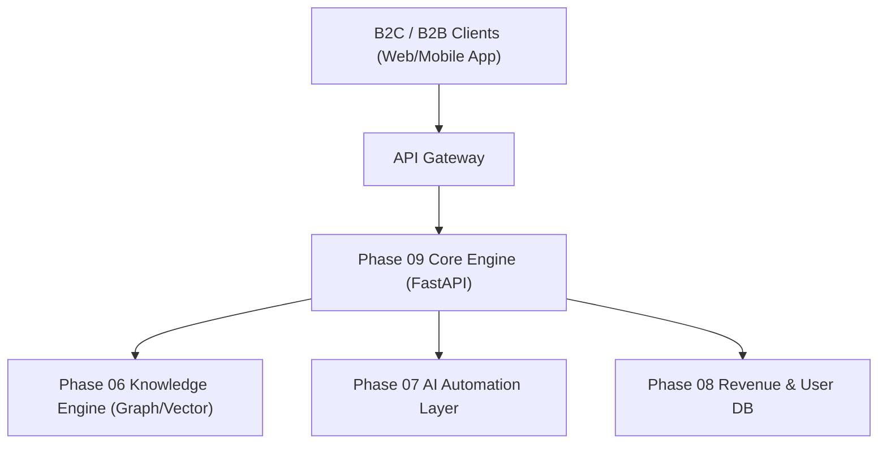

# YM-LAB Service Platform System Topology

---

## Topology Architecture

```mermaid
flowchart TD
    Client["B2C / B2B Clients (Web/Mobile App)"] --> APIGateway["API Gateway"]
    APIGateway --> CoreEngine["Phase 09 Core Engine (FastAPI)"]
    CoreEngine --> KnowledgeEngine["Phase 06 Knowledge Engine (Graph/Vector)"]
    CoreEngine --> AutoLayer["Phase 07 AI Automation Layer"]
    CoreEngine --> CommercialDB["Phase 08 Revenue & User DB"]
```
