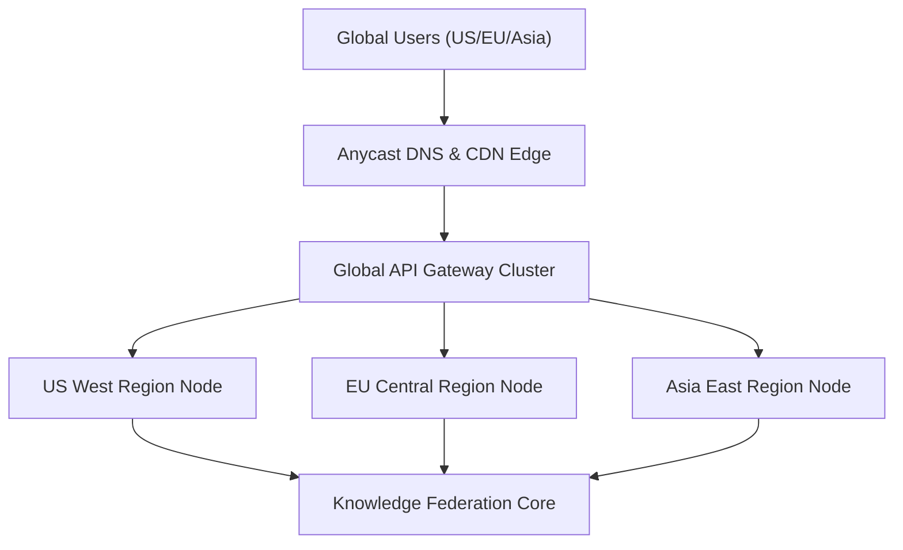

# YM-LAB Global System Topology

---

## Global Topology Architecture

```mermaid
flowchart TD
    GlobalUsers["Global Users (US/EU/Asia)"] --> AnycastDNS["Anycast DNS & CDN Edge"]
    AnycastDNS --> GatewayCluster["Global API Gateway Cluster"]
    GatewayCluster --> US_Node["US West Region Node"]
    GatewayCluster --> EU_Node["EU Central Region Node"]
    GatewayCluster --> ASIA_Node["Asia East Region Node"]
    US_Node --> FederationNetwork["Knowledge Federation Core"]
    EU_Node --> FederationNetwork
    ASIA_Node --> FederationNetwork
```
