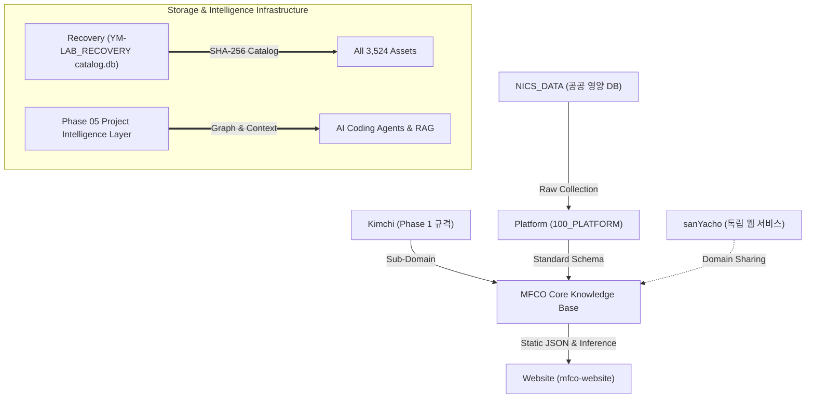

# YM-LAB PROJECT AI Agent Quick-Start Context Payload

> **Purpose**: AI 에이전트가 새로운 세션에서도 10초 이내에 YM-LAB 전체 프로젝트의 아키텍처, 용어, 데이터 구조, 절대 규칙을 즉각 파악하고 추론할 수 있도록 구성된 전용 브리핑 문서입니다.  
> **Target Audience**: AI Pairing Agents (Antigravity, Gemini, GPT-4, Claude), RAG Prompts, Agentic Subagents  

---

## 1. System Summary & Ecosystem Vision

**YM-LAB PROJECT**는 식약처 기능성 원료, 동의보감/한의학 식재료, 농식품올바로(NICS) 영양 데이터 및 산야초 효능을 단일 **Q-Code 온톨로지(MFCO)**로 통합하고, 이를 웹 애플리케이션 및 AI 데이터 서비스로 공급하는 **통합 지식 생태계**입니다.

### 🏛️ Architecture High-Level Diagram

---

## 2. Key Terminology Glossary (핵심 용어 사전)

| 용어 | 정의 및 설명 |
| :--- | :--- |
| **MFCO** | Master Functional Core Ontology. 기능성 원료 및 식재료를 Q-Code 기반으로 구조화한 마스터 온톨로지. |
| **Q-Code** | MFCO 온톨로지 내 식재료, 기능성 그룹, 효능 및 영양 성분을 유일하게 식별하는 인덱스 코드. |
| **NICS** | 농식품올바로. 농촌진흥청/식약처 공공 식품 영양 성분 DB. |
| **sanYacho** | 산야초. 한의학 기반 약용 자생식물 및 웹 서비스 프로덕션 레포지토리. |
| **Recovery Baseline** | Phase 03에서 수집된 3,524개 파일 및 SHA-256 catalog.db 무결성 고정 상태 (변경 절대 금지). |
| **Canonical Asset** | 중복 파일(154건) 중 물리적으로 대표 기준이 되는 마스터 자산. |
| **Project Intelligence Layer**| Phase 05에서 구축된 그래프/메타데이터/지식 인덱스 기반 AI 프로젝트 추론 레이어. |

---

## 3. Mandatory AI Pairing Rules (절대 개발 규칙)

1. 🛑 **Recovery Baseline 변경 절대 금지**: `01_BASELINE`, `catalog.db`, `MANIFEST.json`을 삭제, 이동, 수정하지 말 것.
2. 📄 **신규 문서 및 JSON 생성 중심**: 분석 및 기능 추가는 독립된 신규 파일 생성을 통해서만 수행.
3. 🔗 **명확한 File Scheme 링크 사용**: 모든 파일 및 코드 심볼 연결 시 `[filename](file:///g:/내%20드라이브/YM-LAB_PROJECT_/.../filename)` 형식 준수.
4. 📐 **JSON Schema 준수**: `asset_inventory.schema.json` 및 `project_classification.schema.json` 사양 준수.
5. 🧪 **실증적 검증 원칙**: 모든 작업 후 `python YM-LAB_RECOVERY/verify_consolidation.py`를 실행하여 무결성 대조.

---

## 4. Subsystem Fast Navigation Links

- 📊 **전체 자산 인벤토리**: [asset_inventory.json](file:///g:/내%20드라이브/YM-LAB_PROJECT_/YM-LAB_RECOVERY/asset_inventory.json)
- 🗂️ **프로젝트 자동 분류 스키마**: [project_classification.json](file:///g:/내%20드라이브/YM-LAB_PROJECT_/YM-LAB_RECOVERY/project_classification.json)
- 🕸️ **프로젝트 관계 그래프**: [PROJECT_GRAPH.json](file:///g:/내%20드라이브/YM-LAB_PROJECT_/YM-LAB_RECOVERY/intelligence/PROJECT_GRAPH.json)
- 🔗 **프로젝트 의존성 그래프**: [DEPENDENCY_GRAPH.json](file:///g:/내%20드라이브/YM-LAB_PROJECT_/YM-LAB_RECOVERY/intelligence/DEPENDENCY_GRAPH.json)
- 📘 **프로젝트 지식 인덱스**: [KNOWLEDGE_INDEX.md](file:///g:/내%20드라이브/YM-LAB_PROJECT_/YM-LAB_RECOVERY/intelligence/KNOWLEDGE_INDEX.md)
- 🏷️ **표준 프로젝트 메타데이터**: [PROJECT_METADATA.json](file:///g:/내%20드라이브/YM-LAB_PROJECT_/YM-LAB_RECOVERY/intelligence/PROJECT_METADATA.json)
- 📈 **통합 프로젝트 현황 기록**: [PROJECT_STATUS.md](file:///g:/내%20드라이브/YM-LAB_PROJECT_/PROJECT_STATUS.md)
- 📜 **버전 거버넌스 정책 (SSOT)**: [01_VERSION_GOVERNANCE_POLICY.md](file:///g:/내%20드라이브/YM-LAB_PROJECT_/YM-LAB_RECOVERY/01_VERSION_GOVERNANCE_POLICY.md)
- 🛠️ **AI 개발자 플랫폼 인덱스**: [README.md](file:///g:/내%20드라이브/YM-LAB_PROJECT_/Implementation/20_ai_developer_platform/README.md)
- 🎨 **AI 브랜드 아이덴티티 및 디자인 시스템**: [10_MASTER_REPORT.md](file:///g:/내%20드라이브/YM-LAB_PROJECT_/ABIDS/10_MASTER_REPORT.md)
- 🖥️ **AI 프론트엔드 디자인 시스템**: [10_MASTER_REPORT.md](file:///g:/내%20드라이브/YM-LAB_PROJECT_/AFDS/10_MASTER_REPORT.md)
- 📱 **AI 응용 프로그램 프레임워크**: [10_MASTER_REPORT.md](file:///g:/내%20드라이브/YM-LAB_PROJECT_/AAF/10_MASTER_REPORT.md)
- 🤖 **AI 자율 에이전트 오케스트레이션 시스템 (AAOS)**: [10_PHASE31_WALKTHROUGH.md](file:///g:/내%20드라이브/YM-LAB_PROJECT_/AAOS/10_PHASE31_WALKTHROUGH.md)
