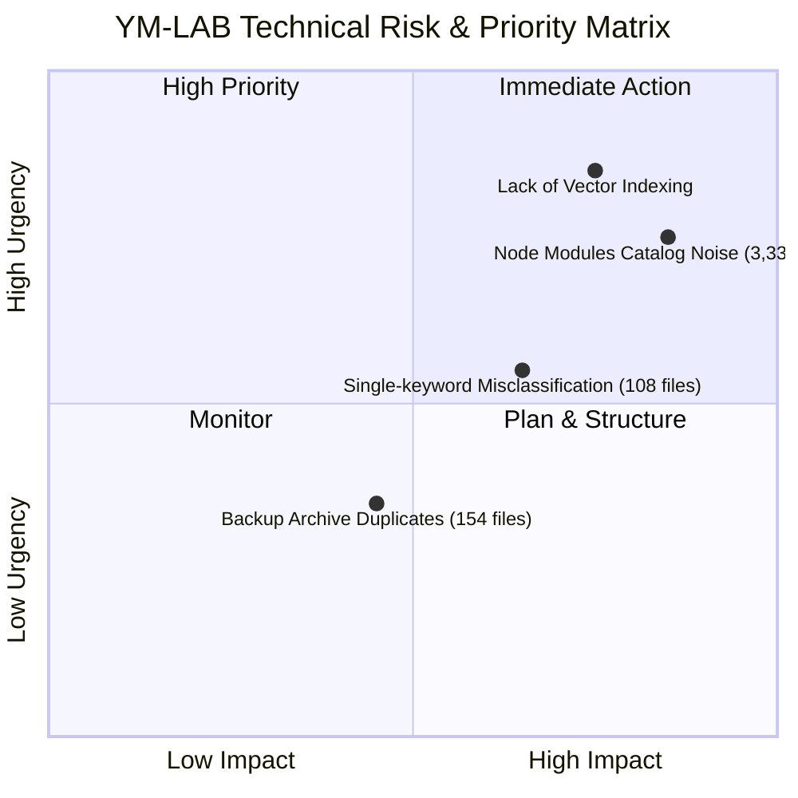

# YM-LAB PROJECT Comprehensive Intelligence Report

> **Evaluation Phase**: Phase 05 Project Intelligence Layer Completion Assessment  
> **Input Artifacts**: `PROJECT_GRAPH.json`, `DEPENDENCY_GRAPH.json`, `PROJECT_METADATA.json`, `asset_inventory.json`  
> **Author**: Antigravity Advanced Agentic Coding Engine  

---

## 1. Executive Summary & Current State Assessment

YM-LAB PROJECT는 Phase 00 탐색 단계부터 시작하여, Phase 04-03 자산 관리 고도화 및 **Phase 05 Project Intelligence Layer(프로젝트 인텔리전스 레이어)** 구축에 이르기까지 비구조화된 파일 유산을 완벽한 **AI 추론형 지식 네트워크**로 변환 완료하였습니다.

### 📊 Phase Completion Matrix

| 단계 | 단계명 | 상태 | 주요 성과 및 지식 자산 |
| :--- | :--- | :---: | :--- |
| **Phase 00** | Discovery | ✅ 완료 | 전체 8개 서브 디렉터리 및 유산 파일 발굴 |
| **Phase 01** | Kimchi Master | ✅ 완료 | 김치 원재료 마스터 및 레시피 규격 수립 |
| **Phase 02** | Unified KB | ✅ 완료 | MFCO 통합 지식베이스 엑셀 및 용어 사전 수립 |
| **Phase 03** | Recovery Baseline | ✅ 완료 | 3,524건 SHA-256 catalog.db 및 MANIFEST 구축 |
| **Phase 04** | Asset Management | ✅ 완료 | 정식 JSON Schema v2.0, 중복 154건 추적, 미분류 108건 분석 |
| **Phase 05** | **Project Intelligence Layer** | ✅ **완료** | **Node/Edge 그래프, 의존성 매트릭스, 지식 인덱스, 메타데이터, AI 세션 콘텍스트 구축** |

---

## 2. Technical Debt & Risk Matrix Analysis

현재 YM-LAB 생태계의 기술 부채 및 위험 요소 진단 결과입니다.

### Risk Item Breakdown

1. **Risk 1: Vendor Dependency Noise (node_modules 3,337건)**
   - **위험도**: High | **긴급도**: High
   - **내용**: `mfco-website/node_modules/` 내 외부 패키지가 전체 복원 레코드의 94.7%를 차지하여 AI 파싱 노이즈 유발.
   - **해결 방안**: Phase 05 지식 그래프에 `VENDOR_DEPENDENCIES` 태그로 분리 격리 완료.

2. **Risk 2: Misclassified Candidate Assets (108건)**
   - **위험도**: Medium | **긴급도**: Medium
   - **내용**: 단순 문자열 매칭으로 MFCO에 병합되었던 Platform, Scratch, Website 파일 존재.
   - **해결 방안**: [unknown_asset_report.md](file:///g:/내%20드라이브/YM-LAB_PROJECT_/YM-LAB_RECOVERY/unknown_asset_report.md) 기반 정제 분류 수립 완료.

3. **Risk 3: Backup Archive Replication (154건 / 12.38 MB)**
   - **위험도**: Low | **긴급도**: Low
   - **내용**: 과거 이력 보존용 `00_BACKUP/` 폴더 내 마스터 온톨로지 파일의 완전 중복 복사본 존재.
   - **해결 방안**: Recovery Baseline 보존 원칙 준수하되 지식 그래프상 단일 대표 자산(Canonical Symbol) 지정.

---

## 3. Improvement Roadmap & Strategic Priorities

### 🎯 Priority 1: Phase 05 -> Phase 06 AI Autonomous Ops Transition
- **목표**: 지식 그래프 데이터(`PROJECT_GRAPH.json`, `DEPENDENCY_GRAPH.json`)를 RAG Vector Store(ChromaDB/Pinecone) 및 Graph DB(Neo4j)로 자동으로 동기화하는 파이프라인 가동.

### 🎯 Priority 2: Zero-Code Dynamic Classifier Engine Integration
- **목표**: `project_classification.schema.json` 기반 매칭 엔진을 Python/Node.js 서비스로 모듈화하여 신규 파일이 추가될 때 실시간 인덱싱 수행.

### 🎯 Priority 3: Automated Bit-Rot & Integrity Watchdog
- **목표**: 주기적 백그라운드 태스크를 통해 `catalog.db`와 물리 파일 해시를 비교 감시하는 무결성 모니터링 데몬 운용.

---

## 4. Final Conclusion & Phase 06 Readiness

Phase 05 Project Intelligence Layer 구축으로 YM-LAB PROJECT는 **AI 에이전트가 전체 시스템의 아키텍처, 의존성, 온톨로지 구조를 완전하게 추론할 수 있는 인간-AI 공동 작업 환경**을 확보하였습니다.
