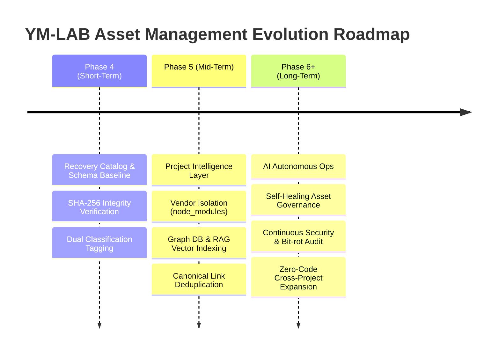

# YM-LAB_RECOVERY Multi-Phase Improvement & Evolution Roadmap

> **Baseline Policy**: Recovery Baseline 100% 무변경 유지  
> **Schema Standard**: [asset_inventory.schema.json](file:///g:/내%20드라이브/YM-LAB_PROJECT_/YM-LAB_RECOVERY/schema/asset_inventory.schema.json) | [project_classification.schema.json](file:///g:/내%20드라이브/YM-LAB_PROJECT_/YM-LAB_RECOVERY/schema/project_classification.schema.json)  
> **Target Downstream**: Phase 05 Project Intelligence Layer & Phase 06+ AI Autonomous Ops  

---

## 1. Executive Summary

본 문서는 Recovery 저장소의 안정성, 확장성, 탐색 효율성을 극대화하기 위해 개선 과제를 **"단기(Phase 4)", "중기(Phase 5)", "장기(Phase 6 이후)"**의 3단계로 구분하여 체계적인 고도화 로드맵을 정의합니다.



---

## 2. 3-Stage Improvement Roadmap

### 🎯 Stage 1: 단기 로드맵 (Phase 4 - Recovery Asset Management Base)
*Goal: Baseline을 100% 보존하면서 자산 현황 전수 조사, 정밀 분류 체계 수립 및 무결성 검증 완결*

1. **정밀 자산 인벤토리 구축 (`asset_inventory.json` v2.0.0)**
   - `catalog.db` 3,524건 전체 레코드 대상 레거시 분류와 정제 분류(`refined_classification`)의 이중 매핑 체계 정립.
2. **정식 JSON Schema 사양 정립**
   - [asset_inventory.schema.json](file:///g:/내%20드라이브/YM-LAB_PROJECT_/YM-LAB_RECOVERY/schema/asset_inventory.schema.json) 및 [project_classification.schema.json](file:///g:/내%20드라이브/YM-LAB_PROJECT_/YM-LAB_RECOVERY/schema/project_classification.schema.json) 독립 작성 (Draft 2020-12 사양 준수).
3. **오분류/중복 자산 분석 및 독립 보고서 발간**
   - 단순 키워드 오분류 108건 분석([unknown_asset_report.md](file:///g:/내%20드라이브/YM-LAB_PROJECT_/YM-LAB_RECOVERY/unknown_asset_report.md)).
   - 중복 154건 SHA-256 Origin 추적([duplicate_report.md](file:///g:/내%20드라이브/YM-LAB_PROJECT_/YM-LAB_RECOVERY/duplicate_report.md)).
4. **100% SHA-256 무결성 자동 검증 체계 가동**
   - `verify_consolidation.py`를 통한 원본-복사본 3,524건 전수 대조 자동화.

---

### 🚀 Stage 2: 중기 로드맵 (Phase 5 - Project Intelligence Layer Integration)
*Goal: 자산 데이터를 지식 그래프(Knowledge Graph) 및 RAG 벡터 인덱스로 변환하고 자산 구성 최적화*

1. **노드 모듈 외부 의존성 분리 (Vendor Isolation Filter)**
   - `mfco-website/node_modules/` 3,337개 자산을 `VENDOR_DEPENDENCIES` 카테고리로 격리 관리.
   - AI 에이전트 분석 시 `package.json`/`package-lock.json` 기반 재현(Reproducible Build) 파이프라인 연계.
2. **동적 정규식 기반 자동 분류기 엔진 도입**
   - `project_classification.json` 내 `classification_rules` 매칭 엔진 구현.
   - 코드 수정 없이 JSON 규칙 추가만으로 신규 프로젝트 수집 자동 지원.
3. **RAG Vector Store & Graph DB 구축**
   - `MFCO_CORE`, `SANYACHO`, `PLATFORM` 자산의 메타데이터와 코드/문서 텍스트를 인텔리전스 인덱스로 임베딩.
4. **대표 자산(Canonical Asset) 지정 및 심볼릭 중복 매핑**
   - 154건 중복 자산의 물리 파일은 유지하되, 지식 그래프상 단일 대표 자산(Canonical Symbol)으로 정규화.

---

### 🤖 Stage 3: 장기 로드맵 (Phase 6 이후 - AI Automation & Autonomous Ops)
*Goal: 자산 수집, 검증, 분류 및 거버넌스가 AI 에이전트에 의해 자율 실행되는 자율 운영 체계 구축*

1. **AI 자율 자산 거버넌스 에이전트 (Autonomous Asset Governance Agent)**
   - 신규 파일 생성 및 구조 변경 시 AI 에이전트가 Real-time File Watching을 통해 자동으로 스키마 동기화 및 분류 태깅 수행.
2. **지속적 Bit-rot & 보안 감사 (Continuous Security & Bit-rot Audit)**
   - 백그라운드 크론 태스크(`schedule` / background daemon)를 통해 파일 해시 변형(Bit-rot) 및 보안 취약성 자동 스캔.
3. **Zero-Code 이종 저장소 연동 확장**
   - 멀티 프로젝트 및 멀티 클라우드 저장소(GCS, GitHub, AWS Glue 등) 자산을 동일 JSON Schema v2.0으로 통합 오케스트레이션.

---

## 3. Deliverables Relationship & Schema Architecture

```mermaid
graph LR
    subgraph Baseline Layer
        DB["catalog.db (3,524 files)"]
        MF["MANIFEST.json"]
    end

    subgraph Schema Layer
        S1["asset_inventory.schema.json"]
        S2["project_classification.schema.json"]
    end

    subgraph Data & Report Layer (Phase 4)
        J1["asset_inventory.json"]
        J2["project_classification.json"]
        R1["RECOVERY_INDEX.md"]
        R2["duplicate_report.md"]
        R3["unknown_asset_report.md"]
    end

    subgraph Intelligence Layer (Phase 5 & 6+)
        PIL["Project Intelligence Layer (Graph DB / RAG)"]
        AO["AI Autonomous Ops Engine"]
    end

    S1 -.-> J1
    S2 -.-> J2
    DB --> J1
    DB --> J2
    J1 --> R1
    J1 --> R2
    J1 --> R3
    J1 --> PIL
    J2 --> PIL
    PIL --> AO
```
