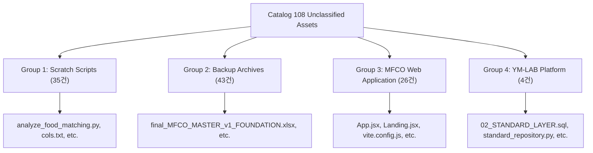

# YM-LAB_RECOVERY Unclassified & Misclassified Assets Report

> **Target Inventory**: [asset_inventory.json](file:///g:/내%20드라이브/YM-LAB_PROJECT_/YM-LAB_RECOVERY/asset_inventory.json)  
> **Total Analysis Target**: **108 건** (기존 catalog.db 내 `project = 'MFCO'`로 단순 분류된 파일)  
> **Reclassification Schema**: [project_classification.json](file:///g:/내%20드라이브/YM-LAB_PROJECT_/YM-LAB_RECOVERY/project_classification.json)  

---

## 1. Overview & Root Cause Analysis

Phase 03의 `consolidate_assets.py` 실행 시 적용된 서브스트링 키워드 매칭(`standard`, `code`, `dictionary`, `function` 등)으로 인해, **실제 MFCO 온톨로지 핵심 자산이 아님에도 MFCO 프로젝트로 일괄 분류된 108개 파일**이 식별되었습니다.

### 오분류 원인 분석 (Root Cause)
1. **Platform 파일의 오분류**: `100_PLATFORM/120_DATABASE/repository/standard_repository.py` 및 `schema/02_STANDARD_LAYER.sql` 내 `standard` 키워드가 MFCO 키워드 리스트와 매칭되어 MFCO로 할당됨.
2. **Scratch 스크립트 오분류**: `07_ONEDRIVE_RECOVERY_FULL/scratch/` 내 35개 검증용 파이썬 스크립트 및 텍스트 덤프가 경로 상 MFCO 하위에 위치하여 MFCO로 분류됨.
3. **Web Application 소스코드 오분류**: `mfco-website` 프론트엔드 레포지토리(React/Vite)의 소스 파일 26개가 단일 프로젝트 태그로 흡수됨.
4. **백업 히스토리 파일 오분류**: `00_BACKUP/` 폴더 내 43개 임시 엑셀/워드 문서가 마스터 자산과 구분 없이 분류됨.

---

## 2. 108 Unclassified Candidate Asset Breakdown

108개 자산은 4가지 명확한 기능적 카테고리로 재분류됩니다.

### Detailed Breakdown Table

| 카테고리 그룹 | 수량 | 파일 확장자 분포 | 주요 내용 및 대표 파일 | 제안 재분류 프로젝트 ID |
| :--- | :---: | :--- | :--- | :--- |
| **Group 1: Scratch Scripts** | **35** | `.py` (19), `.txt` (16) | 점검 스크립트 (`analyze_food_matching.py`, `inspect_excel.py`, `cols.txt`) | `SCRATCH` |
| **Group 2: Backup Archives** | **43** | `.xlsx` (30), `.docx` (3), `.md` (3), `.pdf` (1), 기타 (6) | 과거 버전 백업 (`final_MFCO_MASTER_v1_FOUNDATION.xlsx`, `00_BACKUP/*`) | `BACKUP_ARCHIVE` |
| **Group 3: Web Application** | **26** | `.jsx` (12), `.js` (6), `.css` (3), `.html` (2), `.json` (2), `.md` (1) | React/Vite 프론트엔드 레포지토리 (`App.jsx`, `Landing.jsx`, `vite.config.js`) | `MFCO_WEBSITE` |
| **Group 4: Platform Infra** | **4** | `.sql` (1), `.py` (1), `.json` (2) | YM-LAB 표준 DB 스키마 및 레포지토리 (`02_STANDARD_LAYER.sql`, `standard_repository.py`) | `PLATFORM` |

---

## 3. Platform & App Specific Assets Analysis (Key 4 Files)

`100_PLATFORM` 경로에 존재하나 `MFCO`로 오분류된 4개 파일의 정밀 분석 결과입니다.

1. **`100_PLATFORM/120_DATABASE/schema/02_STANDARD_LAYER.sql`**
   - **기능**: YM-LAB 플랫폼 데이터베이스의 표준 레이어 DDL 테이블 정의 SQL.
   - **조치**: `PLATFORM` 프로젝트 표준 인프라 자산으로 재분류.
2. **`100_PLATFORM/120_DATABASE/repository/standard_repository.py`**
   - **기능**: 표준 데이터 액세스 레이어 Python 레포지토리 모듈.
   - **조치**: `PLATFORM` 프로젝트 표준 인프라 자산으로 재분류.
3. **`100_PLATFORM/checkpoints/collection_state.json`**
   - **기능**: 플랫폼 데이터 수집 엔진 상태 체크포인트 데이터.
   - **조치**: `PLATFORM` 프로젝트 런타임 체크포인트 자산으로 재분류.
4. **`100_PLATFORM/checkpoints/test_collection_state.json`**
   - **기능**: 수집 엔진 테스트 상태 체크포인트 데이터.
   - **조치**: `PLATFORM` 프로젝트 런타임 체크포인트 자산으로 재분류.

---

## 4. Recommendations for Phase 05 Pipeline Integration

1. **Refined Regex Pattern Rules**: Phase 05 수집 스크립트 실행 시 `project_classification.json`의 우선순위 규칙(`priority`) 기반 정규식 매처(Regex Matcher) 도입.
2. **Dynamic Project Tagging**: 단순 서브스트링 검사 대신 경로 깊이(Depth) 및 파일 MIME-type을 결합한 다차원 분류기 적용.
