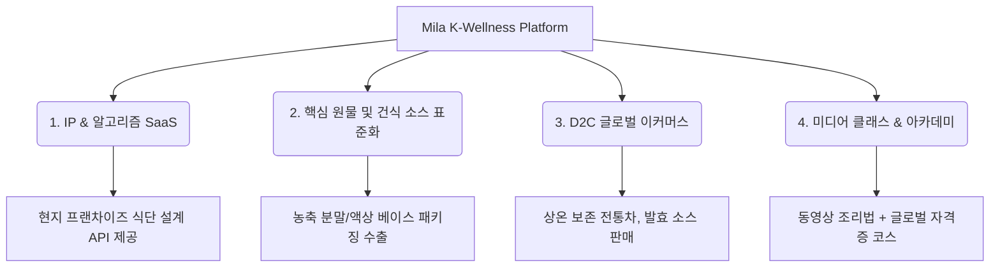

# K-약선요리 글로벌 진출 다각화 및 비즈니스 전략 수립서

약선요리 완제품 밀키트는 신선도 유지, 콜드체인 물류비용, 그리고 국가별 엄격한 축산물·농산물 통관 규제(Quarantine)로 인해 직접 수출 장벽이 매우 높습니다. 

따라서 완제품 수출 대신 **원가율이 낮고 마진이 높으며 규제 장벽을 우회할 수 있는 지식재산권(IP), 핵심 원료 및 소스 표준화, 미디어 교육, D2C 커머스 모델**로 전환하고, 국내외 핵심 제조사 및 학계와의 **3대 다각화 협력 네트워크**를 기반으로 실행해야 합니다.

---

## 1. 4대 핵심 사업 모델 및 글로벌 전환 전략

### ① 레시피 노하우 및 알고리즘 라이선싱 (B2B SaaS / API)
*   **개념**: 현지 레스토랑, 급식 기업, 실버케어 시설이 Nuri Lab의 **7-AXIS 약선 추론 알고리즘 API**를 구독하여 현지 식재료와 결합한 맞춤 식단을 구성할 수 있도록 지원하는 모델입니다.
*   **전략**: 레시피 자체를 텍스트로 수출하는 것이 아니라, 현지인들의 체질과 현지 식자재 공급 상황에 맞게 칠정배합(상극 방지) 규칙을 자동 계산해 주는 **클라우드 연산 엔진**을 라이선싱합니다.

### ② 핵심 원물 및 건식 소스 표준화 (Ingredient Component Model)
*   **개념**: 완제품 밀키트 대신, 약선요리의 핵심 약리 효능을 내는 **동결건조 블록, 한방 육수 농축 액상/분말, 건식 소스 패키지**만 표준화하여 수출합니다.
*   **전략**: 수입국 현지에서 쉽게 구할 수 있는 신선육과 채소는 현지에서 조달하고, 맛과 약리 기능을 결정하는 핵심 베이스(예: '사군자탕 분말 베이스', '삼청 음청 믹스')만 한국에서 공급하여 관세 및 검역 통관을 쉽게 통과시킵니다.

### ③ 상온 보존 완제품 D2C 글로벌 쇼핑몰 (Global Cross-border E-commerce)
*   **개념**: 액상 파우치 차류, 건조 허브 티백, 전통 발효 천연 조미료(전통 장류) 등 상온 보관이 가능하고 유통기한이 1년 이상으로 긴 완제품 중심의 해외 직배송 및 현지 3PL 물류망 연동 쇼핑몰을 구축합니다.
*   **전략**: 글로벌 밀키트 배송망을 직접 구축하기보다, 프리미엄 웰빙 식품군을 큐레이션하여 Amazon 또는 현지 헬스푸드 스토어(예: Whole Foods Market) 입점 및 글로벌 D2C 채널을 타겟팅합니다.

### ④ 미디어 콘텐츠 기반 조리 교육 & 아카데미 (Edutech)
*   **개념**: 체질별 양생법, 전통 약리 조리 기법을 고화질 다국어 영상 및 가이드북으로 제작하고 온라인 아카데미(자격증 연계)를 개설합니다.
*   **전략**: 유튜브, 인스타그램 숏폼을 통한 바이럴 마케팅과 Udemy 등 글로벌 교육 플랫폼에 "K-Yakseon Masterclass"를 런칭하여 팬덤과 B2B 가맹점을 확보하고, 협력 대학교 조리학과와 연계하여 공인 자격증 사업을 확장합니다.

---

## 2. 3대 다각화 협력 및 공급망 네트워크 (Supply Chain & Academic Alliance)

수입 및 규격 장벽을 극복하고 비즈니스 모델을 구동하기 위한 국내 핵심 파트너십 구축 명세입니다.

### ── [트랙 1] 천연물 동결건조 GMP/HACCP 생산망
*   **핵심 파트너**: 프롬바이오, 주식회사 다움, 단정바이오 등
*   **역할/요건**: 한약재 저온 감압 추출 공법(Brix 50%+), 진공 동결건조(-40℃ 이하), 120 Mesh 미세 분밀도 생산. 수입국 안전 기준을 위한 초고압 HPP 및 감마선 멸균 처리.

### ── [트랙 2] 발효 효소 및 건식 조미 소스 제조망
*   **핵심 파트너**: (주)이앤에스, (주)신비바이오, 하남소스, (주)서해식품 등
*   **역할/요건**: 유동층 과립 공법 기반 소화 증진 곡물 발효 효소 생산. 전통 한방 배합비의 쓴맛을 배제한 글로벌 대중성 조미 분말 소스 배합 생산. 시제품 및 시장 반응 테스트를 위한 소량 유연 가동(50kg~100kg MOQ).

### ── [트랙 3] 약선요리 특화학과 및 학술 연구망
*   **핵심 파트너**: 대구한의대학교 약선푸드테크비즈니스학과, 원광디지털대학교 한방건강약선학과, 경희대 F&B R&D 등
*   **역할/요건**: 7-AXIS AI 알고리즘의 처방 정밀도 공동 학술 검증. 'K-Yakseon Master' 공식 교육 아카데미 개설 및 자격 인증서 발급. 교육 매출의 25~30% 배분 산학 생태계 가동.

---

## 3. 사업 기획서 초안 아키텍처 제안 (Pitch Deck Structure)

투자유치 및 파트너 발굴을 위해 작성할 **비즈니스 제안서(Pitch Deck)**의 필수 목차 구성안입니다.

1.  **Executive Summary**: K-Food의 건강한 진화, 기술 기반 약선 IP 플랫폼
2.  **The Problem**: 신선 메디푸드의 높은 물류 장벽과 국가별 농축산물 수입 통관 규제
3.  **Our Solution**: 가볍고 확장성 높은 3대 핵심 모델 (API SaaS + 건식 컴포넌트 소스 + 아카데미)
4.  **Technology (IP)**: 특허 출원 2종(처방 배합 알고리즘 및 비파괴 원격 품질 등급 선별 시스템)
5.  **Eco Network**: 3대 트랙 (한방 동결건조사, 효소/소스 제조사, 약선요리학과) 협력 공급망
6.  **Market Size**: 글로벌 아답토젠 및 웰빙 대체 조미료 시장의 급성장세
7.  **Business Model**: 알고리즘 구독료 + 원료 납품 마진 + 아카데미 교육비 수수료
8.  **Milestones & Financials**: 1단계 R&D 검증 및 산학 연동 $\rightarrow$ 2단계 글로벌 D2C 런칭 $\rightarrow$ 3단계 해외 가맹망 API 확장
9.  **Exit Strategy**: 기술 고도화 후 글로벌 제약·식품사 대상 M&A 및 기술 특례 상장(IPO)
